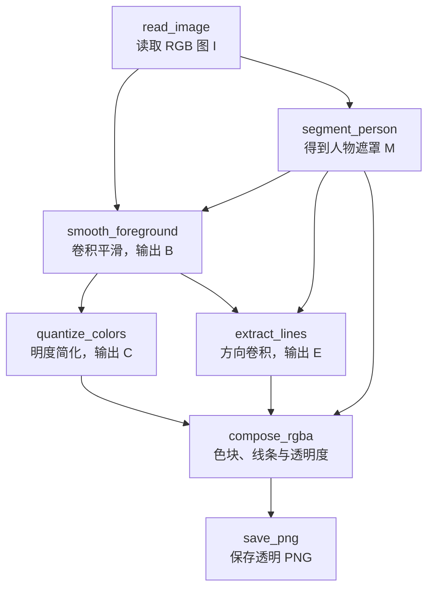

# 自拍人像漫画化：研究方案与设计

> 版本：v0.6（2026-10-07，结构融合管道实现）
>
> 当前范围：一张自拍照片、去除背景、漫画化；暂不训练模型，暂不处理像素风格。  
> 设计原则：先建立可解释的卷积与图像处理基线，再逐步引入更复杂的前沿方法。

已实现逐通道结构融合、保边色块、线条筛选与小图预览放大的函数管道，并成为默认运行路线。第 3 节的第一版最小管道作为 baseline 对照保留。32 项检查及类型检查通过，合成图和首张实际照片已运行；方法与参数见 [README](README.md)，具体证据见 [实施记录](实施记录.md)。第 4—8 节保留方法解释与可选扩展，双边滤波、XDoG、精细 alpha 和方向场尚未加入实现。

## 1. 问题定义

当前默认路线先逐通道提取方向响应，再融合结构强度与主方向，共同指导色块和线条两个分支。色块使用保边基础层、细节分解与连续明度映射，线条使用方向细化与连通筛选，小图交互通过显示插值改善。完整函数、算子类型和坐标约定统一记录在 [下一版设计](下一版设计.md)，该文件名保留以便沿用已有链接。下文第 3 节继续记录第一版对照。

给定一张自拍照片 $I\in[0,1]^{3\times H\times W}$，希望输出带透明通道的漫画人像

$$
Y\in[0,1]^{4\times H\times W},
$$

其中前三个通道是漫画化后的 RGB 前景，最后一个通道是透明度 $\alpha$。背景不再作为漫画内容输出，而是由透明区域表示。

输出需要同时满足三个条件：人物身份和构图基本不变；皮肤和衣物中的细碎纹理得到简化；脸型、五官、发型和人物外轮廓仍然清晰。这里的“漫画风格”先限定为平整色块、适度明暗和清晰线条，暂不追求夸张五官、复杂笔触或特定画师风格。

整个系统可以写成

$$
\hat M=\mathcal S(I),\qquad
\hat C=\mathcal T(I,\hat M),\qquad
Y=\operatorname{Concat}_{\mathrm{channel}}(\hat C,\hat\alpha),
$$

其中 $\mathcal S$ 是人像分割，$\mathcal T$ 是在遮罩约束下进行的漫画化处理，$\hat\alpha$ 是另行估计的边界透明度。将 RGB 与透明度拼接得到 RGBA 文件；换背景预览则使用第 8 节的合成公式。当前方案不训练神经网络，但 GrabCut 会估计当前图像的颜色分布。

## 2. 卷积知识在哪里

本项目目前直接应用的是**卷积算子与滤波知识**，尚未搭建或训练 CNN。CNN 会通过任务数据学习卷积核；当前方案则由我们指定高斯核、方向核和组合规则，权重共享、邻域计算、通道形状和感受野仍然适用。

| 环节 | 与卷积的关系 | 对应课程知识 | 作用 |
| --- | --- | --- | --- |
| 人像粗分割 | GrabCut 不是卷积 | 与引言中的图模型、邻接约束有关 | 确定人物范围 |
| 灰度提取 | 固定通道组合可写成 $1\times1$ 卷积 | 逐点卷积、多通道输入输出 | 得到用于描线的单通道图 |
| 逐通道结构与融合 | 每通道方向卷积，平方/乘积后逐点融合 | DW、非线性与 PW 的分工 | 同时得到颜色结构的强度与方向 |
| 高斯平滑 | 直接使用固定卷积 | 普通卷积、空间可分离、逐通道卷积 | 减少小尺度变化，作为平滑对照 |
| 保边平滑 | 双边滤波是输入相关的非线性加权 | 与动态权重有思想联系 | 尽量在相似颜色内部平均 |
| Sobel 与 DoG | 直接使用固定卷积及响应组合 | 方向响应、多尺度、感受野 | 提供线条依据 |
| XDoG、梯度幅值 | 卷积后接非线性处理 | 特征响应与非线性变换 | 将响应转成可见线条 |
| 遮罩修整、方向滤波 | 混合使用卷积与其他操作 | 局部统计、结构方向、自适应采样 | 改善边缘与线条连贯性 |
| 明度量化、线条与颜色合成 | 逐点运算，不是空间卷积 | 作为滤波后的输出规则 | 形成色块并控制描线强度 |
| RGBA 导出、背景合成 | 拼接与逐点加权，不是卷积 | 图像表示与透明度 | 保存透明人像或替换背景 |

课程对应见 [卷积神经网络基础](../../深度学习应用/深度学习应用（2）：卷积神经网络基础.md)中的“多输入与多输出通道”“填充计算”“方向响应和边缘强度计算”，以及 [卷积神经网络变体](../../深度学习应用/深度学习应用（3）：卷积神经网络变体.md)中的“逐通道卷积”“逐点卷积”“空间可分离卷积”“多尺度融合”“动态卷积”和“可变形卷积”。

### 2.1 固定卷积与自适应滤波

沿用课程中深度学习框架的约定，以下局部核运算写成互相关：

$$
F(p)=\sum_{q\in\mathcal N(p)}K(q-p)I(q).
$$

核 $K$ 在整张图像上固定移动，例如高斯核、Sobel 核和 Laplacian 核。严格的数学卷积应使用 $K(p-q)$；对中心对称高斯核两者相同，对反对称的一阶方向核则会改变响应符号。实现时要固定约定，尤其不能在需要正负号的线条映射中混用。

但人像中不同位置的处理要求不同：皮肤内部可以平滑，眼睛边缘不能被抹掉；背景残留与头发之间也不能简单平均。双边滤波、引导滤波和流场滤波会根据当前像素的颜色、局部结构或方向改变权重。它们可以看作从固定卷积走向输入相关权重的桥梁，与笔记中的动态卷积、可变形卷积有思想上的联系，但并不是训练好的动态卷积网络。

### 2.2 卷积与特征尺度

小核适合读取局部变化，连续空间卷积或较大核可以扩大理论感受野，但具体哪些输入起主要作用仍取决于权重。较大尺度能抑制细碎纹理，也可能抹掉重要五官；扩大感受野本身不等于获得人物语义。

这里可以采用多尺度卷积，但不一定要下采样后再上采样。当前方案优先在同一处理分辨率上，用多个 $\sigma$ 的高斯核构造尺度空间。放大稀疏核的空洞率和增大高斯尺度不是同一操作：前者改变采样间隔，后者改变平滑范围与权重。空洞卷积不作为第一版平滑器。

### 2.3 从像素到线条

先看一个能手算的局部模块。对单通道亮度图 $L$，使用

$$
K_{\mathrm{blur}}=\frac1{16}
\begin{bmatrix}
1&2&1\\
2&4&2\\
1&2&1
\end{bmatrix}
=\frac14
\begin{bmatrix}1\\2\\1\end{bmatrix}
\frac14
\begin{bmatrix}1&2&1\end{bmatrix}.
$$

这个归一化二项式核是一个简单的类高斯平滑核。在皮肤内部，它把小范围变化平均掉；在眼睑边界上，它也可能减弱对比，因此只能作为基础对照。右边的分解说明，同一个二维结果可以通过纵向和横向两次一维滤波得到，这正是空间可分离卷积。一般 $k\times k$ 可分离核每个位置的乘加量由约 $k^2$ 降为 $2k$，边界处理一致时结果相同，仅有浮点误差。

对 RGB 三个通道各做一次这种平滑、通道之间不混合，就对应逐通道卷积。然后用 $L=0.299R+0.587G+0.114B$ 将三通道组合成一个通道，可以写成输入通道数为 3、输出通道数为 1 的固定 $1\times1$ 卷积。这里是显示编码 RGB 上的常用灰度近似，不等于物理亮度或 Lab 明度。

再让 Sobel 核 $K_x,K_y$ 分别作用于 $L$，得到 $g_x=K_x\star L$、$g_y=K_y\star L$。两个方向响应可作为 $2\times H\times W$ 的特征图；固定核依然完成了特征提取。组合 $g=\sqrt{g_x^2+g_y^2}$，再把较强响应映射成深色，才得到可见的描线。求幅值与阈值映射是非线性运算，不能把整个过程称为一次卷积。

所有基础核先取步长 1，并用一致的边界填充保持高宽。优先比较反射填充与零填充，观察零值边界是否带来额外暗边。人物遮罩不属于图像外边界：直接把背景清零再滤波，同样会在人像边缘产生人为跳变，需要第 5 节的遮罩约束。

### 2.4 变体的使用边界

最小版直接使用普通卷积、逐点通道组合、逐通道卷积和空间可分离高斯核；多尺度 DoG 留作替换 Sobel 的下一步。双边滤波的权重来自颜色差异公式，方向滤波的采样来自估计的方向场；它们分别与动态权重、自适应采样相联系，但并不是笔记中的可学习动态卷积或 DCN。

普通双边滤波通常不能像高斯核一样精确拆成横向、纵向两次滤波。形态学膨胀、腐蚀虽然也移动局部窗口，内部主要是最大值或最小值运算，同样不是线性卷积。

转置卷积、PixelShuffle、倒残差与结构重参数化暂不使用。当前没有学习到的解码器，也没有需要融合的训练分支；若为预览而缩小图像，则采用抗混叠缩小与普通插值，并单独检查细线损失。图像基础层与细节层的加减分解，也不能直接称为残差网络。

## 3. 总体流程

### 3.1 最小管道

函数管道按数据依赖连接：人物遮罩参与平滑和合成，平滑图再分成色块与线条两路。每个函数显式接收数组和参数，返回新数组；计算函数不读写文件、不隐式打开窗口、不修改输入。文件操作集中在两端，交互标记由调用者收集后传入分割函数。



第一版选择轻度高斯平滑与 Sobel 描线，先把卷积作用和数据流做清楚。高斯不能保护内部五官边界，因此平滑应温和；这个局限是后续引入双边滤波的实验动机。第一版采用硬遮罩 $\alpha=M$，先保证主体完整与背景删除，再处理细发丝和抗锯齿。当前实现已跑通，初始参数仍需结合自拍调整。

### 3.2 数据约定

接口统一使用 NumPy 风格的通道末置数组：图像为 $H\times W\times3$，RGBA 为 $H\times W\times4$；这是对前文数学记号 $C\times H\times W$ 的存储排列调整。图像与线条图使用 float32、范围 $[0,1]$、RGB 顺序，人物遮罩使用 $H\times W$ 的 bool 数组，True 表示保留。线条图 $E$ 的 0 表示无描线，1 表示最强描线。

从读取完成到导出前，各数组使用同一 $H,W$ 与坐标系。read_image 处理拍摄方向并统一通道，不默认缩放；如果输入分辨率过大，后续再讨论一个显式的工作尺寸设置。GrabCut 所需的整数图像、Lab 的内部范围等转换由相应函数负责，不能泄漏为各步骤间不一致的数据约定。

### 3.3 函数契约

| 函数 | 输入 | 输出 | 第一版方法 | 卷积关系 |
| --- | --- | --- | --- | --- |
| `read_image(path)` | 图片路径 | `I: H×W×3` | 解码、方向校正、RGB 与浮点范围统一 | 无 |
| `segment_person(I, selection)` | 原图、矩形或前景/背景笔划 | `M: H×W` | GrabCut；按新标记重新运行可修正结果 | 无固定卷积，含颜色模型估计与图割 |
| `smooth_foreground(I, M, sigma)` | 原图、遮罩、空间尺度 | `B: H×W×3` | 只由前景像素贡献的归一化高斯平滑 | 固定高斯卷积加逐点归一化 |
| `quantize_colors(B, levels, amount)` | 平滑 RGB、明度档数和量化强度 | `C: H×W×3` | Lab 明度量化，再转回 RGB | 逐点颜色转换与量化，无空间卷积 |
| `extract_lines(B, M, threshold, softness)` | 平滑图、遮罩、阈值和软过渡宽度 | `E: H×W` | 灰度组合、Sobel 两方向、幅值与软阈值 | $1\times1$ 通道组合、两个 $3\times3$ 方向核 |
| `compose_rgba(C, E, alpha, strength)` | 色块、线条、透明度、描线强度 | `Y: H×W×4` | 黑色描线与颜色混合，再拼接 alpha | 无空间卷积 |
| `save_png(Y, path)` | RGBA、输出路径 | 已保存路径 | 检查范围后转为 PNG 支持的位深并保存 | 无 |

只有分割需要当前照片对应的用户标记。selection 的坐标必须基于读取和方向校正后的 I；人物贴边时采用笔划初始化，不能把图像边框默认当背景。记录选择和参数即可重复运行，第一版无需建立通用插件或任务调度框架。

### 3.4 关键计算

平滑在人物像素上使用 $B_c=(G_\sigma*(MI_c))/(G_\sigma*M)$。分子对 RGB 分通道卷积，分母对单通道遮罩卷积；先各自完成卷积再相除，而非将横向、纵向结果分别归一化。由于含有遮罩归一化，整个操作不是一次固定卷积，也不等同于双边保边滤波。

在 $M(p)=1$ 且高斯核中心权重为正时，分母应为正；实现仍需检查小分母与空前景。背景位置不具有前景颜色含义。extract_lines 在使用 Sobel 前，要将局部窗口可能读取的背景位置用邻近前景颜色延拓，再卷积并限制 $E$ 只在前景有效。仅在最后将边缘图乘遮罩，无法撤销卷积已经读入背景的影响。该延拓是避免人为黑白边的近似，不恢复已经混入背景的发丝颜色。

量化使用归一化 Lab 明度 $u$，取 $u'=(1-a)u+aQ_N(u)$，其中 $N\ge2$、$0\le a\le1$，并保留色度。固定档数不涉及全图统计，背景不参与人物调色板估计。RGB 转回后检查色域并限制输出范围。

描线先计算 $g=\sqrt{g_x^2+g_y^2}$，再取 $E=\operatorname{clip}((g-t)/w,0,1)$，其中 $w>0$；$t$ 是 threshold，$w$ 是 softness，Sobel 核的归一化约定在实现中固定。提高 $t$ 抑制更多弱响应。这个函数生成的是局部线条强度，不自动识别五官，也不是真实 alpha。

合成先取黑色描线 $C'=C(1-\lambda E)$，$0\le\lambda\le1$，再将 $C'$ 与 alpha 拼接。第一版传入 `M.astype("float32")`，以后可换成 refine_alpha 的返回值。保存采用普通非预乘 RGBA；RGB 不再次乘 alpha，否则在外部显示器合成时会出现重复衰减。

### 3.5 调用示意

以下接口已在 [pipeline.py](src/cartoon_portrait/pipeline.py) 实现。selection 来自当前图片的交互标记，cfg 是显式参数配置；命令行入口还支持复用已确认的 mask，跳过分割。

```python
image = read_image(input_path)
mask = segment_person(image, selection)
base = smooth_foreground(image, mask, sigma=cfg.sigma)
colors = quantize_colors(base, levels=cfg.levels, amount=cfg.amount)
lines = extract_lines(base, mask, threshold=cfg.threshold, softness=cfg.softness)
rgba = compose_rgba(colors, lines, mask.astype("float32"), strength=cfg.strength)
saved_path = save_png(rgba, output_path)
```

颜色量化与线条提取都从 base 出发。若先量化再提线，脸颊新产生的色阶边界也会被描成黑线，所以不把这两个函数强行串成一条直线。调描线强度只需重新合成；遮罩不变时，调漫画参数也无需重跑分割。可在外层保留 mask、base、colors、lines 和 rgba，便于逐步可视化。

### 3.6 暂缓模块

第一版不独立实现 refine_alpha、结构张量、FDoG、Kuwahara、人脸区域解析或预训练分割。先检查主体是否完整、色块是否简洁、线条是否过密，再根据实际失败位置增加模块或替换函数内部方法。

当前没有上采样。未来若需要更大的输出，可增加显式 resize_output，但它只改变采样尺寸，不恢复已丢失的五官细节。二值遮罩缩放与连续 alpha 缩放采用不同规则；若缩放 RGBA，则临时用预乘颜色与 alpha 一起插值，再还原非预乘存储，以减少透明边界色晕。转置卷积和 PixelShuffle 不属于当前必要流程。

## 4. 人像分割

### 4.1 主方案：GrabCut

GrabCut 是当前实现的单图分割方法。标记窗口支持先用矩形框包含完整人物，再用少量笔划标记明确的前景和背景；也可直接用笔划初始化。算法根据当前照片估计颜色模型，并结合像素邻接关系与边界代价迭代求解；它无需训练数据集，但包含单图参数估计与优化。

它不是 CNN。它的主要作用是生成遮罩，而不是学习漫画风格。OpenCV 的实现也允许在初始结果不准确时加入前景和背景笔划进行再次迭代。[OpenCV GrabCut 教程](https://docs.opencv.org/4.x/d8/d83/tutorial_py_grabcut.html)；原始方法见 [GrabCut，2004](https://www.microsoft.com/en-us/research/publication/grabcut-interactive-foreground-extraction-using-iterated-graph-cuts/)。

矩形初始化会把图像中矩形外的像素视为确定背景，因此矩形必须包含完整前景。自拍中的肩部常接触画面边缘，矩形可以相应延伸到边缘；若无法通过矩形保留完整人物和足够背景，应改用遮罩和前景、背景笔划初始化，不能假定图像四周都是背景。头发、眼镜、衣物与相近颜色背景的交界处，应预留人工修正。

### 4.2 可选方案：预训练分割

若后续允许使用预训练模型，可以比较自拍分割模型与 MODNet 等人像抠图模型。它们可借助学习到的卷积特征估计人物范围或透明度；本项目仅运行推理，外部训练所得的能力应在报告中注明。语义分割与 alpha 抠图不是同一任务，不能把分割置信度直接解释为透明度。

这条路线能减少手动标记，但结果受输入分辨率和模型适用范围影响。当前仅把 [MODNet](https://github.com/ZHKKKe/MODNet) 列为可选对照，尚未下载、运行或验证；它不属于无学习模型的主线。

### 4.3 遮罩到透明度

二值遮罩 $M\in\{0,1\}^{H\times W}$ 表示区域归属，连续透明度 $\alpha\in[0,1]^{H\times W}$ 则近似描述一个像素中前景的贡献。GrabCut 的“可能前景”“可能背景”是离散标签，不是透明度或标定概率，不能直接转换成灰色 alpha。

最小版直接用二值遮罩作为 alpha；后续可在边界带内做抗锯齿或引导修整，作为工程近似。原始混合关系为 $I=\alpha F+(1-\alpha)B_{\mathrm{old}}$；即使 alpha 估计准确，原图边缘颜色也可能已混入背景。简单羽化不等于真正的抠图或前景颜色恢复。

若对遮罩做平滑，应使用原图结构引导，而不是无条件地模糊整个边界。引导滤波可以利用局部线性模型进行保边平滑；它是显式滤波器，不是训练网络。[Guided Image Filtering](https://people.csail.mit.edu/kaiming/eccv10/index.html)

当前阶段的边界目标是头发整体、脸部外轮廓和肩部边缘自然，不要求逐根恢复发丝。验收时分别使用白色和深色预览背景，检查是否有白边、黑边或残留背景颜色。

## 5. 人物区域预处理

### 5.1 颜色空间

描线分支可以使用灰度近似；色块分支建议使用 Lab，单独调整明度 $L^*$ 并保留或适度修改色度。两种标量图的定义不同，参数不可直接通用。实现时固定颜色转换约定、RGB/BGR 通道顺序和数值范围，量化前将 Lab 明度归一化到 $[0,1]$。

如果使用 Lab 等颜色空间，需注意转换本身含有非线性，不能简单地把它完全等同于一个 $1\times1$ 卷积。$1\times1$ 卷积可以实现同一位置的通道线性组合，例如灰度近似

$$
L\approx0.299R+0.587G+0.114B,
$$

但颜色空间的完整转换还需要逐点非线性和归一化。

### 5.2 遮罩约束的保边平滑

对人物区域进行保边平滑，减少皮肤毛孔、拍摄噪声和衣服细碎纹理。双边滤波的权重可以写成

$$
w(p,q)=
\exp\left(-\frac{\|p-q\|^2}{2\sigma_s^2}\right)
\exp\left(-\frac{\|I(p)-I(q)\|^2}{2\sigma_r^2}\right).
$$

$\sigma_s$ 控制空间范围，$\sigma_r$ 控制允许混合的颜色差异。空间距离近且颜色相近的像素权重大。这里先以归一化 RGB 距离作定义；若改用 Lab 距离，需要重新设定颜色尺度。强纹理也可能形成大颜色差异，因此保边不等于一定去除纹理。

令 $A(q)\in[0,1]$ 表示允许参与滤波的前景权重，它可取可靠前景遮罩，不必等于最终显示用的 alpha。对前景位置定义

$$
B(p)=
\frac{\sum_{q\in\mathcal N(p)}w(p,q)A(q)I(q)}
{\sum_{q\in\mathcal N(p)}w(p,q)A(q)},
\qquad
\sum_qw(p,q)A(q)>\delta>0.
$$

分母过小时应回退到原值或可靠前景的边界延拓，不能除以零。分母有效时，归一化能保持常量区域不变。这个操作减少背景参与平均，但不能恢复已经混入背景颜色的发丝像素；边界线条计算也不能直接套用普通零填充。

## 6. 漫画色块

### 6.1 明度分层

在平滑后的亮度图上，将连续明度压缩为少量层次：

$$
Q_N(u)=
\frac{\operatorname{round}((N-1)u)}{N-1},
\qquad u\in[0,1].
$$

这里 $N\ge2$ 是整数。较小的 $N$ 简化明暗层次，也可能使脸颊出现突兀色带。先把 6、8、10 档作为待试参数，而非已经验证的最优值；必要时用 $(1-\eta)u+\eta Q_N(u)$ 控制量化强度，$\eta<1$ 时输出就不再严格限制为 $N$ 档。

量化应放在保边平滑之后，否则皮肤纹理和噪声会被转换成大量小色块。脸部与背景已经由 $\alpha$ 分开，所以颜色统计只在人物区域计算。

### 6.2 结构方向滤波

普通均值或高斯滤波对所有方向一视同仁，容易跨过边界。各向异性 Kuwahara 滤波会根据局部结构方向调整邻域形状，使区域内部趋于平整，同时尽量保留边界和方向信息。它属于固定规则的非线性滤波，不需要训练。[Anisotropic Kuwahara Filtering，2009](https://www.kyprianidis.com/p/pg2009/index.html)

它适合用于头发和衣服的大块方向性结构，但不应直接替代全部处理。参数过强时，脸部细节会消失，参数过弱时，漫画色块仍会碎裂。

## 7. 漫画轮廓

### 7.1 多尺度 DoG

在亮度图 $L$ 上计算两个尺度的高斯响应：

$$
D_{\sigma,k}=G_\sigma*L-G_{k\sigma}*L,
\qquad k>1.
$$

高斯卷积是低通操作；两种尺度相减后，均匀区域的响应较小，而某个尺度范围内的亮度变化被突出。频率角度看，DoG 近似带通滤波，因此能够提取与轮廓和局部结构相关的变化。

XDoG 在两路高斯响应上加入可调抑制，再接软阈值。为避免混淆线条方向，明确采用

$$
U=G_\sigma*L-\tau G_{k\sigma}*L,\qquad
M_{\mathrm{line}}(p)=
\begin{cases}
1,&U(p)\ge\epsilon,\\
1+\tanh\!\left(\phi[U(p)-\epsilon]\right),&U(p)<\epsilon,
\end{cases}
$$

其中 $\phi>0$，$M_{\mathrm{line}}=1$ 表示白底，线条强度为 $E=1-M_{\mathrm{line}}$。在其他参数固定时，提高 $\epsilon$ 会扩大或加深暗响应，不能沿用“边缘强度阈值越高，线越少”的说法；后者只适用于对非负边缘强度做大于阈值筛选。$\tau=1$ 时回到普通 DoG，$\tau\ne1$ 时也会保留部分亮度成分。[XDoG，2012](https://www.kyprianidis.com/p/cag2012/winnemoeller-cag2012.pdf)

这一模块可以实现为两个固定高斯分支，再接权重为 $[1,-\tau]$ 的 $1\times1$ 通道组合，最后做逐点非线性。线性部分也可合并为核 $G_\sigma-\tau G_{k\sigma}$；实验中保留分支，便于展示每种尺度的作用。

### 7.2 方向一致的线条

单独逐像素计算 DoG，容易得到断裂、噪声化的线条。可以先用梯度构造结构张量

$$
J=G_\rho*
\begin{bmatrix}
L_x^2 & L_xL_y\\
L_xL_y & L_y^2
\end{bmatrix},
$$

梯度由方向核获得，张量各分量的平滑直接使用高斯卷积；乘积与特征分解则是其他运算。设特征值 $\lambda_1\ge\lambda_2\ge0$，在清晰边缘附近，大特征值的方向近似法向，小特征值的方向近似切向。两者接近或整体很小时方向不可靠，应减弱方向引导。

基于平滑结构张量估计方向，再沿法向计算差分、沿切向汇集响应，是可选的流场滤波方案。原始 Edge Tangent Flow 还采用非线性向量平滑来组织方向；两者属于相关方法，不能视为完全相同的计算步骤。[Coherent Line Drawing，2007](https://www.umsl.edu/~kangh/Papers/kang_npar07_hi.pdf)

对自拍而言，希望保留脸型、眼眉、鼻翼、嘴唇与发型结构，同时减少皮肤杂线。这是设计目标，不是固定核自带的语义能力。先通过平滑尺度、软阈值和描线强度减少杂线；若需要区域保护，可用手工区域标记，或另行讨论外部人脸解析模型。

### 7.3 轮廓与色块合成

设 $C$ 是颜色简化后的色块图，$E\in[0,1]$ 是线条强度，$K$ 是线条颜色。可以使用

$$
C_{\mathrm{cartoon}}=(1-\lambda E)C+(\lambda E)K,
\qquad 0\le\lambda\le1.
$$

这里 $E$ 越大，输出越接近线条颜色。第一版使用全局 $\lambda$；若获得区域标记，再改成空间权重 $\lambda(p)$，减弱面部细碎描线。人物外轮廓由遮罩独立控制，不能把所有细发丝都自动描成粗黑边。

## 8. 背景移除与漫画化的边界

这两个任务必须保持顺序，但不应混为一个任务。

分割首先求区域标签 $M$，抠图进一步处理透明度 $\alpha$ 与混合颜色；漫画化修改前景内部的颜色、明暗和线条。如果分割错误，后续滤波无法补回被删掉的头发；如果漫画化参数不合适，准确的透明度也不会自动产生理想风格。

因此，实验中应保存三个中间结果：人物遮罩或透明度、没有背景的原始前景、漫画化后的前景。这样可以判断问题来自分割还是来自漫画化。

最终合成公式为

$$
Y_{\mathrm{preview}}=\alpha C_{\mathrm{cartoon}}+(1-\alpha)B_{\mathrm{new}}.
$$

主要输出保留 RGBA PNG；白色、灰色和深色背景只用于预览边缘质量。

## 9. 实验版本

### 9.1 基线版本

第一版按第 3 节的七个函数执行：读图、GrabCut、归一化高斯平滑、明度量化、Sobel 描线、硬遮罩 RGBA 合成、保存。文中的双边、XDoG 等先作为替换方案，不同时加入。

它的目的不是一次获得最复杂的效果，而是验证每个卷积和非线性步骤都能从中间结果中看出作用。

### 9.2 方向扩展

当前已实现“逐通道特征→结构融合→色块与线条”，并导出灰度路线与多通道路线的对照。双边、引导滤波、XDoG 与流场方向滤波作为后续方法对照，Kuwahara 单列为可选色块实验；每次只改变一个主要因素。

主要观察线条是否更连续、皮肤纹理是否减少、头发和肩部边缘是否保留，以及脸部是否出现过度平滑或黑线过多。

### 9.3 可选外部模型

预训练人像分割模型保留为后续选项，可与 GrabCut 输出比较。比较时保持漫画化方法一致，以便单独评价“遮罩质量”的影响。

如果未来允许扩展到 CNN 模型，可以把保边平滑、DoG、多尺度色块等规则模块替换为卷积网络模块，再比较：规则核是否更可解释，学习到的卷积是否更能适应不同自拍条件。这不属于当前无训练主线。

## 10. 参数与评价

应固定一组原始输入和输出尺寸，逐项调整参数。建议保存：原图、遮罩、透明度、平滑结果、颜色分层、轮廓层、最终透明 PNG 以及不同背景预览。

### 10.1 卷积对照

为了让作业直接展示课程知识，先使用几个合成小图与同一张自拍完成以下对照。合成常量图、阶跃边缘和细线用于检查算子；自拍用于观察视觉影响，两者的用途不同。

| 对照 | 保持一致的条件 | 观察与解释 |
| --- | --- | --- |
| 二维高斯与横纵分解 | 核系数、填充、输入精度 | 输出应在浮点误差内一致；解释空间可分离的计算节省 |
| 逐通道平滑与灰度通道组合 | 输入、空间尺寸 | 前者处理邻域且不混合颜色，后者混合通道且不扩大感受野 |
| 高斯与双边平滑 | 同一图像、相近邻域范围 | 比较纹理去除与边界模糊；不假定两种方法有完全等价参数 |
| Sobel 与 DoG/XDoG | 同一遮罩、处理尺寸和亮度定义 | 比较方向响应、尺度差分与最终线条，分别展示非线性映射前后 |
| 小尺度与较大尺度 | 除尺度外的参数固定 | 检查杂线减少是否伴随五官和发丝损失 |

记录高斯核大小、标准差、边界方式、工作分辨率、双边颜色尺度、XDoG 的 $\tau,\epsilon,\phi$、明度档数和描线强度。缩放照片后，空间参数要随分辨率重新考虑，不能把同一像素半径当成相同的视觉尺度。

### 10.2 结果检查

结果评价暂不使用“越接近原图越好”这一标准，因为漫画化本来就要舍弃细碎纹理。更合适的检查是：人物是否仍可辨认；眼眉、眼睛和嘴部是否完整；头发与肩部是否没有明显背景；色块是否连续；线条是否主要落在结构边界上；透明边缘在浅色和深色背景下是否都自然。

只有一张自拍时，这些检查只能说明该图上的效果与算子行为，不能证明对其他人物、背景和光照的普遍适用性。当前已有合成测试图和首张实际照片的新旧路线结果；每次运行记录计算耗时，尚未建立多图质量评价或严格速度基准。

## 11. 当前结论与未决问题

已实现**逐通道方向响应→非线性特征→逐点融合→色块与线条双分支**，并增加小图交互放大。结构用于约束颜色混合，也用于选择描线位置；两者使用独立参数，不把全部颜色边界都画成黑线。下一步应重新确认完整人物遮罩，再比较实际效果和分支参数。

与卷积神经网络笔记的直接联系是：高斯和 Sobel 展示空间可分离的核，RGB 独立处理展示 DW 连接，非线性特征后的通道组合展示 PW 融合。结构矩阵进一步提供强度与主方向，保边优化和连通筛选则将这些线索用于漫画化。

接下来需要通过实际照片确定明暗分层程度、颜色与结构权重、线条阈值。小图保持原始计算尺寸，交互放大，支持前景/背景笔划修正。当前范围仍是应用卷积知识的无训练方法；若课程后来明确要求实际 CNN，再讨论具有实际作用的网络模块及训练来源。

本文件保存问题定义、第一版实现与方法背景，当前接口以 [下一版设计](下一版设计.md) 为准。实际图像与测量结果另存实施记录，方案预期不作为已完成结果。

## 12. 参考资料

- [《动手学深度学习》：风格迁移](https://zh-v2.d2l.ai/chapter_computer-vision/neural-style.html)
- [GrabCut：Interactive Foreground Extraction，2004](https://www.microsoft.com/en-us/research/publication/grabcut-interactive-foreground-extraction-using-iterated-graph-cuts/)
- [Bilateral Filtering for Gray and Color Images，1998](https://users.cs.duke.edu/~tomasi/papers/tomasi/tomasiIccv98.pdf)
- [Guided Image Filtering，2010](https://people.csail.mit.edu/kaiming/eccv10/index.html)
- [Coherent Line Drawing，2007](https://www.umsl.edu/~kangh/Papers/kang_npar07_hi.pdf)
- [XDoG，2012](https://www.kyprianidis.com/p/cag2012/winnemoeller-cag2012.pdf)
- [Flow-Based Image Abstraction，2009](https://openreview.net/pdf/4263915375e7d8eebcd0865bfdfa8987a866531b.pdf)
- [Anisotropic Kuwahara Filtering，2009](https://www.kyprianidis.com/p/pg2009/index.html)
- [MODNet，2022](https://github.com/ZHKKKe/MODNet)

## 13. 修订记录

| 日期 | 版本 | 内容 |
| --- | --- | --- |
| 2026-10-06 | v0.1 | 建立单张自拍去背景与漫画化方案；区分固定卷积、自适应滤波和非卷积步骤；增加课程知识映射、可手算例子与对照实验。 |
| 2026-10-06 | v0.2 | 按用户要求收敛为五个处理函数与两个文件函数；明确 HWC 接口、遮罩与线条语义、分支依赖和边界处理；第一版采用高斯与 Sobel，精细模块延后，上采样不作为必需步骤。 |
| 2026-10-06 | v0.3 | 实现七个函数、交互标记与命令行入口；输出中间图、透明 PNG 和参数记录；通过 14 项检查及类型检查，完成合成图验证，真实自拍效果待验证。 |
| 2026-10-07 | v0.4 | 基于首张照片分析，明确下一版色块与线条独立分支、明度基础/细节分解及软分层、线条筛选与显示插值；另存下一版设计，尚未改动处理实现。 |
| 2026-10-07 | v0.5 | 统一为逐通道特征、结构融合和双分支架构；补充 DW/非线性/PW 的分工、颜色结构矩阵、保边权重和函数契约，同步课程课后作业。仅修订文档，下一版尚未实现。 |
| 2026-10-07 | v0.6 | 实现结构融合主线、WLS 色块与软明度映射、方向细化及连通筛选、小图插值交互；保存原始特征与对照图，保留 baseline。32 项检查与类型检查通过，完成合成图及既有照片验证。 |
