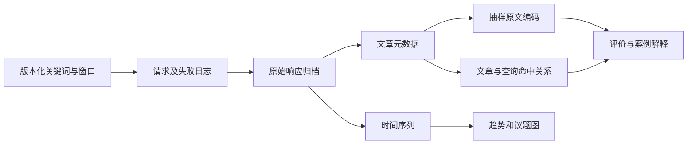

# iPhone 18 Pro 发布前后国际新闻媒体的议题演变与来源国差异

> 研究设计 v0.3（课程版），2026-09-21。题目和核心问题已确认；重点是布尔词设计、结果验证和有限原文分析。当前交付见 [课程作业报告](课程作业报告.md)。
> 本次执行范围：4 个固定 NGrams 文件、65 个候选 URL、16 例核读检查、3 张图及短报告。下文保留的全窗 DOC 采集、阶段占比、国家比例及统计指标均为可选扩展，不再作为作业完成条件；以第 8—10 节当前范围为准。

## 1. 核心研究问题

**围绕 iPhone 18 Pro / Pro Max 的发布，GDELT 所收录国际新闻媒体的关注强度和议题侧重如何随“预热—发布—预购—首发”阶段变化？不同来源国家的媒体是否表现出不同的关注重点和产品评价？**

这里的“舆论反响”包括三层：报道是否增多、围绕什么讨论、如何评价产品。它不直接测量消费者总体态度、真实销量或购买意愿。研究对象限定为 GDELT 检索得到的新闻文本；国家属性指媒体来源地，不是报道提及的国家，也不是作者、读者或消费者的国籍。

这个问题可拆成以下几个可执行的小问题：

| 问题 | 观测对象 | 证据 | 可回答的结论 |
| --- | --- | --- | --- |
| RQ1：报道何时集中出现？ | 每个 UTC 日的基础检索匹配量 | `TimelineVolRaw` 的匹配量及分母 | 发布节点附近的收录报道强度、持续时间 |
| RQ2：各阶段更常讨论什么？ | 六类议题在基础集合中的出现比例 | 相同窗口、相同基础词的议题子查询 | 议题提及结构及其变化 |
| RQ3：来源国家有何差异？ | 各国自身相关报道中的议题比例 | `sourcecountry:` 与议题组合查询 | 各国收录媒体的报道侧重差异 |
| RQ4：如何评价这些变化？ | 抽样报道对产品的实际评价和理由 | 原文核读、引文归属、人工编码；语调曲线作辅助 | 对价格、能力、升级价值等的赞许、批评与混合评价 |

可以检验一个有解释力的预期：**技术能力的讨论是否在发布期更突出，而价格、升级价值、供货等消费决策议题在预购和首发期更突出？** 这是待检验预期；如果数据没有这种变化，或多个议题同时增强，也属于有效结果。避免事先把美国、日本、中国媒体写成固定的立场类型。

课程对应关系：第 2 讲强调样本与代表性，以及定量描述和定性解释的互补；第 3 讲强调关键词检索、数据存储和媒体话语分析。本研究用检索式定义观测对象，用结构化数据保留证据，用小规模原文阅读解释量化差异。

## 2. 时间、产品与来源边界

### 2.1 事件依据与时间窗口

Apple 官方公告标注 2026-09-09 发布 iPhone 18 Pro / Pro Max，09-12 开始预购，09-18 正式发售，见文末事件资料。将这些日期作为阶段划分依据，不把广告措辞当作第三方评价。

| 阶段 | 分析日历范围 | 完整阶段天数 | 作用 |
| --- | --- | ---: | --- |
| 预热期 | 08-26—09-08 | 14 | 建立发布前的讨论基线，保留传闻和预测 |
| 发布期 | 09-09—09-11 | 3 | 观察发布消息和首轮解读 |
| 预购期 | 09-12—09-17 | 6 | 观察价格、升级决策、预购与评测 |
| 首发期 | 09-18—09-25 | 8 | 观察上手体验、供货和持续讨论 |

**正式目标窗口**为 `[2026-08-26 00:00:00Z, 2026-09-26 00:00:00Z)`；本次初步设计的**实际截止点**是 `2026-09-21 00:00:00Z`，只使用已经结束的完整 UTC 日。09-21—09-25 尚未观测，不能填零或写成既有结果。首发期目前只有 3 个完整分析日。

内部统一使用 UTC 和左闭右开的窗口；向接口传参时将结束点转换为前一秒，并在正式采集前核对 API 的边界行为。官方公告日期采用其页面标注的日历日期；如果后续按小时讨论发布效应，必须另行核实事件时刻和时区。主分析按日，补做阶段边界前后移动一天的敏感性检查。

阶段长短不同，所以比较阶段关注强度时使用日均值；议题占比用阶段内分子、分母分别求和后计算。不会把 14 天预热期总量与 3 天发布期总量直接比较为“热度更高”。

### 2.2 产品范围

主集合聚焦 Pro / Pro Max。基本版 iPhone 18、折叠机和其他同期产品只在与目标机型相关时作为比较背景；仅讨论其他产品的记录不进入人工有效样本。综合发布会报道可以进入候选集合，但需要记录目标机型是主角还是顺带提及。

宽口径 `iphone 18` 检索单独用于检查别名遗漏。不得直接将其总量与 Pro 主集合拼接，否则研究对象会改变。

### 2.3 国家和地区

先查看全球来源分布，再检查美国、英国、日本、中国来源媒体的覆盖情况。配置文件暂用这四组，尚未把它们视为可比较的充分样本。

- 查询使用 `sourcecountry:unitedstates`、`sourcecountry:unitedkingdom`、`sourcecountry:japan`、`sourcecountry:china`。使用全名避免把 GDELT 的 FIPS 代码与 ISO 代码混淆。
- 保存接口返回的 `sourcecountry` 原值；后续建立显式映射表。香港、台湾等接口分类如出现，保留原始类别，并在报告中解释分组口径，不悄悄合并。
- 全窗有效文章少于 30 篇，或只有少于 3 个媒体域名的组，优先作案例描述，或合并时间阶段；这是本研究的保守展示规则，不是统计代表性的保证。
- 阶段内分母不足 10 的议题比例标注“小样本”，不作排名。缺少有效分母时记为缺失。
- 若四组覆盖不平衡，可以保留全球概况，将主比较收缩为覆盖较好的两个国家；不得把“未检索到”直接解释为该国不关心。

## 3. 布尔关键词监测组合

### 3.1 将概念变成可运行的查询

设 $B$ 为产品基础集合，$T_k$ 为议题词集合，$C_c$ 为媒体来源过滤条件，$E$ 为明确排除的来源集合：

$$
Q_{k,c}=(B\cap T_k\cap C_c)\setminus E.
$$

在 GDELT DOC 中，空格表达 AND，同义词放在一个 `(... OR ...)` 中，排除条件用前缀 `-`。不使用嵌套 OR 块。英文查询匹配 GDELT 的英文检索文本，包括由其他语言翻译的内容；不限制 `sourcelang:english`，因为那会改变“国际媒体”的覆盖范围。语法依据见文末官方 DOC 文档与更新说明。

基础产品词：

```text
("iphone 18 pro" OR "iphone18 pro" OR "iphone18pro" OR "iphone 18 promax" OR "iphone18 promax")
```

`"iphone 18 pro"` 预计可以匹配包含该连续短语的 Pro Max 报道；需要通过试检索核对，必要时显式补充拼写。不能只凭预期断言已覆盖所有译名。保留拼写变体，是为了检查空格差异对检索的影响。

主查询排除 Apple 自有站点：

```text
-domain:apple.com -domain:apple.com.cn
```

目的是区分企业发布材料与新闻反响。转载企业新闻稿的第三方站点仍可能命中，要在原文核读时标记。该排除规则不等于已经识别了全部独立媒体。

**修正上一版建议：主查询不要求出现 `launch / release`，也不直接添加 `-rumor -leak`。** 前者可能漏掉不重复介绍事件的评测、价格和体验报道；后者会把预热期系统性删弱，还会误删“此前传闻已得到证实”这类发布后报道。发布行为词可作为辅助标签，传闻排除式只作敏感性对照。

### 3.2 议题词典 v0.1

下表是操作化的初稿，不是数据已经证实的议题重要性排序。完整可运行表达式见 `config/study.json` 和程序导出的 `queries.csv`。

| 议题 ID | 所代表的问题 | 关键词示例 | 核读重点 |
| --- | --- | --- | --- |
| `camera` | 影像能力有什么变化？ | camera / cameras / photography / photographic / "variable aperture" | 是否真正讨论目标机型影像能力 |
| `ai` | AI 能做什么、能否使用？ | "artificial intelligence" / "Apple Intelligence" / Siri / "generative AI" / "on-device AI" | 区分 AI 能力评价与无关 AI 背景 |
| `performance_battery` | 性能和日常体验如何？ | performance / chip / chipset / battery / charging / overheating / "A20 Pro" | 性能与续航可在样本足够时再拆分 |
| `price_value` | 价格是否合理、值得升级吗？ | price / prices / pricing / expensive / affordable / value / upgrade / upgrades | value、upgrade 容易产生泛化误匹配 |
| `market_competition` | 如何与其他品牌和市场比较？ | competition / competitor / competitors / Samsung / Huawei / Xiaomi / "market share" / demand | 竞争品牌仅出现在页尾推荐区的噪声 |
| `availability` | 何时能买到、供货如何？ | preorder / preorders / "pre-order" / "pre-orders" / availability / shipment / shipments / delivery / shortage / shortages | 供货描述与营销导购的区别 |

不只检索负面词或正面词，避免采集时预设态度。例如相机讨论既可能赞赏创新，也可能认为升级有限。新增外观、隐私等议题需要原文依据；可在试采集后调整，但正式分析前固定词典版本，并用同一版本重新查询整个窗口。

可直接运行的美国价格议题示例：

```text
("iphone 18 pro" OR "iphone18 pro" OR "iphone18pro" OR "iphone 18 promax" OR "iphone18 promax")
(price OR prices OR pricing OR expensive OR affordable OR value OR upgrade OR upgrades)
-domain:apple.com -domain:apple.com.cn
sourcecountry:unitedstates
```

辅助查询：

1. 宽口径：`("iphone 18" OR "iphone18")` 加相同来源过滤和排除条件，用于发现遗漏。
2. 严格排除传闻：主查询追加 `-rumor -rumors -rumour -rumours -leak -leaks`，检查结论对过滤选择是否敏感。
3. 媒体核验：主查询追加 `domain:具体域名`，检查少量已知相关报道是否能找到。已知相关例子只能诊断遗漏，不能据此声称测出了总体召回率。

配置生成 9 类词组合 × 5 个来源范围 = **45 条可审计检索式**；其中主分析为基础词和六类议题，另外两类是敏感性查询。没有必要第一次就把所有式子完整跑一遍。

### 3.3 先做检索质量检查

课程版选择约 12—16 个诊断案例，覆盖主报道、比较或综述、疑似顺带提及及不同阶段；记录是否属于目标产品、议题是否与产品有关、是否转载、是否营销导购、是否能访问正文。选择规则用于发现正例和反例，不是随机抽样。若以后进行扩大样本的独立检验，可使用下式：

$$
\widehat{\mathrm{Precision}}_k
=\frac{\text{人工确认主题相关的已核读命中数}}{\text{该主题已核读命中数}}.
$$

这个比例只评价已核读样本。本次目的性选择不报告总体准确率，也不设置 80% 通过线；通过具体新增、漏删和误匹配案例验证词典，并在同一固定语料中复算。检索“命中”仅意味着共现，不自动意味着文章主议题。

## 4. 数据采集：汇总层与文章层分工

### 4.1 汇总层：回答时间和议题比例

对基础查询、六类主题查询及来源组调用 `TimelineVolRaw`，固定相同时间窗口，设置 `timelinesmooth=0`。时间窗口超过一周时，文档描述返回日粒度；实际粒度要从响应验证，保留原始时间戳。

接口的匹配量是 GDELT 所报告的记录量，不能称为全网报道总量或独立原创稿数。全球查询可用 `norm` 校正 GDELT 当天总体收录量。国家比较则以该国的基础产品查询作分母，无需依赖一个尚未验证分母语义的国家归一化图。

`TimelineTone` 可提供匹配报道的平均语调，但仅作为补充。在正式运行前验证其返回格式，不从 `ArtList` 臆造单篇 `tone` 字段。若需要精确单篇 GDELT 分数，要额外研究 GKG 关联方案；这不是本次作业必须完成的内容。

### 4.2 文章层：提供可追溯的解释证据

`ArtList` 保存标题、URL、媒体域名、语言、来源国和 `seendate`。它返回元数据而不是完整正文，也不保证含有单篇语调分数。保留字段名称 `seendate_raw`；核实之前不将它重命名为文章原始发布时间。人工从原网页查到的发布时间单独填写，并保留时区或“未知”。

官方文档给出列表上限 250 条，默认相关性排序也会影响样本。初步脚本使用 `DateAsc` 和 25 条上限，仅用于检查接口与字段，**不是总体抽样，也不据此绘制国家报道占比**。

正式文章采集可按以下方式推进：

1. 基础查询按 UTC 日和来源组切片，单次请求 `maxrecords=250`。
2. 若正好返回 250 条，标记 `limit_reached=1`，将该时间段二分并重新查询。
3. 可递归细分到 15 分钟；边界使用重叠并以 URL 去重，核对边界文章是否遗漏。若仍触顶，继续按明确的来源或语言拆分，或明确标注为截断样本。
4. 无论是否触顶，都不声称取得全部真实新闻；接口覆盖和排序仍有边界。若以后实施这条全窗扩展路线，可另定请求预算；旧设计的 200 次预算不再适用于当前课程版。
5. 文章级主题归属来自主题查询命中或人工核读，保存“文章—查询”的多对多关系。不要仅以多语种标题是否含英文关键词来复现全文检索结果。

全量列表递归采集器是可选扩展；本次 `gdelt_probe.py` 已实现有限试检索、审计日志、结构化存储和失败处理，未实现递归补抓。课程版已经使用本地 NGrams 布尔求值完成有限结果分析，不依赖这个扩展。

### 4.3 请求策略与失败处理

- 串行请求，默认至少间隔 6 秒；这是本项目保守设置，不是声称官方允许固定吞吐率。
- 429、部分 5xx、网络错误可有限重试，保留每次尝试；遇到长时间 `Retry-After` 或连续失败，停止当前试采集，保留待运行任务。
- HTTP 200 也需要检查是不是正确 JSON 和预期字段。错误页面、超时、无效 JSON 不能记作零篇文章。
- 每个运行使用独立目录，保存配置快照、请求参数、完整 URL、UTC 请求时间、原始响应和 SHA-256。重复运行不覆盖旧结果。
- 同一天分子的主题查询与分母的基础查询若状态不完整，不计算议题比例；后续索引回补也可能导致不同请求时刻的轻微不一致，应记录并复查。

### 4.4 DOC 受限时的 Web NGrams 备用路线

本次 DOC 试采集的两次请求均返回 HTTP 429。官方在 2026-06-30 的[迁移说明](https://blog.gdeltproject.org/using-the-new-web-ngrams-dataset-to-find-relevant-coverage/)中提供了可供本地检索的分钟四词组文件。一个历史分钟的实测已成功：1,617 条目录记录中命中 61 个文档。它证明局部检索可行，尚不能证明所有日期可用或与 DOC 的检索总体一致。原始证据与复算见[初步实验记录](初步实验记录.md)。

每个时间片包含 `toc.json.gz` 目录与 `ngrams.txt.gz` 词组统计，按 `(file_stamp, DOCID)` 关联。一个文档可出现多个词组命中；判断 AND 必须在**文档集合层**取交集，而不是要求产品词和议题词出现在同一个四词组内。OR 取并集，NOT 从候选集合中剔除。例如：

$$
B_f=\bigcup_{b\in\mathcal B}\{d:b\text{ 在片段 }f\text{ 的文档 }d\text{ 的词组中命中}\},
\qquad
Q_{k,f}=(B_f\cap T_{k,f})\setminus E_f.
$$

其中 $E_f$ 可由目录 URL 的域名得到；国家过滤则需要另外核验媒体来源。现有 `ngrams_probe.py` 只实现产品正则的可行性探针，**尚未实现这套完整布尔求值**，不能将其 61 条结果冒充 DOC 基础查询的返回值。

| 要素 | DOC 主路线 | NGrams 备用路线的处理 |
| --- | --- | --- |
| 产品与议题 | 服务端全文查询 | 对同一文件内的文档集合做布尔运算；保存匹配词组及规则版本 |
| 时间 | 成功的全窗汇总或分片请求 | 固定可追溯的文件清单；缺文件、下载失败和成功但零命中分别记录 |
| 国家 | `sourcecountry` 原值 | 核验媒体域名与来源依据；不由 `lang` 或报道提及国家推定 |
| 语言 | DOC 英文检索与翻译规则 | 实测词组的语言和译文覆盖后设计词典；不预设英文词覆盖全部多语种内容 |
| 关注度 | 验证后的匹配量及 `norm` | 抽样片段只能描述样本量；不得伪造 DOC 日总量或总体归一化分母 |
| 产品立场 | 原文编码；tone 辅助 | 仍需访问原文编码；词组不是全文，不据此重建文章 |

规模先限制在跨日期的最多 12 对文件、压缩传输总预算 150 MiB，用于估算可用性与质量。若采用片段抽样，先固定“阶段 × 日期 × 时段”抽样框、选择规则和随机种子，再执行；不能根据某个时段命中多就临时挑选。缺失必须报告，不能不断换成有结果的片段而仍称为随机样本。

备用路线的主题比例只能解释为“在同一组成功观测片段中的目标产品候选文章，有多少同时命中该议题”。同一 URL 跨片段出现时，先在规定分析范围内去重；所有议题使用相同片段和基础集合。即使比例有了分母，仍受片段选择、词典语言覆盖和转载影响，不代表全窗新闻总体。

因此，正式分析有两种完成路径：DOC 恢复后按第 4.1—4.3 节执行；若持续受限，则将问题收缩为“固定片段样本中的议题结构与来源差异”，重新记录样本边界。两条路线的数据不直接拼成一条时间曲线。

## 5. 结构化存储设计（作业核心）

使用 **原始响应 + SQLite + CSV**。原始文件保留返回内容；SQLite 表达关联关系；UTF-8 BOM CSV 便于用 Excel 检查和作为附件提交。不需要为这次作业搭建数据库服务。



| 表/文件 | 一行表示 | 关键字段与含义 |
| --- | --- | --- |
| `queries` | 一个版本内一条组合查询 | `query_id, version, topic, country, query` |
| `requests` | 一次实际请求尝试 | `request_id, request_key, query_id, mode, start_utc, end_exclusive_utc, requested_at, attempt, status, http_status, item_count, limit_reached, url, raw_path, raw_sha256, error` |
| `articles` | 一个精确 URL | `article_id, url, title, seendate_raw, domain, language, sourcecountry_raw, url_mobile` |
| `article_hits` | 某次查询命中某篇文章 | `request_id, article_id, query_id, result_rank` |
| `timeline_points` | 某次查询的一条时间序列点 | `request_id, query_id, mode, series, date_raw, value, norm` |
| `coding.csv`（后续填写） | 一位编码者对一篇文章的核读 | 文章 ID、相关性、正文是否可访问、时间、主要议题、多标签、产品立场、评价主体、证据摘录及理由 |

请求使用 URL 哈希标识参数组合，但请求尝试有独立 ID。文章 ID 为精确 URL 的 SHA-256；初步阶段不冒险删除 URL 查询参数，因为它们可能标识不同内容。移动端别名、转载、相似标题和正文近重复另行复核。

同一篇文章可以命中 AI、价格和续航三个主题：`articles` 只有一条，`article_hits` 有多条。基础篇数以适当范围内去重的文章 ID 计算；多标签议题总和可能超过基础篇数。不能把各主题结果简单相加当作全部文章。

正式研究另建内容重复簇和纳入标记：报道传播范围可保留不同媒体的转载；评价分析需识别同一新闻稿反复出现的情况。对“全部媒体记录”和“剔除重复宣传材料后的核读样本”分别解释，不把局部去重后的列表分母套在未去重的汇总查询上。

## 6. 指标及解释

令 $n_{c,t}$ 为日期 $t$ 来源组 $c$ 的基础匹配记录量，$n_{k,c,t}$ 为同一条件下主题 $k$ 的记录量，$G_t$ 为 GDELT 当日总体收录量。

全球关注强度：

$$
A_t=100\frac{n_{\mathrm{global},t}}{G_t}.
$$

同时展示原始 $n_{\mathrm{global},t}$ 和 $A_t$，区分“确实多了记录”与“当天整体新闻收录量变化”。`norm` 缺失或为零时不计算，不从文章列表长度推算。

阶段日均匹配量：

$$
\bar n_{c,s}=\frac{\sum_{t\in s}n_{c,t}}{D_s},
$$

其中 $D_s$ 是阶段内**已完整观测且请求有效**的日数。缺失的日子需要在图中留空；若阶段不完整，写清实际截止日，避免与完整阶段作无条件比较。

阶段内主题提及比例：

$$
P_{k,c,s}=100\frac{\sum_{t\in s}n_{k,c,t}}{\sum_{t\in s}n_{c,t}}.
$$

它回答“该国在该阶段关于目标产品的收录报道中，有多少提到这个议题”。它不等于“所有新闻中该议题的份额”，也不等于“该国多少人关心这个议题”。分子分母必须采用同一基础词、排除式、来源过滤和有效日期集合。

因为是多标签共现，$\sum_k P_{k,c,s}$ 可以超过 100%。因此不使用饼图或 100% 堆叠图展示这些查询占比。若需要主要议题的构成图，必须根据统一人工规则将文章赋予一个主议题，并单独说明样本分母。

跨国差异可用百分点差 $P_{k,c_1,s}-P_{k,c_2,s}$ 表达，并在图边列出每组基础匹配量。它是收录媒体的描述性差异，不能据此证明国家文化、政治倾向或发布会的因果影响。

## 7. 报道语调与产品评价

全文可能包含竞争、市场下滑、缺货等负面词，但作者仍认可手机本身；文章也可能引用 Apple 的赞誉而没有表达自己的赞同。因此区分：

- **GDELT tone**：系统对整篇匹配报道的语调度量，辅助描述语言变化。
- **产品评价 stance**：人工判断作者或报道主体如何评价目标产品，可取正面、负面、混合、中性、无法判断。
- **评价主体**：记者/编辑、Apple、分析师、受访消费者或其他被引述者。引用的立场不自动当作作者立场。

本次检查 16 个目的性案例：7 篇相关、4 个排除、5 个无法取得正文。覆盖不足的阶段只报告缺失，不凑国家或阶段配额。原先 60—100 篇的分层编码方案保留为扩展，不是本次任务。无法打开全文的保留元数据并标记，不编造立场。

编码字段模板见 `templates/coding.csv`；本次实际字段见 `data/coursework_reviews.json`。记录证据位置、评价对象和理由，多语种原文的中文摘要只作辅助。本次由助手进行原文核读和初步编码，尚未完成独立第二编码者复核，不虚称双人编码或一致性检验。

## 8. 可视化与报告

| 图 | 横纵轴/分组 | 回答的问题 | 使用条件 |
| --- | --- | --- | --- |
| 图 1：布尔规则独立对照 | 条件；候选 URL 数 | 哪些限制会改变检索集合？ | 同一固定语料，不作逐层漏斗 |
| 图 2：语言词典修订对照 | 议题；英文和补词命中数 | 原文词汇补足了哪些表达？ | 同一批 40 个英／西／法语 URL |
| 图 3：核读案例矩阵 | 页面日期、来源；实质议题；具体评价 | 不同阶段和来源案例如何讨论？ | 7 篇相关原文；不作国家态度比例 |

三张图已经生成 PNG/SVG，嵌入《课程作业报告》。世界地图、词云、全窗趋势和自动语调均不作为本次交付要求。

短报告结构为：研究问题与范围 → 关键词理由与真实命中对照（重点）→ 原文正反例 → 阶段和来源案例 → 有限结论。附件保存关键词注册表、采样和核读记录、原始响应哈希、SQLite/CSV 和复现步骤。

每条结论用“结果—证据—解释—限制”组织。例如：“在本次 GDELT 收录样本中，某阶段价格议题提及比例从 x% 变为 y%；结合若干原文，可见讨论集中于……；但该变化可能受到媒体覆盖和转载的影响。”在取得真实数据前不填 x、y。

## 9. 执行阶段和完成标准

| 环节 | 课程版完成标准 | 当前结果 |
| --- | --- | --- |
| 研究界定 | 明确产品、媒体文本、阶段和来源含义 | 已确认 |
| 有限检索 | 事先说明语料选择，保存真实文件和失败状态 | 四文件，4,774 条目录；65 个候选 URL |
| 布尔验证 | 同一语料对照 OR、AND、NOT 与语言补词 | 注册表、计数、逐例规则命中证据齐备 |
| 原文解释 | 保留有效、排除、未知三种结果及依据 | 16 例检查，7 篇实质相关 |
| 可视化 | 2—3 张与证据范围相称的图 | 3 张 PNG/SVG |
| 写作复核 | 每条结论回到原文，代码和数据口径一致 | 短报告、结构化附件，11 项测试及类型检查通过 |

本次不再以取得 DOC 时间序列、四国配额、全窗递归采集或大规模核读作为完成门槛。阶段与国家的覆盖不足时，直接改为有来源依据的案例比较；未取得的数据不填零。

## 10. 当前实现与下一步

课程版已完成。本地布尔求值与四文件采样由 `scripts/coursework_analysis.py` 实现，核读记录为 `data/coursework_reviews.json`，绘图由 `scripts/plot_coursework.py` 实现。主报告为 `课程作业报告.md`，固定输出为 `data/coursework/20260921T133415_219021Z/`。如以后需要推广为总体结论，再扩大各阶段原文覆盖并进行独立编码复核。

使用说明和本机环境情况见 `README.md`，当前实际结果见 `课程作业报告.md`，早期连通实验见 `初步实验记录.md`。这些文档共同区分“设计可以如何做”与“目前真实验证到哪里”。

## 资料依据

- [课程第 2 讲](../../../大数据与舆论分析导论/大数据与舆论分析导论（2）：舆论分析方法的演进.md)、[课程第 3 讲](../../../大数据与舆论分析导论/大数据与舆论分析导论（3）：数据收集与存储.md)：作业目标和方法定位。
- [Apple 发布公告](https://www.apple.com/newsroom/2026/09/apple-debuts-iphone-18-pro-and-iphone-18-pro-max/)、[中国大陆公告](https://www.apple.com.cn/newsroom/2026/09/apple-debuts-iphone-18-pro-and-iphone-18-pro-max/)、[正式发售记录](https://www.apple.com.cn/newsroom/2026/09/the-latest-iphone-apple-watch-and-airpods-lineups-arrive-in-stores-worldwide/)：事件节点，核对于 2026-09-21。
- [GDELT DOC 2.0 官方说明](https://blog.gdeltproject.org/gdelt-doc-2-0-api-debuts/)：接口模式、布尔规则、来源过滤、列表上限和时间参数。文档发布较早，实际运行结果优先核对，不将其历史范围描述当作当前保证。
- [DOC 接口更新](https://blog.gdeltproject.org/updates-doc-2-0-api/)：英文检索与非英语内容、词形变化和词云限制。
- [原始匹配量模式说明](https://blog.gdeltproject.org/gdelt-2-0-api-now-supports-raw-result-counts/)：`TimelineVolRaw` 的记录量口径。
- [Web NGrams 与检索迁移说明](https://blog.gdeltproject.org/using-the-new-web-ngrams-dataset-to-find-relevant-coverage/)：2026-06-30 发布；文件格式、DOCID 关联、分钟文件节奏与备用路线，2026-09-21 重新核对。

> 研究的主线是：用清楚的检索规则界定“看到了哪些报道”，用结构化存储证明“这些数字从哪里来”，再讨论“关注点如何随时间和来源变化”。这样即使发现与预期不同，也能形成完整且可复核的课程作业。
