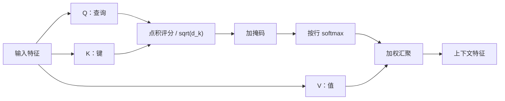
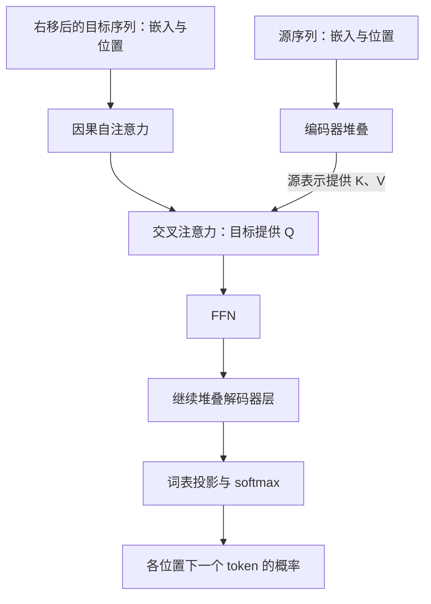
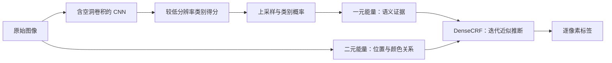

> 本篇讨论两个问题：Transformer 如何通过注意力组织上下文，以及 DeepLab 如何通过条件随机场细化语义分割。

| 主线               | 当前已知的信息        | 需要解决的问题                | 得到什么         |
| ---------------- | -------------- | ---------------------- | ------------ |
| 注意力与 Transformer | 一组 token 的特征向量 | 当前位置应该从哪些位置读取信息        | 融合上下文后的特征    |
| DeepLab 与 CRF    | 图像与每个像素的类别概率   | 哪些像素的标签应该保持一致，哪里应该允许变化 | 考虑像素关系后的标签预测 |

## 注意力与 Transformer

### 从固定汇聚到按需读取

设输入包含 $n$ 个 token，每个 token 用一个 $d$ 维向量表示，按行排列为 $\mathbf X\in\mathbb R^{n\times d}$。token 是模型处理的基本单元：文本中可以是子词，图像中可以是一个图像块，不一定对应完整的词或单个像素。

如果用平均值汇总输入，则 $\bar{\mathbf x}=\frac1n\sum_{j=1}^n\mathbf x_j$，每个位置的权重相同。然而，理解“杯子放不进箱子，因为它太大了”中的“它”，需要根据当前问题判断杯子与箱子的关系，固定平均并不能有针对性地选择信息。

**注意力**（attention）用查询 $\mathbf q_i$ 表示当前位置的信息需求，为候选位置计算权重，再汇聚其内容：

$$
a_{ij}
=\frac{\exp(s_{ij})}{\sum_{r=1}^{n_k}\exp(s_{ir})},
\qquad
\mathbf o_i=\sum_{j=1}^{n_k}a_{ij}\mathbf v_j.
$$

其中 $s_{ij}$ 是位置 $i$ 对位置 $j$ 的评分，$\mathbf v_j$ 是从该位置读取的值，$n_k$ 是可读取位置数。每一行权重满足 $a_{ij}\geq0$、$\sum_j a_{ij}=1$；因此，在没有注意力 dropout 时，单个头的汇聚结果是值向量的加权平均。

这里的关键是：**权重随输入和查询变化**。同一组内容可以因查询不同而产生不同摘要；模型学习的是“如何决定权重”，而不是为每两个固定位置永久存储一个权重。注意力汇聚与核回归的联系可参考[《动手学深度学习》10.2 节](https://zh-v2.d2l.ai/chapter_attention-mechanisms/nadaraya-waston.html)。

### Q、K、V 的含义

查询、键和值分别记为 query、key、value：

| 对象 | 作用 | 直觉 |
| --- | --- | --- |
| $\mathbf q_i$ | 与所有候选键比较 | 当前需要寻找什么信息 |
| $\mathbf k_j$ | 参与匹配评分 | 该位置凭什么被匹配到 |
| $\mathbf v_j$ | 被加权汇聚 | 该位置实际提供什么内容 |

对自注意力，三者来自同一输入，但使用不同投影。以下省略偏置，并将单个向量视为列向量，矩阵中存放其转置：

$$
\begin{aligned}
\mathbf Q&=\mathbf X\mathbf W_Q\in\mathbb R^{n\times d_k},\\
\mathbf K&=\mathbf X\mathbf W_K\in\mathbb R^{n\times d_k},\\
\mathbf V&=\mathbf X\mathbf W_V\in\mathbb R^{n\times d_v},
\end{aligned}
\qquad
\begin{aligned}
\mathbf W_Q,\mathbf W_K&\in\mathbb R^{d\times d_k},\\
\mathbf W_V&\in\mathbb R^{d\times d_v}.
\end{aligned}
$$

$\mathbf W_Q,\mathbf W_K,\mathbf W_V$ 是模型参数，在不同输入之间复用；$\mathbf Q,\mathbf K,\mathbf V$ 则是当前输入产生的中间变量。训练时，任务损失的梯度经过评分与汇聚运算传回这些投影矩阵，使模型逐渐学会有用的匹配关系。

为什么区分键与值？寻找一本书时，可以根据主题索引找到它，再读取正文；用于匹配的特征与最终需要提取的内容可以不同。分开投影允许模型分别学习这两种表示。这个比喻只说明计算角色，实际向量的各维通常没有人为指定的语义。

### 缩放点积注意力

#### 矩阵计算

设查询数为 $n_q$、键值对数为 $n_k$，则：

$$
\mathbf Q\in\mathbb R^{n_q\times d_k},
\quad
\mathbf K\in\mathbb R^{n_k\times d_k},
\quad
\mathbf V\in\mathbb R^{n_k\times d_v}.
$$

**缩放点积注意力**（scaled dot-product attention）定义为：

$$
\boxed{
\mathbf O
=\operatorname{softmax}_{\mathrm{row}}
\left(\frac{\mathbf Q\mathbf K^\top}{\sqrt{d_k}}+\mathbf M\right)\mathbf V
}
$$

其中 $\mathbf M\in\mathbb R^{n_q\times n_k}$ 是加性掩码；允许读取的位置取 $0$，禁止读取的位置取 $-\infty$。没有屏蔽要求时可令 $\mathbf M=\mathbf0$。softmax 沿**每个查询对应的所有键**计算，形状变化为：

$$
\underbrace{\mathbf Q\mathbf K^\top}_{n_q\times n_k}
\quad\longrightarrow\quad
\underbrace{\mathbf A}_{n_q\times n_k}
\quad\longrightarrow\quad
\underbrace{\mathbf A\mathbf V}_{n_q\times d_v}.
$$

第 $i$ 行得到一个查询的输出，因此输出位置数由查询数决定；输出向量维度由值向量决定。评分 $s_{ij}=\mathbf q_i^\top\mathbf k_j/\sqrt{d_k}$ 同时受方向和长度影响，除非另行归一化，否则它并不是余弦相似度。公式与评分函数的比较可参考[教材 10.3 节](https://zh-v2.d2l.ai/chapter_attention-mechanisms/attention-scoring-functions.html)。



#### 为什么除以根号维度

先作尺度分析：假设 $\mathbf q,\mathbf k$ 的各分量相互独立，均值为 $0$、方差为 $1$。这些是便于分析的假设，训练后的特征不一定严格满足。

令 $s=\mathbf q^\top\mathbf k=\sum_{r=1}^{d_k}q_rk_r$，则：

$$
\mathbb E[s]=0,
\qquad
\operatorname{Var}(s)
=\sum_{r=1}^{d_k}\mathbb E[q_r^2]\mathbb E[k_r^2]
=d_k.
$$

点积的标准差随 $\sqrt{d_k}$ 增长。若直接将它送入 softmax，维度增大时更容易出现某个位置权重接近 $1$、其余位置接近 $0$ 的情况。对一行 softmax，雅可比元素为：

$$
\frac{\partial a_j}{\partial s_r}
=a_j(\delta_{jr}-a_r),
$$

其中 $\delta_{jr}$ 在 $j=r$ 时为 $1$，否则为 $0$。当权重过度集中时，许多导数很小，模型难以继续调整位置间的分配。缩放后有：

$$
\operatorname{Var}\left(\frac{s}{\sqrt{d_k}}\right)=1.
$$

因此，根号维度用于抵消点积尺度随维度的增长，为训练提供更合适的起点；它不保证所有注意力始终均匀，也不保证整个网络不会梯度消失。这是原始 [Transformer 论文](https://arxiv.org/abs/1706.03762)采用该缩放的依据。

计算 softmax 时还可以减去该行最大值：

$$
a_j=\frac{\exp(s_j-s_{\max})}{\sum_r\exp(s_r-s_{\max})}.
$$

这一步不改变结果，主要避免指数溢出；它与除以 $\sqrt{d_k}$ 的作用不同。

### 一次注意力手算

只考虑一个查询，令 $d_k=2$，取：

$$
\mathbf q=
\begin{bmatrix}\sqrt2\\0\end{bmatrix},
\quad
\mathbf K=
\begin{bmatrix}
1&0\\
0&1\\
-1&0
\end{bmatrix},
\quad
\mathbf V=
\begin{bmatrix}
1&0\\
0&1\\
1&1
\end{bmatrix}.
$$

这些是投影后的示例数值。缩放评分与权重分别为：

$$
\frac{\mathbf q^\top\mathbf K^\top}{\sqrt2}
=\begin{bmatrix}1&0&-1\end{bmatrix},
\qquad
\mathbf a
=\frac{(e,1,e^{-1})}{e+1+e^{-1}}
\approx(0.665,0.245,0.090).
$$

于是输出为：

$$
\mathbf o^\top
=0.665(1,0)+0.245(0,1)+0.090(1,1)
\approx(0.755,0.335).
$$

第一个键与查询最匹配，因此第一个值贡献最大；另外两个位置仍然提供信息。**注意力通常是软选择**，并非直接复制评分最高位置的向量。若屏蔽第三个位置，需要先将其评分设为 $-\infty$，再对前两个评分重新归一化，权重变为约 $(0.731,0.269,0)$。

### 自注意力、交叉注意力与掩码

#### 信息来自哪里

**自注意力**（self-attention）让同一组 token 相互读取，$\mathbf Q,\mathbf K,\mathbf V$ 都由 $\mathbf X$ 投影得到；“自”指来源相同，不表示每个位置只关注自己。

**交叉注意力**（cross-attention）则让一组特征查询另一组特征。设查询输入为 $\mathbf X_q\in\mathbb R^{n_q\times d}$，被读取输入为 $\mathbf X_s\in\mathbb R^{n_k\times d}$，则：

$$
\mathbf Q=\mathbf X_q\mathbf W_Q,
\qquad
\mathbf K=\mathbf X_s\mathbf W_K,
\qquad
\mathbf V=\mathbf X_s\mathbf W_V.
$$

例如，翻译时目标语言当前位置查询源语言表示；分割时一组掩码查询读取图像特征。两组输入长度可以不同；原始特征维度也可以不同，只要投影后查询与键的维度一致。

#### 哪些位置可以被读取

掩码用于规定信息流动范围，常见两种：

- **填充掩码**：屏蔽用于凑齐批量长度的 padding 位置。
- **因果掩码**：当前位置只读取自己及之前的位置，禁止读取未来。

对长度为 $n$ 的因果自注意力：

$$
M_{ij}=
\begin{cases}
0,&j\leq i,\\
-\infty,&j>i.
\end{cases}
$$

例如长度为 $3$ 时，掩码矩阵是：

$$
\mathbf M=
\begin{bmatrix}
0&-\infty&-\infty\\
0&0&-\infty\\
0&0&0
\end{bmatrix}.
$$

这里允许读取对角线，是因为自回归训练采用**输入与目标错开一位**：输入 $(\mathrm{BOS},y_1,y_2)$，对应预测 $(y_1,y_2,y_3)$。预测 $y_2$ 的位置读取到的是输入 $y_1$，没有读取待预测答案。

训练时正确目标序列已知，可以用教师强制（teacher forcing）并行计算所有位置；生成时下一个 token 尚未知，通常仍需逐步生成。因而，“Transformer 能并行训练”不等于“自回归生成所有 token 都能同时完成”。每个有效查询还应至少保留一个可读取位置，否则整行均被屏蔽时 softmax 没有正常的归一化分布。

### 多头注意力

单个头为一个查询产生一组位置权重；如果需要同时读取多种关系，可以使用**多头注意力**（multi-head attention）。第 $r$ 个头使用自己的投影：

$$
\begin{aligned}
\mathbf H_r
&=\operatorname{Attention}
(\mathbf X\mathbf W_Q^{(r)},
\mathbf X\mathbf W_K^{(r)},
\mathbf X\mathbf W_V^{(r)}),\\
\operatorname{MHA}(\mathbf X)
&=\operatorname{Concat}(\mathbf H_1,\dots,\mathbf H_h)\mathbf W_O.
\end{aligned}
$$

其中 $h$ 为头数，$\mathbf H_r\in\mathbb R^{n\times d_v}$，$\mathbf W_O\in\mathbb R^{hd_v\times d}$。常见设置为 $d_k=d_v=d/h$，要求 $d$ 能被 $h$ 整除。例如 $d=512,h=8$，每个头使用 $64$ 维，拼接后恢复 $512$ 维，再通过 $\mathbf W_O$ 混合。

不同头可以学习不同的位置关系和特征子空间，但并没有预先规定某个头必须表示语法、颜色或边缘；它们也可能学到冗余关系。不能把多头理解为把一个完整的 $d$ 维注意力计算机械复制 $h$ 次。相关结构可参考[教材 10.5 节](https://zh-v2.d2l.ai/chapter_attention-mechanisms/multihead-attention.html)。

在上述固定总宽度的标准设置下，忽略偏置，Q、K、V 和输出投影共约 $4d^2$ 个参数。每个头在所有位置共享自己的参数，所以序列变长会增加计算量，却不会为每对位置增加一组可学习参数。

### 位置从哪里来

#### 没有位置时的对称性

如果不提供位置信息，也没有携带顺序的掩码，纯自注意力只能依据内容建立关系。记 $\operatorname{SA}(\mathbf X)=\operatorname{Attention}(\mathbf X\mathbf W_Q,\mathbf X\mathbf W_K,\mathbf X\mathbf W_V)$，设 $\mathbf P$ 是重排 token 的置换矩阵，则：

$$
\mathbf Q'=\mathbf P\mathbf Q,\quad
\mathbf K'=\mathbf P\mathbf K,\quad
\mathbf V'=\mathbf P\mathbf V.
$$

评分的行和列会同时重排。记 $\mathbf S=\mathbf Q\mathbf K^\top/\sqrt{d_k}$，逐行 softmax 满足：

$$
\operatorname{softmax}_{\mathrm{row}}
(\mathbf P\mathbf S\mathbf P^\top)
=\mathbf P\operatorname{softmax}_{\mathrm{row}}(\mathbf S)\mathbf P^\top.
$$

因此：

$$
\operatorname{SA}(\mathbf P\mathbf X)
=\mathbf P\operatorname{SA}(\mathbf X).
$$

这称为**置换等变性**：打乱输入，输出跟着打乱，内容之间的关系却没有获得新的顺序含义。要区分“甲追乙”和“乙追甲”，模型需要顺序来源。因果掩码本身已引入前后约束，上述无掩码证明不能直接套用于固定因果掩码。

#### 绝对位置与相对位置

一种方法是给 token 表示加位置向量：$\mathbf X^{(0)}=\mathbf E+\mathbf P_{\mathrm{pos}}$。两者形状均为 $n\times d$。原始 Transformer 使用正弦、余弦编码：

$$
\begin{aligned}
\mathrm{PE}(p,2r)&=\sin\left(p/10000^{2r/d}\right),\\
\mathrm{PE}(p,2r+1)&=\cos\left(p/10000^{2r/d}\right).
\end{aligned}
$$

其中 $p$ 是位置，$r=0,\dots,d/2-1$，此处假设 $d$ 为偶数。不同频率提供不同变化尺度；固定偏移可由三角函数加法公式表示为每对坐标上的线性变换。位置编码也可以直接作为参数学习。参见[教材 10.6 节](https://zh-v2.d2l.ai/chapter_attention-mechanisms/self-attention-and-positional-encoding.html)。

**旋转位置编码**（RoPE）把位置作用在查询与键上。先看一个二维分量对，令：

$$
\mathbf R(\theta)=
\begin{bmatrix}
\cos\theta&-\sin\theta\\
\sin\theta&\cos\theta
\end{bmatrix},
\quad
\widetilde{\mathbf q}_i=\mathbf R(i\omega)\mathbf q_i,
\quad
\widetilde{\mathbf k}_j=\mathbf R(j\omega)\mathbf k_j.
$$

由于 $\mathbf R(\alpha)^\top\mathbf R(\beta)=\mathbf R(\beta-\alpha)$，得到：

$$
\widetilde{\mathbf q}_i^\top\widetilde{\mathbf k}_j
=\mathbf q_i^\top\mathbf R((j-i)\omega)\mathbf k_j.
$$

于是评分中的位置作用显式依赖相对距离 $j-i$。高维情形把向量划分成多个二维分量对，使用不同频率旋转。这个推导说明了 RoPE 如何编码相对关系，但不意味着评分只取决于距离，也不保证任意长序列都能可靠外推。参见 [RoFormer](https://arxiv.org/abs/2104.09864)。

### 从注意力到 Transformer 块

注意力负责跨位置读取信息，Transformer 还需要在每个位置加工特征，并让多层网络稳定训练。以下以编码器块为例。

#### 逐位置前馈网络

对输入 $\mathbf H\in\mathbb R^{n\times d}$，前馈网络（feed-forward network，FFN）为：

$$
\operatorname{FFN}(\mathbf H)
=\phi(\mathbf H\mathbf W_1+\mathbf b_1)\mathbf W_2+\mathbf b_2,
$$

其中 $\mathbf W_1\in\mathbb R^{d\times d_{\mathrm{ff}}}$、$\mathbf W_2\in\mathbb R^{d_{\mathrm{ff}}\times d}$，偏置沿 token 维广播。形状按 $n\times d\to n\times d_{\mathrm{ff}}\to n\times d$ 变化；$\phi$ 引入非线性。

FFN 对每个位置使用同一组参数，单独看这一模块并不混合不同 token。注意力让位置之间交流，FFN 则在各位置内部组合特征；两者交替堆叠，可以逐层形成更复杂的上下文表示。

#### 残差与归一化

原始 Transformer 采用 **Post-LN**，即先做残差相加，再做层归一化。省略 dropout 时：

$$
\begin{aligned}
\mathbf U&=\operatorname{LN}
\bigl(\mathbf X+\operatorname{MHA}(\mathbf X)\bigr),\\
\mathbf Y&=\operatorname{LN}
\bigl(\mathbf U+\operatorname{FFN}(\mathbf U)\bigr).
\end{aligned}
$$

残差分支要求输入和输出形状一致。对于 $\mathbf y=\mathbf x+F(\mathbf x)$，局部雅可比为 $\mathbf I+\mathbf J_F$，提供了一条直接传递信号与梯度的路径；但归一化和整个深层计算仍会影响实际梯度。

LayerNorm 对**一个 token 的特征维度**归一化。对 $\mathbf x\in\mathbb R^d$：

$$
\mu=\frac1d\sum_{r=1}^d x_r,
\qquad
v=\frac1d\sum_{r=1}^d(x_r-\mu)^2,
\qquad
\operatorname{LN}(\mathbf x)
=\boldsymbol\gamma\odot
\frac{\mathbf x-\mu\mathbf1}{\sqrt{v+\epsilon}}
+\boldsymbol\beta.
$$

$\boldsymbol\gamma,\boldsymbol\beta\in\mathbb R^d$ 可学习，$\epsilon>0$ 保证数值稳定。这里没有对整个批量或所有 token 共用一个均值。

另一种安排是 **Pre-LN**，先归一化再进入子层：

$$
\begin{aligned}
\mathbf U&=\mathbf X+\operatorname{MHA}(\operatorname{LN}(\mathbf X)),\\
\mathbf Y&=\mathbf U+\operatorname{FFN}(\operatorname{LN}(\mathbf U)).
\end{aligned}
$$

这样残差主路径不必在每个块后立即经过归一化；相关理论与实验说明，归一化位置会影响初始化时的梯度尺度和训练稳定性。两者是不同的模块安排，不能将 Pre-LN 公式写成原始 Transformer 的结构。参见[教材 10.7 节](https://zh-v2.d2l.ai/chapter_attention-mechanisms/transformer.html)与 [On Layer Normalization in the Transformer Architecture](https://arxiv.org/abs/2002.04745)。

> 注意力完成跨位置的信息汇聚，FFN 完成逐位置的非线性加工，残差与归一化帮助多层模块协同训练。一个注意力层还不是完整的 Transformer。

### 编码器、解码器与训练

原始 Transformer 用编码器处理源序列，用解码器生成目标序列。解码器每层依次包含因果自注意力、读取编码器输出的交叉注意力、FFN，各子层配有残差与归一化。



图中省略残差与归一化，仅表示信息流。若解码器输出为 $\mathbf H\in\mathbb R^{T\times d}$，词表为 $\mathcal V$，输出投影矩阵为 $\mathbf W_{\mathrm{vocab}}\in\mathbb R^{d\times|\mathcal V|}$，则 $\mathbf Z=\mathbf H\mathbf W_{\mathrm{vocab}}+\mathbf b\in\mathbb R^{T\times|\mathcal V|}$，随后沿词表维做 softmax。

自回归条件概率与单条序列的训练损失为：

$$
P_\theta(y_{1:T}\mid x)
=\prod_{t=1}^T P_\theta(y_t\mid y_{<t},x),
\qquad
\mathcal L
=-\sum_{t=1}^T\log P_\theta(y_t\mid y_{<t},x).
$$

注意这里存在两种 softmax：注意力 softmax 在**可读取位置之间**分配权重；输出 softmax 在**词表类别之间**分配预测概率。它们的归一化轴和含义不同。

根据任务，可以使用不同组合：

| 结构 | 典型信息流 | 用途 |
| --- | --- | --- |
| 仅编码器 | 有效输入位置通常可以双向交流 | 表示学习、分类、序列标注 |
| 仅解码器 | 标准自回归设置中只读取当前位置及之前输入 | 连续预测下一个 token |
| 编码器—解码器 | 双向编码输入，因果生成输出，并交叉读取输入 | 翻译等条件序列生成 |

这里的“解码器”指 Transformer 中的模块角色。分割网络也会使用“解码器”一词，但它可以只是恢复空间分辨率的卷积模块，未必包含上述三种子层。

### 图像如何进入 Transformer

Vision Transformer（ViT）把图像变成 token 序列。设图像为 $H\times W\times C_{\mathrm{in}}$，划分为边长 $P$ 的不重叠图像块，且 $H,W$ 均能被 $P$ 整除，则：

$$
n=\frac HP\frac WP,
\qquad
\mathbf x_i^{\mathrm{patch}}\in\mathbb R^{P^2C_{\mathrm{in}}},
\qquad
\mathbf e_i^\top
=(\mathbf x_i^{\mathrm{patch}})^\top\mathbf W_E,
$$

其中 $\mathbf W_E\in\mathbb R^{P^2C_{\mathrm{in}}\times d}$。例如 $224\times224$ 图像取 $P=16$，得到 $14\times14=196$ 个图像 token；分类时可另加一个分类 token。

分割需要保留空间对应关系。图像 token 的输出可以恢复为二维特征排列，再经多尺度融合和预测头生成像素标签；不能只保留一个整图类别向量。图像块过大会压缩细节，直接使用大量小块又会增加全局注意力开销。参见 [ViT](https://arxiv.org/abs/2010.11929)。

[Swin Transformer](https://arxiv.org/abs/2103.14030)通过局部窗口和移位窗口控制计算范围，并建立层次化特征。若每个窗口含 $m$ 个 token，共约 $n/m$ 个窗口，则窗口内评分的总计算量为 $(n/m)\,O(m^2d)=O(nmd)$。固定窗口大小时，它对 token 总数近似线性，但单层窗口注意力不能直接连接任意两个远处位置。

### 计算代价与前沿延伸

#### 二次开销来自哪里

在标准多头设置下，各头总宽度为 $d$，全局自注意力的两次核心乘法 $\mathbf Q\mathbf K^\top$ 与 $\mathbf A\mathbf V$ 共需 $O(n^2d)$ 量级计算；Q、K、V 和输出投影约为 $O(nd^2)$，FFN 约为 $O(nd\,d_{\mathrm{ff}})$。

若显式保存所有头的注意力矩阵，存储量为 $O(hn^2)$。例如单个样本、单层、$h=8,n=4096$，仅一个以 16 位浮点数存储的注意力张量就需要：

$$
8\times4096^2\times2\ \text{字节}=256\ \text{MiB}.
$$

这还不包含其他激活值、梯度和优化器状态。序列长度翻倍，该张量大小变为四倍。参数量不随 $n$ 平方增长，**位置交互的计算和中间结果**才是这里的主要问题。

#### 改善计算的不同路线

下面选取截至 **2026 年 9 月 29 日** 已公开、与基础公式直接相关的代表性工作；年份采用首次公开年份，不表示同一排行榜上的先后。

| 方法 | 主要改变 | 与标准注意力的关系 |
| --- | --- | --- |
| FlashAttention（2022） | 分块计算与在线 softmax，减少显存读写 | 保留稠密注意力的数学运算，不显式存储完整注意力矩阵 |
| FlashAttention-3（2024） | 结合 Hopper GPU 的异步执行和低精度计算 | 进一步提高硬件利用率；具体精度路径存在相应舍入或量化误差 |
| GQA（2023） | 多个查询头共享一组键、值头 | 减少自回归推理的 KV 缓存与读取开销 |
| Native Sparse Attention（2025） | 结合压缩信息、选定 token 块和局部窗口 | 改变连接与汇聚方式，并将稀疏计算纳入训练 |

[FlashAttention](https://arxiv.org/abs/2205.14135)的重点是减少数据搬运：不把整个 $n\times n$ 矩阵写入显存，仍可分块累积正确的归一化结果。它没有消除所有 token 对之间的计算，因此不能据此称稠密注意力的算术复杂度已变成线性。[FlashAttention-3](https://arxiv.org/abs/2407.08608)进一步说明，相同数学结构的实际速度还受硬件调度与数值精度影响。

自回归生成时，历史 token 在因果约束下的表示无需因新 token 到来而重算，可以缓存各层历史的 K、V。若一层使用 $h_{\mathrm{kv}}$ 个键值头、各头键和值的维度均为 $d_k$，批量为 $B$，缓存包含约 $2Bnh_{\mathrm{kv}}d_k$ 个元素；因子 $2$ 来自 K 和 V。[GQA](https://arxiv.org/abs/2305.13245)减小 $h_{\mathrm{kv}}$，但查询仍可能读取全部历史位置，因此它与缩短上下文或稀疏连接并不是同一件事。

[Native Sparse Attention](https://arxiv.org/abs/2502.11089)把粗粒度压缩、细粒度选择和局部窗口结合起来。由此可以理解一个工程问题：少算一些位置只有在选择、访存和并行方式也高效时，才会转化为实际加速；不能只根据非零权重数量判断运行速度。

### 思考与小结

1. **如果所有键相同，会怎样？** 对同一个查询，所有未屏蔽位置的评分相同，权重均匀；即使值不同，也只能得到这些值的平均。
2. **自注意力矩阵一定对称吗？** 不一定。Q、K 的投影通常不同；即使原始评分矩阵对称，各行 softmax 的分母也可能不同。
3. **较大注意力权重就是对最终预测贡献较大吗？** 不能直接等同。输出还取决于值向量、输出投影、残差和后续层；权重图可以帮助观察信息读取，但单独不能证明因果贡献。

> 注意力以内容相关的权重汇聚信息；Transformer 将这种跨位置交流与逐位置加工反复组合。理解它时，应同时追踪“谁查询谁”“沿哪个维度归一化”“哪些连接允许发生”以及“输出是什么形状”。

## DeepLab 与条件随机场

### 像素分类还缺少什么

设输入图像为 $\mathbf I\in\mathbb R^{H\times W\times3}$，共有 $N=HW$ 个像素、$C$ 个语义类别。将像素按固定顺序编号，标签随机变量为 $Y_1,\dots,Y_N$，每个 $Y_i\in\{1,\dots,C\}$。

分割网络为每个像素输出 logits $z_i(l)$，经类别维 softmax 得到：

$$
p_i(l)=\frac{\exp(z_i(l))}{\sum_{c=1}^C\exp(z_i(c))},
\qquad
\hat y_i=\arg\max_l p_i(l).
$$

将各像素分别分类，对应一种条件分解：

$$
P_{\mathrm{ind}}(\mathbf y\mid\mathbf I)
=\prod_{i=1}^N p_i(y_i).
$$

这里的“分别”是指**给定图像后，输出标签的概率模型按像素分解**，并不是说网络只看当前像素。卷积感受野或注意力已经可以让 $p_i$ 利用周围乃至整张图像的信息；问题在于，最终标签之间没有额外的显式一致性约束。

例如，同一片天空中可能出现零散的“建筑”像素，物体边缘附近的预测也可能比较模糊。单纯把低分辨率得分图插值放大，只会依据已有得分进行平滑，不能主动判断高分辨率图像中的哪一条颜色边缘应当成为语义边界。

### DeepLab 中 CRF 的位置

早期 DeepLab 将两个任务分开处理：深度网络提供语义判断，条件随机场利用像素关系细化标签。典型流程为：



空洞卷积通过拉开采样间隔，在不增加核权重数量的情况下扩大覆盖范围；配合减少部分下采样，可以保留更密集的特征。它帮助网络兼顾上下文和分辨率，但不能保证输出恰好贴合每个物体边界。

**全连接条件随机场**（fully connected CRF，也称 DenseCRF）接收网络的类别概率，同时读取原图的位置与颜色信息，判断哪些标签组合更合理。这是[早期 DeepLab](https://arxiv.org/abs/1412.7062)的典型后处理设计。后续版本对多尺度特征与解码器进行了改进，不能把 CRF 视为所有 DeepLab 版本都必需的组成部分。

### 条件随机场的定义

**条件随机场**（conditional random field，CRF）直接建模给定输入后的输出联合分布 $P(\mathbf Y\mid\mathbf I)$。“条件”表示图像 $\mathbf I$ 已知；“随机场”表示多个标签变量按图结构关联，而非逐个互不相关地决定。

图中的节点是标签变量 $Y_i$，边表示标签间的相互作用。图像分割可以使用四邻域、八邻域或全连接图；自然语言中的线性链 CRF 只是另一种图结构。DenseCRF 含大量环路，不能直接沿用线性链的前向后向算法来完成精确推断。概率图模型背景可参考 Sutton 与 McCallum 的教材式综述 [An Introduction to Conditional Random Fields](https://arxiv.org/abs/1011.4088)。

用能量函数表示条件分布：

$$
P(\mathbf y\mid\mathbf I)
=\frac{\exp[-E(\mathbf y;\mathbf I)]}{Z(\mathbf I)},
\qquad
Z(\mathbf I)=
\sum_{\mathbf y\in\{1,\dots,C\}^N}
\exp[-E(\mathbf y;\mathbf I)].
$$

$Z(\mathbf I)$ 称为配分函数，对全部 $C^N$ 种标签组合归一化。固定图像时，能量越低，标签组合概率越大；最大后验（MAP）预测满足：

$$
\mathbf y^\star
=\arg\max_{\mathbf y}P(\mathbf y\mid\mathbf I)
=\arg\min_{\mathbf y}E(\mathbf y;\mathbf I).
$$

求最优标签时可以忽略与 $\mathbf y$ 无关的 $Z(\mathbf I)$，但这不代表训练或计算完整分布时也可以随意忽略它。“随机场”描述的是标签的不确定性，预测过程并不要求随机给像素分配标签。

### 一元能量与二元能量

考虑一元项与成对项组成的 CRF：

$$
E(\mathbf y;\mathbf I)
=\sum_{i=1}^N\psi_{u,i}(y_i)
+\sum_{i<j}\psi_p(y_i,y_j).
$$

这里省略了势函数对图像的依赖，$i<j$ 保证每个无向像素对只计一次。本篇把 $\psi$ 直接称为能量项；一些概率图教材则把 $\exp(-\psi)$ 称为势函数，阅读时应注意符号约定。

#### 一元项：保留语义证据

早期 DeepLab 使用网络类别概率构造：

$$
\psi_{u,i}(l)=-\log p_i(l).
$$

网络越支持某个类别，将像素分给该类的代价就越小。例如 $p_i(l)=0.9$ 时，代价约为 $0.105$；概率为 $0.1$ 时，代价约为 $2.303$。

如果删除全部二元项：

$$
\exp[-E(\mathbf y)]
=\prod_i p_i(y_i),
\qquad
Z=\prod_i\sum_l p_i(l)=1,
$$

因此 CRF 恰好退化为独立像素分类。这说明它是在网络证据之上加入标签关系，而不是另起一个不依赖网络的分类器。

#### 二元项：约束标签关系

一种简单形式是：

$$
\psi_p(y_i,y_j)
=b_{ij}\,\mu(y_i,y_j),
\qquad
\mu(l,l')=\mathbf1[l\neq l'].
$$

$\mu$ 为 Potts 标签兼容函数：相同标签不加罚，不同标签增加代价。$b_{ij}=b_{ji}\geq0$ 表示两个像素应当保持一致的强度。

对于位置接近、外观相似的两个像素，取较大的 $b_{ij}$；对于明显跨越颜色边缘的像素，可让 $b_{ij}$ 较小。于是二元项并不要求整张图标签相同，而是要求**有较强关联的像素尽量一致**。若相互作用过强，它仍可能压过一元项并造成过度平滑。

### DenseCRF 的高斯核

DenseCRF 为所有不同像素对建立成对项，但连接强度由图像特征决定。设 $\mathbf r_i\in\mathbb R^2$ 为像素坐标，$\mathbf c_i\in\mathbb R^3$ 为颜色向量，常见权重为：

$$
\begin{aligned}
b_{ij}
={}&w_{\mathrm{app}}
\exp\left(
-\frac{\|\mathbf r_i-\mathbf r_j\|^2}{2\sigma_\alpha^2}
-\frac{\|\mathbf c_i-\mathbf c_j\|^2}{2\sigma_\beta^2}
\right)\\
&+w_{\mathrm{sm}}
\exp\left(
-\frac{\|\mathbf r_i-\mathbf r_j\|^2}{2\sigma_\gamma^2}
\right),
\qquad i\neq j,
\end{aligned}
$$

其中 $w_{\mathrm{app}},w_{\mathrm{sm}}\geq0$，三个带宽均为正；约定 $b_{ii}=0$。

| 项 | 使用的信息 | 倾向 |
| --- | --- | --- |
| 外观核（appearance kernel） | 空间距离与颜色差异 | 让距离近、颜色相似的像素取得一致标签 |
| 平滑核（smoothness kernel） | 空间距离 | 抑制小范围孤立预测，提供局部平滑 |

$\sigma_\alpha$ 控制外观核的空间范围，$\sigma_\beta$ 控制对颜色差异的容忍度，$\sigma_\gamma$ 控制平滑核的空间范围。带宽越大，权重随相应差异衰减得越慢；“全连接”表示原则上考虑所有像素对，不表示远处像素都具有很大影响。模型与高效推断方法来自 [Krähenbühl 与 Koltun 的 DenseCRF 工作](https://arxiv.org/abs/1210.5644)（NeurIPS 2011，arXiv 版本为 2012 年）。

固定空间距离，只观察颜色因子 $k(\Delta)=\exp[-\Delta^2/(2\sigma_\beta^2)]$：

```tikz
\begin{document}
\begin{tikzpicture}[xscale=1.5,yscale=3.0]
  \draw[->] (0,0) -- (4.3,0) node[right] {$\Delta$};
  \draw[->] (0,0) -- (0,1.15) node[above] {$k(\Delta)$};
  \draw[dashed,color=gray] (0,1) -- (4,1);
  \draw[color=red,thick,domain=0:4,samples=100]
    plot (\x,{exp((0-\x*\x)/2)});
  \draw[color=blue,thick,domain=0:4,samples=100]
    plot (\x,{exp((0-\x*\x)/8)});
  \node[color=red,right] at (1.1,0.25) {$\sigma_\beta=1$};
  \node[color=blue,right] at (2.4,0.63) {$\sigma_\beta=2$};
  \node[left] at (0,1) {$1$};
  \node[below left] at (0,0) {$0$};
\end{tikzpicture}
\end{document}
```

图中 $\Delta$ 为颜色差异，单位与 $\sigma_\beta$ 一致。较小的颜色带宽更容易阻断跨颜色边缘的信息传递，但同一物体内部的纹理也可能被当成边界；带宽过大则可能把不同物体连在一起。RGB 若从 $[0,255]$ 缩放到 $[0,1]$，颜色带宽也应相应调整，不能直接复用原数值。

平滑核不考虑颜色，即使外观核已被颜色差异压低，它仍可能跨越边界传递信息。因此，CRF 的边界保持能力取决于一元项、两个核及其强度之间的平衡，并非只要加入高斯核就能正确恢复边界。

### 两个像素的能量比较

设只有两个像素、前景 $F$ 与背景 $B$ 两类，网络概率为：

$$
(p_1(F),p_1(B))=(0.55,0.45),
\qquad
(p_2(F),p_2(B))=(0.10,0.90).
$$

逐像素分类得到 $(F,B)$。假设两像素外观相似，取 $b_{12}=0.8$，全部四种组合的能量为：

| $(y_1,y_2)$ | 一元项之和 | 二元项 | 总能量 |
| --- | --- | --- | --- |
| $(F,F)$ | $-\log0.55-\log0.10\approx2.900$ | $0$ | $2.900$ |
| $(F,B)$ | $-\log0.55-\log0.90\approx0.703$ | $0.8$ | $1.503$ |
| $(B,F)$ | $-\log0.45-\log0.10\approx3.101$ | $0.8$ | $3.901$ |
| $(B,B)$ | $-\log0.45-\log0.90\approx0.904$ | $0$ | $0.904$ |

最低能量变为 $(B,B)$。像素 1 原本只略微偏向前景，像素 2 则强烈支持背景；一致性项使像素 1 接受了更有力的邻近证据。

如果它们位于明显的颜色边界两侧，令 $b_{12}=0.05$，则 $(F,B)$ 的能量降为约 $0.753$，低于 $(B,B)$ 的 $0.904$，标签变化被保留下来。

固定 $y_2=B$ 时，两种选择的能量差为：

$$
E(F,B)-E(B,B)
=\log\frac{0.45}{0.55}+b_{12}.
$$

只有 $b_{12}>\log(0.55/0.45)\approx0.201$，一致性收益才足以让像素 1 改判。这个小例子说明：CRF 在**网络证据与关系约束之间比较代价**，并非简单执行邻居多数投票。

### 为什么需要近似推断

上例可以枚举 $2^2$ 个组合，实际图像却有 $C^N$ 个组合。全连接图还有 $N(N-1)/2$ 条无向边，一般多类别情形下，精确求解联合分布或全局 MAP 都很困难。

DenseCRF 使用**均值场近似**（mean-field approximation），用一个可分解分布近似真实的标签联合分布：

$$
\mathcal Q(\mathbf y)=\prod_{i=1}^N q_i(y_i),
\qquad
q_i(l)\geq0,\quad \sum_{l=1}^Cq_i(l)=1.
$$

这里 $q_i(l)$ 是像素 $i$ 属于类别 $l$ 的近似边缘概率，与前半篇的查询向量 $\mathbf q_i$ 含义不同。目标为：

$$
\min_{\{q_i\}}
D_{\mathrm{KL}}\bigl(\mathcal Q\|P(\cdot\mid\mathbf I)\bigr).
$$

“用独立分布近似”并不意味着删除关系项：更新一个 $q_i$ 时仍需要其他位置当前的概率。真实相关性被压缩成其他像素传来的平均影响，因而便于计算，但无法完整表示复杂的联合不确定性。变分近似的基础可参考 [Stanford CS228：Variational Inference](https://ermongroup.github.io/cs228-notes/inference/variational/)。

### 均值场更新的推导

#### 展开优化目标

将 $\log P(\mathbf y\mid\mathbf I)=-E(\mathbf y)-\log Z$ 代入 KL 散度：

$$
\begin{aligned}
D_{\mathrm{KL}}(\mathcal Q\|P)
&=\sum_{\mathbf y}\mathcal Q(\mathbf y)
\log\frac{\mathcal Q(\mathbf y)}{P(\mathbf y\mid\mathbf I)}\\
&=\sum_i\sum_l q_i(l)\log q_i(l)
+\mathbb E_{\mathcal Q}[E(\mathbf Y)]
+\log Z.
\end{aligned}
$$

其中能量期望为：

$$
\mathbb E_{\mathcal Q}[E]
=\sum_i\sum_l q_i(l)\psi_{u,i}(l)
+\sum_{i<j}\sum_{l,l'}q_i(l)q_j(l')\,b_{ij}\mu(l,l').
$$

第一项 $\sum q\log q$ 是负熵，第二项鼓励较低能量；$\log Z$ 对当前待优化的 $q_i$ 是常数。

#### 固定其他位置

固定全部 $q_j$（$j\neq i$），只优化 $q_i$。假设标签兼容函数对称，取出与它有关的项：

$$
\mathcal F_i
=\sum_l q_i(l)\log q_i(l)
+\sum_l q_i(l)
\left[
\psi_{u,i}(l)+
\sum_{j\neq i}b_{ij}\sum_{l'}\mu(l,l')q_j(l')
\right].
$$

用拉格朗日乘子 $\lambda_i$ 约束 $\sum_lq_i(l)=1$，求导并令其为零：

$$
\log q_i(l)+1+\psi_{u,i}(l)
+\sum_{j\neq i}b_{ij}\sum_{l'}\mu(l,l')q_j(l')
+\lambda_i=0.
$$

因此：

$$
\boxed{
q_i^{(t+1)}(l)
\propto
\exp\left[
-\psi_{u,i}(l)
-\sum_{j\neq i}b_{ij}
\sum_{l'}\mu(l,l')q_j^{(t)}(l')
\right]
}
$$

最后在**当前像素的类别维度**归一化，使 $\sum_lq_i^{(t+1)}(l)=1$。这个式子把全局组合问题转成反复更新各像素概率的问题。

### 一轮更新怎样执行

#### 消息传递与类别兼容

通常从网络概率初始化：$q_i^{(0)}(l)=p_i(l)$。定义类别消息：

$$
m_i^{(t)}(l)=\sum_{j\neq i}b_{ij}q_j^{(t)}(l).
$$

它表示其他像素按关系强度加权后，对类别 $l$ 提供了多少支持。消息汇总后，标签兼容变换为：

$$
c_i^{(t)}(l)
=\sum_{l'}\mu(l,l')m_i^{(t)}(l'),
\qquad
q_i^{(t+1)}
=\operatorname{softmax}_{l}
\bigl(-\boldsymbol\psi_{u,i}-\mathbf c_i^{(t)}\bigr).
$$

这里 $\boldsymbol\psi_{u,i}$ 与 $\mathbf c_i^{(t)}$ 均为当前像素的 $C$ 维类别向量。对 Potts 模型 $\mu(l,l')=\mathbf1[l\neq l']$：

$$
\begin{aligned}
c_i^{(t)}(l)
&=\sum_{l'\neq l}m_i^{(t)}(l')\\
&=\underbrace{\sum_{j\neq i}b_{ij}}_{\text{与类别 }l\text{ 无关}}
-m_i^{(t)}(l).
\end{aligned}
$$

softmax 对所有类别同时加减同一常数不变，于是更新可以简化为：

$$
\boxed{
q_i^{(t+1)}(l)
=
\frac{p_i(l)\exp[m_i^{(t)}(l)]}
{\sum_c p_i(c)\exp[m_i^{(t)}(c)]}
}
$$

原来的“惩罚与其他像素不一致”，等价于更新时“增加其他像素对同一类别的支持”。注意每轮使用的是固定的一元证据 $p_i(l)$；不能擅自把它换成上一轮的 $q_i^{(t)}(l)$，否则会改变推断过程。

#### 接续两像素例子

仍取 $b_{12}=0.8$。像素 2 初始为 $(0.1,0.9)$，传给像素 1 的消息是：

$$
m_1^{(0)}(F)=0.8\times0.1=0.08,
\qquad
m_1^{(0)}(B)=0.8\times0.9=0.72.
$$

更新后：

$$
q_1^{(1)}(F)
=\frac{0.55e^{0.08}}{0.55e^{0.08}+0.45e^{0.72}}
\approx0.392,
\qquad
q_1^{(1)}(B)\approx0.608.
$$

像素 1 从略偏前景变为偏向背景。若 $b_{12}=0.05$，消息改为 $(0.005,0.045)$，得到 $q_1^{(1)}(F)\approx0.540$，仍保留前景判断。前面的能量枚举给出该小例子的精确 MAP；这里展示的是一次近似概率更新，两者不是同一种计算。

#### 迭代与输出

实际计算会反复执行“消息传递 → 兼容变换 → 结合一元项 → 类别归一化”，经过 $T$ 轮后输出 $\hat y_i=\arg\max_lq_i^{(T)}(l)$。

需要区分三件事：

- 均值场优化的是可分解近似分布，并非直接枚举寻找全局最低能量标签。
- 对近似边缘概率逐像素取最大值，不保证得到原始 CRF 的精确联合 MAP。
- 前面的推导对应固定其他变量时的坐标更新。工程中常并行更新全部像素并只运行有限轮，不能据此保证每轮 KL 都下降或一定收敛到全局最优。

> 均值场把其他像素当前的类别分布变成“平均意见”，再与当前像素的一元证据结合。独立的是近似分布的表示形式，信息更新仍然相互依赖。

### 全连接计算如何加速

朴素计算 $m_i(l)=\sum_{j\neq i}b_{ij}q_j(l)$，每个像素都遍历所有像素，消息传递每轮需要 $O(N^2C)$ 量级计算。

DenseCRF 利用 $b_{ij}$ 是少量高斯核之和这一结构。以外观核为例，定义五维特征：

$$
\mathbf f_i=
\left(
\frac{r_{i,x}}{\sigma_\alpha},
\frac{r_{i,y}}{\sigma_\alpha},
\frac{c_{i,R}}{\sigma_\beta},
\frac{c_{i,G}}{\sigma_\beta},
\frac{c_{i,B}}{\sigma_\beta}
\right)^\top.
$$

则该核可写为 $k(\mathbf f_i,\mathbf f_j)=\exp[-\|\mathbf f_i-\mathbf f_j\|^2/2]$。对每个类别，$\sum_jk(\mathbf f_i,\mathbf f_j)q_j(l)$ 可以看成在这个特征空间中对概率值做高斯滤波，而不必显式建立全部像素对权重矩阵。

高维滤波可通过 permutohedral lattice 等方法近似实现；在核数量、特征维度和类别数固定时，相关消息传递可近似做到对像素数线性增长。若滤波包含自身项，需按所用核的约定去掉它，以对应 $j\neq i$。一般标签兼容矩阵还会带来类别之间的计算，不能把“消息传递加速”理解为任意 CRF 都能线性求解。

这种加速与普通图像模糊不同：滤波距离同时考虑坐标和颜色，空间相近但颜色差异大的像素可能相隔很远。CRF 还会反复结合一元项和类别归一化，因此也不等同于对预测图做一次双边滤波。

### 训练与后处理的区别

早期 DeepLab 先用像素监督训练网络，再调节 CRF 参数并在预测时做后处理。假设全部像素都有标签，网络可使用：

$$
\mathcal L_{\mathrm{pixel}}
=-\frac1N\sum_i\log p_i(y_i^{\mathrm{true}}).
$$

此时学习的是网络参数；执行 CRF 推断时，主要更新的是当前图像的 $q_i(l)$，网络权重不因推断迭代而改变。应区分**训练参数**与**对给定图像推断标签**。

如果直接训练参数化 CRF 的条件似然，则：

$$
-\log P_\theta(\mathbf y^{\mathrm{true}}\mid\mathbf I)
=E_\theta(\mathbf y^{\mathrm{true}};\mathbf I)
+\log Z_\theta(\mathbf I).
$$

配分函数依赖参数 $\theta$，不能像 MAP 预测时那样直接删除。完整概率训练与“先训 CNN、再做 CRF 后处理”是不同方案。

[CRF-RNN（2015）](https://arxiv.org/abs/1502.03240)将有限次均值场迭代展开为可微计算层，并通过反向传播联合学习网络和相应的 CRF 参数。“RNN”指的是反复应用推断更新，不是图像变成了按时间采样的序列。对展开后的输出计算分割损失，也不自动等于精确优化原始 CRF 的条件似然。

### DeepLab 的演化与局限

#### 各版本解决什么问题

| 版本 | 主要设计 | CRF 的位置 |
| --- | --- | --- |
| DeepLabv1（2014/2015） | 空洞卷积获得较密集的语义得分 | 用全连接 CRF 细化边界 |
| DeepLabv2（2016） | 引入空洞空间金字塔池化 ASPP，汇聚多尺度上下文 | 仍使用 CRF 后处理 |
| DeepLabv3（2017） | 改进空洞卷积、多尺度汇聚和训练方案 | 论文主要结果不使用 DenseCRF 后处理 |
| DeepLabv3+（2018） | 加入融合浅层特征的解码器，并采用空洞可分离卷积 | 通过网络内的解码过程细化边界，主要结果不依赖 CRF |

其中 v1 同列首次公开与会议年份，其他行采用首次公开年份。[DeepLabv2](https://arxiv.org/abs/1606.00915)中的 ASPP（Atrous Spatial Pyramid Pooling）使用不同空洞率的分支观察不同范围，再汇聚上下文；它主要回答“需要看多大的范围”。CRF 则根据原图关系调整输出标签，侧重“边界应该落在哪里”。

[DeepLabv3](https://arxiv.org/abs/1706.05587)与 [DeepLabv3+](https://arxiv.org/abs/1802.02611)表明，可以通过更好的特征、训练和解码结构降低对外部 CRF 的依赖。v3+ 将高层语义特征与较高分辨率的浅层特征融合，使边界恢复成为网络可以学习的过程。

#### 什么时候可能变差

Potts DenseCRF 依赖“距离近、颜色相近，标签也倾向相同”的假设，它并不总符合语义：

- 白色物体与白色背景颜色相似，较强关联可能把边界抹掉。
- 同一物体内部纹理复杂，颜色差异可能阻断本应连贯的信息传递。
- 细小目标的一元证据较弱时，周围大面积背景可能将其压制。
- 网络把整片区域高置信度地分错类别时，颜色核通常无法凭空补出缺失的语义知识。

因此，加入 CRF 是否有效，应在相同网络输出上比较细化前后结果，观察整体 mIoU、边界区域与细小目标，同时记录额外推理时间。不能仅凭边缘看上去更锐利，就认定语义预测更准确。

### 从 CRF 到现代分割

#### 学习上下文与预测掩码

[SegFormer（2021）](https://arxiv.org/abs/2105.15203)使用层次化 Transformer 编码器生成多尺度特征，再用轻量 MLP 解码器融合并预测语义类别。可以把它理解为在**特征形成阶段**增强上下文，再从融合后的表示生成标签；这与经典 DenseCRF 在**已有类别概率之上**施加显式关系约束的侧重点不同。

[Mask2Former（2021/2022）](https://arxiv.org/abs/2112.01527)进一步使用一组查询预测类别与掩码。其 masked attention 将查询读取图像特征的范围限制在当前预测掩码对应区域内，可以示意为：

$$
\operatorname{softmax}_{\mathrm{row}}
\left(
\frac{\mathbf Q_{\mathrm{mask}}\mathbf K_{\mathrm{img}}^\top}{\sqrt{d_k}}
+\mathbf M_{\mathrm{region}}
\right)\mathbf V_{\mathrm{img}}.
$$

这里写的是便于对照前文的缩放点积形式：$\mathbf M_{\mathrm{region}}$ 表示区域约束。它与语言生成中的因果掩码作用不同：前者约束“读取哪片图像区域”，后者约束“能否读取未来位置”。相同的注意力运算可以因查询来源和掩码定义不同而承担不同任务。

截至本篇查阅日期，更近的代表工作 [SAM 3（2025）](https://arxiv.org/abs/2511.16719)根据短语、图像示例等概念提示，在图像与视频中检测、分割和跟踪相匹配的物体。这又改变了输出要求：从固定类别的逐像素标注，扩展到由提示指定目标的概念分割；它不能直接等同于为整张图的每个像素分配一个预定义语义类别。

这些研究提供了不同的改进位置：增强特征、学习掩码间与图像间的关系，或改变任务提示方式。它们并不构成“Transformer 必然优于 CRF”的结论，实际效果仍受数据、分辨率、训练与计算预算影响。

#### 与注意力的联系

把单头注意力与 Potts CRF 的均值场消息并列：

$$
\underbrace{\mathbf o_i=\sum_j a_{ij}\mathbf v_j}_{\text{注意力：汇聚特征}},
\qquad
\underbrace{m_i(l)=\sum_{j\neq i}b_{ij}q_j(l)}_{\text{CRF：汇聚类别支持}}.
$$

两者都可以看成图上的加权消息传递，但这只是计算结构上的联系：

| 比较 | 标准点积注意力 | 本篇 Potts DenseCRF |
| --- | --- | --- |
| 传递内容 | 学习得到的值向量 | 当前类别概率 |
| 关系来源 | 查询与键的匹配 | 位置、颜色高斯核 |
| 权重性质 | 每个查询对应一行归一化权重，通常不对称 | 本篇 $b_{ij}$ 对称，通常不按行归一化 |
| softmax 的轴 | 被读取的位置 | 当前像素的类别 |
| 更新目的 | 构造供后续任务使用的特征 | 近似推断低能量模型的标签分布 |
| 概率含义 | 一行权重不是整个标签配置的联合分布 | 从明确的条件联合分布与能量函数出发 |

因此，可以借助“信息从其他位置流过来”理解两者，但不能把一次注意力直接解释成 CRF 推断，也不能把任意注意力层都赋予同一个全局能量函数。

### 思考与小结

1. **二元项全部为零时会怎样？** 能量分解，均值场各轮保持 $q_i(l)=p_i(l)$，恢复逐像素分类。
2. **为什么不先对网络概率取 argmax，再交给 CRF？** $(0.51,0.49)$ 与 $(0.99,0.01)$ 会被压成同一标签，置信程度丢失；一元项需要保留这种差别。
3. **全连接 CRF 与全连接神经网络一样吗？** 前者指标签图上所有像素对之间有成对关系；后者指神经元的参数连接方式。“全连接”描述的是不同对象。
4. **均值场中的“均值”是什么？** 对其他像素未知标签的影响取当前分布下的期望，不是对像素坐标或原始图像直接求均值。

> DeepLab 的网络提供语义证据，CRF 用图像相关的成对关系约束标签组合；均值场再把难以直接求解的联合分布近似为可迭代更新的像素概率。理解 CRF 的重点是能量如何权衡、消息如何计算，以及近似推断保留了什么、丢失了什么。

## 教材与阅读顺序

正文已在相应结论附近给出论文链接。继续学习时，可以按下面的顺序阅读，先核对公式和信息流，再阅读性能实验：

1. **注意力基础**：[《动手学深度学习》第 10 章](https://zh-v2.d2l.ai/chapter_attention-mechanisms/index.html)，重点是评分函数、多头注意力、位置编码和 Transformer。
2. **原始架构**：[Attention Is All You Need](https://arxiv.org/abs/1706.03762)，结合本文检查编码器、解码器中的 Q、K、V 来源与掩码。
3. **CRF 与变分推断**：[An Introduction to Conditional Random Fields](https://arxiv.org/abs/1011.4088)和 [Stanford CS228 变分推断讲义](https://ermongroup.github.io/cs228-notes/inference/variational/)，关注条件分布、配分函数与近似推断。
4. **DenseCRF 与 DeepLab**：先读 [DenseCRF](https://arxiv.org/abs/1210.5644)的模型与均值场部分，再读 [DeepLabv1](https://arxiv.org/abs/1412.7062)的边界恢复部分，区分通用概率模型与具体视觉系统。
5. **延伸研究**：高效注意力从 FlashAttention、GQA 到 Native Sparse Attention；分割从 DeepLabv3+、Mask2Former 到可提示分割。每次追问：改变的是特征、连接、推断算法，还是任务本身？

