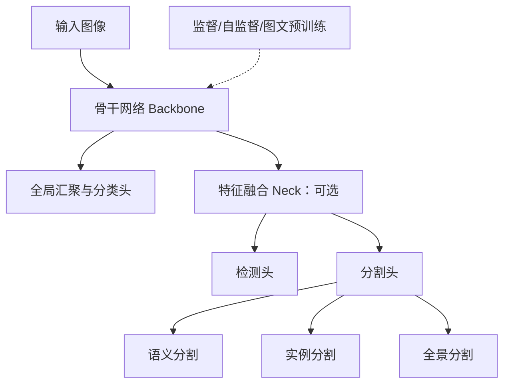

## 视觉模型概览

视觉模型的输入通常是图像或视频帧，输出可以是一个类别、若干个物体的位置，或者与输入具有相同空间分辨率的像素级预测。理解视觉模型时，最好把**网络结构**、**视觉任务**和**预训练方式**分开：ResNet、Swin Transformer 是网络结构；图像分类、目标检测和分割是任务；监督学习、自监督学习和图文对比学习是训练模型的方式。

### 视觉模型的共同结构

许多视觉识别模型可以按以下三个部分理解，其中颈部网络是可选的，具体模块划分取决于模型设计：

1. **骨干网络（backbone）**：从原始图像中提取由浅到深的特征。浅层特征保留较多边缘、纹理和位置信息，深层特征包含更强的语义信息。
2. **颈部网络（neck）**：对不同分辨率的特征进行融合，常见结构有 FPN（Feature Pyramid Network）、PAN 和 BiFPN。它主要解决目标大小变化以及高层语义与低层细节之间的结合问题。
3. **任务头（head）**：将特征转换为具体任务的输出，例如分类概率、边界框坐标或像素掩码。

设单张输入图像为 $\mathbf{x}\in\mathbb{R}^{H\times W\times C}$，其中 $H,W,C$ 分别为高度、宽度和通道数。骨干网络、颈部网络和任务头分别记为 $B_\theta$、$N_\phi$ 和 $H_\psi$，下标表示各模块的可学习参数，则可以写成：
$$
\begin{aligned}
\mathbf{F}&=B_\theta(\mathbf{x}),\\
\mathbf{G}&=N_\phi(\mathbf{F}),\\
\hat{\mathbf{y}}&=H_\psi(\mathbf{G}).
\end{aligned}
$$

若没有独立的颈部网络，可以令 $N_\phi$ 为恒等映射，即 $\mathbf{G}=\mathbf{F}$。例如，图像分类通常直接对骨干输出进行全局汇聚，再预测类别。

对于层次化骨干，可以从 $L$ 个阶段取出特征图，构成特征集合 $\mathbf{F}$：
$$
\mathbf{F}^{(l)}\in\mathbb{R}^{H_l\times W_l\times C_l},
\qquad l=1,\dots,L.
$$
随着网络加深，这类骨干的 $H_l,W_l$ 通常逐渐减小而 $C_l$ 增大。空间分辨率下降使计算量可控，通道数增加则允许网络存储更多种类的特征。检测和分割需要精确的位置，仅使用低分辨率特征容易损失小目标和边界细节，因此常通过跳跃连接或特征金字塔融合浅层与深层信息。这是常见设计，并非所有模型必须采用的结构。

因此，骨干网络与任务不是同一层级的概念。一个 ResNet 骨干可以接分类头（图像分类）、检测头（目标检测）或分割头（语义分割/实例分割/全景分割）；一个 Swin Transformer 也可以作为多种视觉任务的骨干。

### 图像分类

图像分类回答“整张图像属于什么类别”。设类别数为 $K$，模型输出未归一化的类别得分（logits）$\mathbf{z}\in\mathbb{R}^K$，单标签分类通过 softmax 得到类别概率：
$$
p_k=\frac{\exp(z_k)}{\sum_{j=1}^{K}\exp(z_j)},
\qquad
\sum_{k=1}^{K}p_k=1.
$$
给定真实类别 $y$，交叉熵损失为：
$$
\mathcal{L}_{\mathrm{cls}}=-\log p_y.
$$

单标签分类为每张图像指定一个真实类别，例如“猫”或“狗”，但图像中可以包含多个物体。若任务允许一张图像同时具有多个互不排斥的标签，则使用多标签分类，令每个类别分别通过 sigmoid 输出：
$$
p_k=\operatorname{sigmoid}(z_k),
$$
并使用逐类别的二元交叉熵。分类输出只描述整张图像，不告诉我们物体位于哪个像素或哪个区域。

### 目标检测

目标检测同时回答两个问题：图像中有哪些物体，以及每个物体位于哪里。一个检测结果可以写成：
$$
\hat{\mathcal{Y}}=\{(\hat{\mathbf{b}}_i,\hat{c}_i,\hat{s}_i)\}_{i=1}^{M},
$$
其中 $M$ 是预测目标数，可以随图像变化；$\hat{\mathbf{b}}_i$ 是边界框，$\hat{c}_i$ 是类别，$\hat{s}_i$ 是置信度。边界框可以使用中心坐标和宽高表示：
$$
\mathbf{b}=(c_x,c_y,w,h),
$$
或使用左上角与右下角坐标表示：
$$
\mathbf{b}=(x_{\min},y_{\min},x_{\max},y_{\max}).
$$

检测模型需要同时学习类别与位置，其目标可以概括为：
$$
\mathcal{L}_{\mathrm{det}}
=\mathcal{L}_{\mathrm{cls}}
+\lambda_{\mathrm{box}}\mathcal{L}_{\mathrm{box}}.
$$
其中 $\lambda_{\mathrm{box}}>0$ 用于平衡定位与分类；具体检测器还可能包含目标存在性等损失，且需要确定预测与真实目标的匹配关系。定位损失可以使用 $L_1$、Smooth $L_1$ 或基于交并比（IoU）的损失。两个框的交并比定义为：
$$
\operatorname{IoU}(A,B)
=\frac{|A\cap B|}{|A\cup B|}.
$$

其中 $|\cdot|$ 表示区域面积。两框完全重合时 IoU 为 $1$，没有交集时为 $0$。

检测方法可以沿三条代表性路线学习，下面的划分用于理解设计思路，并不是严格互斥的分类：

- **两阶段检测器**先产生候选区域，再对每个区域分类并回归边界框。R-CNN、Fast R-CNN 和 Faster R-CNN 构成这一演化链条；Faster R-CNN 用与检测网络共享特征的 Region Proposal Network（RPN）生成候选框，减少了传统候选区域算法的开销。
- **单阶段检测器**直接在特征图上密集预测类别和边界框（每个位置都要预测"这里是否有目标 + 是什么类别 + 框在哪"）。YOLO 将检测看成一次前向传播，SSD 使用多尺度特征图预测不同大小的物体，RetinaNet 则通过 focal loss 缓解前景与背景样本极度不平衡的问题。
- **端到端集合预测检测器**把整张图的检测结果整体看作一个集合，一次输出一组预测，而不是按固定空间位置一一对应；训练时通过二分图匹配，为每个真实目标选择一个预测与之配对，其余没有被匹配上的预测，统一学习为"无目标"（即模型学会主动输出"这里没有东西"）。DETR 用这种方式替代传统的候选区域生成与非极大值抑制（NMS，即去除重复检测框）的流程，但原始版本收敛较慢。后续 Deformable DETR、DINO detector 和 RT-DETR 分别从多尺度可变形注意力、去噪训练和实时推理等方向改进。

### 像素级分割

分割要求为每个像素给出预测。设图像大小为 $H\times W$，语义分割的输出为：
$$
\hat{\mathbf{Y}}\in\{1,\dots,K\}^{H\times W}.
$$
假设每个像素都有有效标签，$y_{u,v}$ 为位置 $(u,v)$ 的真实类别，$p_{u,v,k}$ 为该像素属于类别 $k$ 的预测概率，则逐像素交叉熵为：
$$
\mathcal{L}_{\mathrm{seg}}
=-\frac{1}{HW}
\sum_{u=1}^{H}\sum_{v=1}^{W}
\log p_{u,v,y_{u,v}}.
$$

| 任务 | 像素标签的含义 | 是否区分同类物体 |
| --- | --- | --- |
| 语义分割（semantic segmentation） | 每个像素属于哪个类别 | 不区分。例如两只狗都标为“狗” |
| 实例分割（instance segmentation） | 为每个目标预测类别和独立的像素掩码，通常不要求标注全部背景 | 区分。例如标出“狗 1”和“狗 2” |
| 全景分割（panoptic segmentation） | 同时覆盖背景区域和可数物体 | 背景按类别标记，物体按实例区分 |

**FCN** 将分类网络改造成可以接受任意尺寸输入并进行逐像素预测的全卷积网络，关键是融合深层的语义信息和浅层的空间细节。**U-Net** 采用收缩路径和对称扩张路径，并通过跳跃连接恢复细粒度位置，在医学图像分割中尤其常用。**DeepLab** 使用空洞卷积扩大感受野，并结合多尺度上下文。**Mask R-CNN** 在 Faster R-CNN 旁边增加一个并行的掩码分支，为每个检测到的实例生成像素掩码。

以“两只狗站在草地上”为例：语义分割把两只狗的像素都标为“狗”；实例分割分别输出两只狗的掩码；全景分割还要把草地等背景区域纳入统一预测。三者的主要区别是标签定义和输出要求。

### 经典骨干网络的演化

卷积神经网络骨干的经典发展可以概括为下表。时间主要采用论文首次公开年份；有些方法的正式发表时间晚一年。

| 模型 | 时间 | 主要思想 | 对后续模型的影响 |
| --- | --- | --- | --- |
| LeNet-5 | 1998 | 卷积、下采样和小型全连接分类器 | 展示局部感受野与权重共享在视觉识别中的作用 |
| AlexNet | 2012 | 深层卷积网络、ReLU、GPU 训练和数据增强 | 促成深度 CNN 在 ImageNet 上的大规模应用 |
| VGG | 2014 | 使用大量 $3\times3$ 小卷积核堆叠深度 | 结构简单，成为检测和分割的常用预训练骨干 |
| GoogLeNet/Inception | 2014 | 在一个模块中并行使用不同尺度卷积 | 在计算预算有限时提高多尺度特征提取能力 |
| ResNet | 2015/2016 | 残差连接 $\mathbf{y}=\mathcal{F}(\mathbf{x})+\mathbf{x}$ | 缓解深层网络优化困难，成为通用视觉骨干 |
| DenseNet | 2016/2017 | 在同一密集块内拼接前面各层的特征 | 加强特征复用与梯度传播，同时增加特征存储与访问开销 |
| MobileNet、ShuffleNet | 2017— | 深度可分离卷积、通道重排等轻量化操作 | 面向移动端和边缘设备部署 |
| EfficientNet | 2019 | 联合缩放深度、宽度和输入分辨率 | 系统讨论精度与计算量的平衡 |

以 ResNet 为例，假设输入与输出形状相同，普通网络直接学习目标映射 $\mathcal{H}(\mathbf{x})$，残差分支则学习相对于输入的修正：
$$
\mathcal{F}(\mathbf{x})=\mathcal{H}(\mathbf{x})-\mathbf{x},
\qquad
\mathbf{y}=\mathcal{F}(\mathbf{x})+\mathbf{x}.
$$
当最优映射接近恒等映射时，残差分支只需学习较小的修正项，梯度还可以沿跳跃连接传播。若空间尺寸或通道数发生变化，需要先用投影等操作对齐形状，再相加。残差连接为深层优化提供了更直接的信息与梯度通路，具体学习效果仍取决于网络、数据和训练目标。

### Transformer 与现代骨干

Vision Transformer（ViT）将图像切分为大小为 $P\times P$ 的图像块，把每个图像块展平并投影为 token，再结合位置信息使用 Transformer 处理序列。若 $H,W$ 都能被 $P$ 整除，不计额外的分类 token，则图像 token 数量为：
$$
N=\frac{H}{P}\frac{W}{P}.
$$
在特征维度固定时，全局自注意力中 token 两两交互的计算量随 $N$ 呈 $O(N^2)$ 增长，因此高分辨率图像会带来较大开销。Swin Transformer 将自注意力限制在局部窗口，并在相邻模块中交替采用普通窗口与移位窗口，使信息能够跨窗口传播；配合逐阶段下采样形成多尺度特征，便于接入检测和分割框架。

卷积通过局部连接和参数共享引入适合图像的结构假设；全局自注意力则允许远距离位置直接交互。步幅为 $1$、忽略边界影响时，卷积具有平移等变性，即输入平移后特征图相应平移；下采样和边界处理会限制这一性质。现代模型可以结合卷积与注意力，并根据数据规模、分辨率和部署硬件进行取舍。ConvNeXt 系列表明，经过现代化架构设计和训练方法，纯卷积网络仍然具有很强的竞争力；ConvNeXt V2 进一步将卷积网络与掩码自编码器（masked autoencoder）预训练结合。

### 从任务模型到视觉基础模型

传统视觉识别系统常针对固定任务和类别训练，也会使用分类预训练进行迁移。视觉基础模型进一步扩大数据和任务覆盖范围，强调表示的通用性以及对新任务的适应能力。以下选取截至 **2026 年 9 月 17 日** 已公开的代表性工作，作为进一步学习的入口：

1. **自监督视觉表示**：DINO、MAE、DINOv2 和 DINOv3 不依赖每张图像的人工类别标签，而是通过不同形式的一致性学习或掩码重建学习视觉特征。DINOv3（2025）强调大规模数据、模型和训练过程的共同扩展，并针对密集特征长时间训练中的退化引入 Gram anchoring。
2. **视觉—语言对齐**：CLIP、SigLIP 和 SigLIP 2（2025）使用图像—文本对学习对齐的表示，使模型能够通过图像与类别文字的相似度进行零样本分类，也能为检测、分割和多模态模型提供特征。零样本指无需使用目标任务的标注样本进行专门训练，并不保证预训练数据从未包含相关概念。
3. **开放词汇检测**：Grounding DINO 将文本或指代表达式引入检测器，可以根据“红色汽车”“戴帽子的人”等描述寻找目标，突破固定类别集合的限制。
4. **可提示分割与视频理解**：SAM（2023）将点、框等视觉提示转换为目标掩码；SAM 2（2024）引入视频记忆机制，将目标分割扩展到连续帧；SAM 3（2025）支持文字、示例和视觉提示下的检测、分割与跟踪，SAM 3.1（2026 年 3 月）进一步提高多物体视频处理效率。

这里需要区分两种能力：DINOv3 主要提供可迁移的视觉特征，接入任务头后完成预测；Grounding DINO 和 SAM 系列则进一步让用户通过相应提示指定“要找什么”。SAM 和 SAM 2 的目标掩码通常不附带固定的语义类别，因此不能直接等同于一张完整的语义标签图。SAM 3 增加了概念提示能力，但其输出仍取决于提示与模型学到的知识。

此外，**DINO detector 与自监督学习中的 DINO、DINOv2、DINOv3 是不同的研究系列**：前者属于 DETR 检测器的改进，后者主要研究视觉表征预训练。

### 经典算法与前沿算法对照

| 研究问题    | 经典学习路径                                     | 现代或前沿延伸                                                        | 核心变化                           |
| ------- | ------------------------------------------ | -------------------------------------------------------------- | ------------------------------ |
| 骨干与分类   | LeNet-5、AlexNet、VGG、GoogLeNet、ResNet       | ViT、Swin、ConvNeXt V2                                           | 从卷积架构扩展到注意力与现代化卷积设计            |
| 通用表示预训练 | 监督分类预训练与迁移学习                               | DINOv3、SigLIP 2                                                | 扩大自监督和图文学习规模，为多个下游任务提供特征       |
| 目标检测    | R-CNN → Fast R-CNN → Faster R-CNN；YOLO、SSD | DETR、Deformable DETR、DINO detector、RT-DETR、Grounding DINO、DEIM | 从候选框或密集预测，发展到集合预测、开放词汇和实时端到端检测 |
| 语义分割    | FCN、U-Net、DeepLab                          | SegFormer、Mask2Former                                          | 改进上下文建模，或将逐像素分类改写为掩码集合预测       |
| 实例分割    | Mask R-CNN、SOLO                            | Mask2Former                                                    | 从候选区域或位置驱动的预测，扩展到基于查询的掩码预测     |
| 全景分割    | Panoptic FPN                               | Mask2Former                                                    | 用统一架构解析背景类别与物体实例               |
| 可提示分割   | 交互式图像分割                                    | SAM → SAM 2 → SAM 3 / 3.1                                      | 通过提示指定目标，并扩展到视频、概念识别和跨帧跟踪      |

表中的方法并非同一层级：例如 DEIM（2025）是改善 DETR 匹配与收敛的训练框架，可与 D-FINE 等检测器结合使用。所谓“前沿”涉及训练方法、网络结构和任务设置共同变化，并非单一模型的版本升级。

其中 **Mask2Former** 值得作为统一分割模型的代表：它用 masked attention 约束跨注意力关注预测的局部掩码区域，并可以用同一类架构处理语义、实例和全景分割。它并没有消除三种任务在标签和评价指标上的差异，而是复用了特征提取、查询和掩码预测的结构。

### 建议的学习顺序

本章先从卷积、池化、填充、步幅和感受野开始，理解 CNN 为什么适合图像的局部结构；随后用 LeNet、AlexNet 和 ResNet 观察骨干网络的演化。之后可以进一步学习：

1. 用分类任务理解 logits、softmax、交叉熵和特征迁移。
2. 用 Faster R-CNN 和 YOLO 对比两阶段、单阶段检测，并理解边界框回归、IoU 与 NMS。
3. 用 FCN、U-Net 和 Mask R-CNN 理解从整图预测到逐像素预测、再到实例级掩码。
4. 学习注意力机制与 ViT，再结合 FPN、Swin 和 Mask2Former 理解多尺度特征与统一分割架构。
5. 最后阅读 DINOv3、SigLIP 2、Grounding DINO 和 SAM 系列，理解视觉自监督、视觉—语言对齐和视觉基础模型之间的联系。

参考：

- [Deep Residual Learning for Image Recognition](https://openaccess.thecvf.com/content_cvpr_2016/papers/He_Deep_Residual_Learning_CVPR_2016_paper.pdf)
- [An Image Is Worth 16x16 Words: Transformers for Image Recognition at Scale](https://openreview.net/pdf?id=YicbFdNTTy)
- [Swin Transformer: Hierarchical Vision Transformer using Shifted Windows](https://arxiv.org/abs/2103.14030)
- [ConvNeXt V2: Co-designing and Scaling ConvNets with Masked Autoencoders](https://arxiv.org/abs/2301.00808)
- [Faster R-CNN: Towards Real-Time Object Detection with Region Proposal Networks](https://proceedings.neurips.cc/paper/2015/hash/14bfa6bb14875e45bba028a21ed38046-Abstract.html)
- [End-to-End Object Detection with Transformers](https://arxiv.org/abs/2005.12872)
- [DEIM: DETR with Improved Matching for Fast Convergence](https://openaccess.thecvf.com/content/CVPR2025/html/Huang_DEIM_DETR_with_Improved_Matching_for_Fast_Convergence_CVPR_2025_paper.html)
- [Fully Convolutional Networks for Semantic Segmentation](https://openaccess.thecvf.com/content_cvpr_2015/html/Long_Fully_Convolutional_Networks_2015_CVPR_paper.html)
- [U-Net: Convolutional Networks for Biomedical Image Segmentation](https://arxiv.org/abs/1505.04597)
- [Mask R-CNN](https://arxiv.org/abs/1703.06870)
- [Masked-attention Mask Transformer for Universal Image Segmentation](https://arxiv.org/abs/2112.01527)
- [DINOv3](https://arxiv.org/abs/2508.10104)
- [SigLIP 2](https://arxiv.org/abs/2502.14786)
- [Grounding DINO](https://arxiv.org/abs/2303.05499)
- [SAM 2](https://ai.meta.com/research/sam2/)
- [SAM 3 / SAM 3.1](https://ai.meta.com/blog/segment-anything-model-3/)

## 卷积的含义

图像中的一个像素通常只与附近像素存在较强的局部关系。若让每个输出都连接全部输入，参数量会随图像尺寸快速增长，而且没有利用图像的局部结构。卷积使用一个较小的窗口在输入上移动，在每个位置进行相同的加权求和，从而实现**局部连接**和**参数共享**。

### 从全连接到局部加权

设一维输入信号为 $f$，卷积核为 $h$。全连接计算会让一个输出同时依赖所有输入位置；卷积则只取输入的一小段局部区域，并使用同一个卷积核重复计算。卷积核中的每个元素都是一个权重，决定局部区域中对应位置对输出的影响。

因此，卷积同时带来两种结构假设：

- **局部性**：一个输出主要由输入的局部邻域决定；
- **平移共享**：相同的局部模式出现在不同位置时，使用同一组权重进行检测。

这两种假设使卷积层的参数量主要由卷积核大小和通道数决定，而不直接随输入图像的高和宽增长。

### 一维连续卷积

设两个连续信号为 $f(t)$ 和 $h(t)$，卷积定义为：

$$
(f*h)(t)
=
\int_{-\infty}^{+\infty}
f(\tau)h(t-\tau)\,\mathrm d\tau .
$$

利用变量替换，也可以写成：

$$
(f*h)(t)
=
\int_{-\infty}^{+\infty}
f(t-\tau)h(\tau)\,\mathrm d\tau .
$$

这两个写法表达同一个运算。对固定的 $t$，可以把 $h(t-\tau)$ 看作卷积核在位置 $t$ 处的形状：先将 $h$ 关于原点翻转，再平移到当前位置，最后与 $f$ 逐点相乘并积分。因此，输出在 $t$ 处的值反映了卷积核与输入信号在该位置的加权重合程度。

其中，$f$ 可以看作输入信号，$h$ 可以看作卷积核或滤波器。若 $h$ 集中在 $0$ 附近，输出主要依赖 $f(t)$ 附近的局部信息；若 $h$ 的支撑范围较宽，输出会综合更大范围的信号。单位脉冲满足：

$$
(f*\delta)(t)=f(t),
$$

说明卷积核决定了输入信号将如何被重新组合。单位脉冲对应“保持原信号”的特殊卷积核，其他卷积核则可能产生平滑、增强边缘或提取周期等效果。

### 一维离散卷积

对于离散序列 $f[n]$ 和 $h[n]$，卷积定义为：

$$
(f*h)[n]
=
\sum_{k=-\infty}^{+\infty}
f[k]h[n-k].
$$

连续卷积中的积分，在离散情形下变成对所有离散位置的求和。式中的 $n-k$ 体现了卷积核的翻转和移动：当输出位置固定为 $n$ 时，输入序列的不同位置分别与移动后的卷积核权重相乘。

如果卷积核只有有限长度 $K$，则可以在有效范围内写成：

$$
y[n]
=
\sum_{k=0}^{K-1}f[n-k]h[k].
$$

有限序列在边界处如何处理，会影响输出的长度和数值。常见做法包括只计算完全落在输入范围内的有效区域，或者在输入两端补零；后面的 Padding 小节将专门讨论这一问题。

### 二维卷积与图像

设灰度图像为 $X$，二维卷积核为 $K$。严格按照数学卷积定义，二维离散卷积可以写成：

$$
Y[m,n]
=
\sum_i\sum_j
X[i,j]K[m-i,n-j].
$$

其中，$m,n$ 表示输出位置，$i,j$ 遍历输入图像中的空间位置。每个输出像素都是输入图像与移动后的卷积核在当前位置的加权汇聚。

若卷积核的大小为 $K_h\times K_w$，则一次局部计算只涉及一个对应大小的输入窗口。卷积核在图像的高度和宽度方向上移动，在每个位置重复同一计算。这就是二维卷积实现局部特征提取和权重共享的方式。

### 数学卷积与 CNN 中的互相关

需要注意，深度学习框架中的 `Conv2d` 通常实现的是**互相关**（cross-correlation），而不是严格数学定义下的卷积。互相关不在计算前翻转卷积核，其局部计算写成：

$$
Y[m,n]
=
\sum_{i=0}^{K_h-1}
\sum_{j=0}^{K_w-1}
X[m+i,n+j]W[i,j].
$$

严格卷积会翻转卷积核，而互相关只是在当前位置截取局部区域，与权重逐元素相乘后求和：

- 如果卷积核关于中心对称，翻转前后相同，卷积与互相关结果相同；
- 如果卷积核不对称，二者的数值结果一般不同；
- 在 CNN 中，卷积核是通过数据学习得到的，因此可以把一个卷积核替换为其翻转版本，二者具有相同的表达能力。

更形式化地说，若 $W$ 是严格卷积核 $K$ 旋转 $180^\circ$ 后得到的权重，则：

$$
X*K=X\star W,
$$

其中 $*$ 表示严格卷积，$\star$ 表示互相关。因此，深度学习文献和框架虽然通常把这一层称为“卷积层”，实际计算往往是互相关；区别主要来自参数的编号约定和实现方式。

### 卷积核的直观意义

卷积核不是简单地把多个像素替换成一个像素，而是使用一组权重对局部区域进行加权汇聚，得到一个新的特征响应。由于卷积核在不同空间位置共享，同一个局部模式无论出现在图像的什么位置，都可以使用同一组权重进行检测。

例如，下面的 $3\times3$ 卷积核会比较局部区域上下两侧的亮度差异：

$$
K=
\begin{bmatrix}
-1&-1&-1\\
0&0&0\\
1&1&1
\end{bmatrix}.
$$

若局部区域下方的像素整体比上方更亮，计算结果通常为正；若上方更亮，结果通常为负。因此，这类卷积核能够对水平边缘产生较强响应。这个例子用于说明卷积核可以检测局部模式；实际 CNN 中的卷积核通常由训练过程自动学习，而不是手工指定。

> 小结：卷积的核心是在局部区域内进行加权求和，并在不同位置共享同一组权重。连续卷积用积分描述，离散卷积用求和描述，二维卷积则将这一操作扩展到图像的两个空间方向。CNN 实际使用的通常是互相关，但由于卷积核可学习，严格卷积与互相关具有相同的表达能力。下一节将进一步讨论卷积核滑动的步长、边界填充、输入输出尺寸以及多通道卷积。

## 卷积神经网络计算

为了说明卷积层的形状变化，先约定单个样本的输入特征图为：

$$
\mathbf{X}\in\mathbb{R}^{C_{\mathrm{in}}\times H\times W},
$$

其中 $C_{\mathrm{in}}$ 是输入通道数，$H,W$ 是空间高度和宽度。实际使用小批量时，张量通常增加批量维度：

$$
\mathbf{X}\in\mathbb{R}^{B\times C_{\mathrm{in}}\times H\times W},
$$

其中 $B$ 是批量大小。卷积层主要改变通道数和空间尺寸，批量大小通常保持不变。

### 特征图与输出尺寸

设卷积核空间大小为 $K_h\times K_w$，垂直和水平方向的步长分别为 $S_h,S_w$，每侧填充大小分别为 $P_h,P_w$。当不考虑 dilation（空洞率）时，输出特征图的空间尺寸为：

$$
H_{\mathrm{out}}
=
\left\lfloor
\frac{H+2P_h-K_h}{S_h}
\right\rfloor+1,
$$

$$
W_{\mathrm{out}}
=
\left\lfloor
\frac{W+2P_w-K_w}{S_w}
\right\rfloor+1.
$$

推导高度公式时，填充后输入高度为 $H+2P_h$。卷积核的起始位置可以从 $0$ 移动到 $H+2P_h-K_h$，每次移动 $S_h$ 个像素，因此可放置的位置数为上述商加 $1$；向下取整表示最后一个窗口必须完整落在填充后的输入范围内。宽度公式完全相同。

若使用 dilation $D_h,D_w$，卷积核在相应方向的有效尺寸变为：

$$
K_{h,\mathrm{eff}}=D_h(K_h-1)+1,
\qquad
K_{w,\mathrm{eff}}=D_w(K_w-1)+1,
$$

只需在输出尺寸公式中将 $K_h,K_w$ 替换为有效尺寸。普通卷积对应 $D_h=D_w=1$。

### 步长

步长（stride）表示卷积核在输入特征图上每次移动的像素数。步长为 $1$ 时，卷积核逐像素扫描；步长大于 $1$ 时，会跳过部分位置，使输出空间尺寸减小：

$$
S_h>1\ \text{或}\ S_w>1
\quad\Longrightarrow\quad
H_{\mathrm{out}}<H\ \text{或}\ W_{\mathrm{out}}<W.
$$

在不改变卷积核大小和填充的情况下，增大步长可以降低计算量和特征图存储，但也会丢弃部分空间位置的信息。因而步长既是计算效率的控制参数，也是一种下采样操作；是否适合使用较大步长，取决于任务是否需要保留精细的空间定位。

### 卷积核与权重

先考虑单通道输入和单个卷积核。设输入为 $X\in\mathbb{R}^{H\times W}$，权重为 $K\in\mathbb{R}^{K_h\times K_w}$，偏置为 $b\in\mathbb{R}$，则互相关形式的输出为：

$$
Y[m,n]
=
\sum_{i=0}^{K_h-1}
\sum_{j=0}^{K_w-1}
X[mS_h+i,nS_w+j]K[i,j]+b.
$$

这里省略了填充后输入的记号，实际计算时 $X$ 表示已经完成 padding 的特征图。卷积核的参数量为：

$$
K_hK_w+1,
$$

其中 $1$ 是偏置参数。卷积核在所有空间位置复用，所以参数量不会乘以 $H_{\mathrm{out}}W_{\mathrm{out}}$；这正是参数共享带来的主要节省。

卷积核参数不是预先规定的边缘模板。训练时，网络根据损失函数的梯度更新 $K[i,j]$ 和 $b$，使输出特征图逐渐对任务相关的局部模式产生响应。早期层常学习边缘、方向和纹理等简单模式，较深层则组合这些局部响应形成更复杂的结构。

### 多输入与多输出通道

彩色图像具有多个输入通道，深层特征图也通常包含多个通道。一个输出通道对应一个跨所有输入通道的卷积核：

$$
\mathbf{W}^{(o)}
\in
\mathbb{R}^{C_{\mathrm{in}}\times K_h\times K_w},
\qquad o=1,\dots,C_{\mathrm{out}}.
$$

第 $o$ 个输出通道在位置 $(m,n)$ 的值为：

$$
Y_o[m,n]
=
b_o
+
\sum_{c=0}^{C_{\mathrm{in}}-1}
\sum_{i=0}^{K_h-1}
\sum_{j=0}^{K_w-1}
X_c[mS_h+i,nS_w+j]
W_{o,c,i,j}.
$$

因此，输入和输出张量的形状分别为：

$$
\mathbf{X}\in\mathbb{R}^{C_{\mathrm{in}}\times H\times W},
\qquad
\mathbf{Y}\in\mathbb{R}^{C_{\mathrm{out}}\times H_{\mathrm{out}}\times W_{\mathrm{out}}}.
$$

卷积层的参数量为：

$$
C_{\mathrm{out}}C_{\mathrm{in}}K_hK_w+C_{\mathrm{out}}.
$$

其中每个输出通道拥有一组覆盖所有输入通道的权重，并在空间位置上共享；不同输出通道学习不同的局部模式。偏置 $b_o$ 只依赖输出通道，并在所有空间位置广播。

若只在对应输入通道内分别进行卷积，再得到相同数量的输出通道，这种特殊形式称为 depthwise convolution；它的参数量较小，但不能在卷积这一步混合不同输入通道的信息，通常需要再接 $1\times1$ pointwise convolution 完成通道混合。这是深度可分离卷积降低计算量的基本思路。

### 池化计算

池化（pooling）也使用局部窗口在特征图上移动，但窗口中的数值通常按照固定规则汇聚，不包含通过训练学习的卷积核权重。最大池化和平均池化分别定义为：

$$
Y[m,n]
=
\max_{0\leq i<K_h,\,0\leq j<K_w}
X[mS_h+i,nS_w+j],
$$

$$
Y[m,n]
=
\frac{1}{K_hK_w}
\sum_{i=0}^{K_h-1}\sum_{j=0}^{K_w-1}
X[mS_h+i,nS_w+j].
$$

最大池化保留局部窗口中响应最强的值，适合表示“某种特征是否在附近出现”；平均池化保留局部平均响应，具有平滑作用。池化通常通过步长大于 $1$ 实现下采样，从而减少后续计算量并增大后续单元对应的感受野。

池化层通常没有可学习参数，因此不会像卷积层那样主动学习新的模式。它的主要作用是改变特征图的空间分辨率、聚合局部信息和提高一定程度的局部平移鲁棒性。过度池化会损失目标边界和小物体信息，所以现代检测与分割网络常通过多尺度特征、跳跃连接或带步长卷积来补回空间细节。

### Padding 计算

填充（padding）是在输入特征图边界外补充额外数值，最常见的是补零。若高度方向每侧补 $P_h$ 个位置，宽度方向每侧补 $P_w$ 个位置，则有效输入大小变为：

$$
(H+2P_h)\times(W+2P_w).
$$

当 $P_h=P_w=0$ 时，称为 **valid convolution**，即不进行填充。若步长为 $1$ 且卷积核尺寸为奇数，取：

$$
P_h=\frac{K_h-1}{2},
\qquad
P_w=\frac{K_w-1}{2},
$$

便有：

$$
H_{\mathrm{out}}=H,
\qquad
W_{\mathrm{out}}=W.
$$

这种设置常称为 **same padding**，因为它保持空间尺寸不变。若步长大于 $1$，或卷积核尺寸为偶数，为了使输出尺寸满足预期，可能需要在上下、左右使用不相等的填充；因此“same”并不总是等价于两侧使用相同数量的 padding。

填充可以让边界像素获得与内部像素相近的处理机会，避免特征图在连续卷积后过快缩小。但零填充也会在边界引入与真实图像不同的数值，可能产生边界效应。具体采用 valid、same 或其他边界模式，应根据输出尺寸和任务需求选择。

### 感受野计算

感受野（receptive field）是某一层一个特征值在原始输入上实际依赖的区域。若某个特征值只由输入图像中的一个像素决定，其感受野大小为 $1\times1$；经过卷积和池化后，它通常会依赖更大的输入区域。

为了递推计算感受野，同时记录相邻特征值在原图上的间隔。令第 $l$ 层的卷积核大小、步长和 dilation 分别为 $k_l,s_l,d_l$，定义：

$$
r_0=1,
\qquad
j_0=1,
$$

其中 $r_l$ 是第 $l$ 层特征值的感受野边长，$j_l$ 是相邻特征值对应的原始输入位置间隔（也称 jump）。则有：

$$
j_l=j_{l-1}s_l,
$$

$$
r_l
=
r_{l-1}+(k_l-1)d_lj_{l-1}.
$$

解释第二个式子：第 $l$ 层卷积核覆盖 $k_l$ 个位置，首尾之间相隔 $(k_l-1)d_l$ 个前一层特征位置；而前一层相邻位置在原图上相隔 $j_{l-1}$，因此新增的感受野为 $(k_l-1)d_lj_{l-1}$。步长不会直接改变单个窗口覆盖的大小，但会改变下一层特征点在原图上的间隔。

例如，连续两个 $3\times3$、步长为 $1$ 的卷积层满足：

$$
r_1=1+(3-1)\times1=3,
\qquad
r_2=3+(3-1)\times1=5.
$$

因此第二层一个特征值对应原图上的 $5\times5$ 区域。若随后使用一个核为 $2$、步长为 $2$ 的池化层，则：

$$
j_3=2,
\qquad
r_3=5+(2-1)\times1=6.
$$

此时感受野边长为 $6$，相邻池化输出在原图上的间隔为 $2$。感受野描述的是理论上的依赖范围；实际训练后，窗口内不同位置对输出的影响可能并不相同，不能把感受野大小直接等同于模型真正使用的有效信息范围。

> 小结：卷积层通过局部窗口和共享权重生成特征图，输出尺寸由输入大小、卷积核、填充和步长共同决定；多通道卷积在局部空间计算之外，还会混合输入通道。池化提供固定的局部汇聚和下采样，感受野则描述深层特征能够利用多大范围的输入信息。下一节将用 LeNet 将这些基本组件组合起来。

### LeNet 框架
注意不是全连接，关注神经元的连接方式

## 各类卷积操作

### 不同方向的卷积
- x - 方向
- y - 方向
- 边缘
