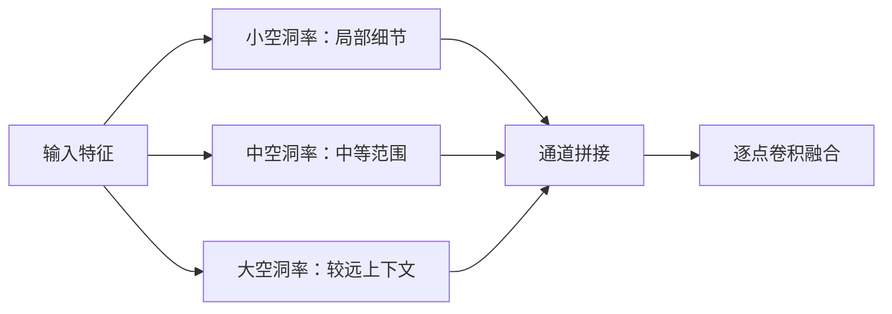
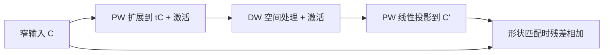

## 卷积变体概览

### 统一表示

设单张输入特征图为 $\mathbf X\in\mathbb R^{C_{\mathrm{in}}\times H\times W}$，输出为 $\mathbf Y\in\mathbb R^{C_{\mathrm{out}}\times H_o\times W_o}$。以下主要讨论二维互相关，即深度学习框架中通常所说的卷积。令两个空间方向采用相同的核大小 $k$、步长 $s$、每侧填充 $p$ 和空洞率 $d$。将填充后的输入记为 $\bar{\mathbf X}$，普通非分组卷积为：

$$
Y_o[m,n]
=b_o+\sum_{c=0}^{C_{\mathrm{in}}-1}
\sum_{i=0}^{k-1}\sum_{j=0}^{k-1}
W_{o,c,i,j}\bar X_c[sm+di,sn+dj].
$$

其中 $\mathbf W\in\mathbb R^{C_{\mathrm{out}}\times C_{\mathrm{in}}\times k\times k}$。普通密集采样取 $d=1$，输出高度为：

$$
H_o=\left\lfloor\frac{H+2p-d(k-1)-1}{s}\right\rfloor+1,
$$

宽度同理。这里 $s$ 控制整个窗口每次移动多远，$d$ 控制窗口内部的采样点相隔多远。观察前面的求和式，每个输出都要读取所有输入通道的局部邻域，再用相应权重将它们加起来。具体接口约定可对照 [PyTorch Conv2d 文档](https://docs.pytorch.org/docs/2.14/generated/torch.nn.Conv2d.html)。

### 卷积变体的设计意图

普通卷积同时完成空间处理与通道混合，代价也来自这两部分。如果并非所有通道都需要直接交流，就可以减少通道之间的连接；如果空间处理与通道混合可以分步完成，就可以尝试分解卷积。这引出了**分组、逐通道、逐点和可分离卷积**。

当局部窗口不足以判断一个位置的含义时，还需要让它读到更远的上下文。大核增加采样点，**空洞卷积**拉开采样间隔，两者都能扩大覆盖范围，却会保留不同的局部信息。若任务进一步要求逐像素输出，就要考虑如何从较小的特征图生成较大的网格，由此引出**转置卷积、插值后卷积和子像素卷积**。

前面这些安排通常预先固定。面对形状和内容差异很大的输入，**可变形卷积**让采样位置随特征变化，**动态卷积**则让有效核随输入变化。最后，倒残差和结构重参数化把这些算子组织成模块，进一步处理表达、优化与部署的问题。

这些改动可以配合使用。例如，逐通道卷积也能采用大核或空洞率，分组卷积也能使用 $1\times1$ 核。PixelShuffle、插值和通道重排本身没有可学习的卷积核，但它们参与了相关模块的计算，因此也需要一起理解。

### 参数与计算量

以下比较权重数量时忽略偏置和归一化参数。普通卷积的参数量与单样本乘加次数（MACs）分别为：

$$
P_{\mathrm{conv}}=k^2C_{\mathrm{in}}C_{\mathrm{out}},
\qquad
M_{\mathrm{conv}}=H_oW_o k^2C_{\mathrm{in}}C_{\mathrm{out}}.
$$

第一式统计需要学习多少个权重，第二式表示算一张图时要计算多少次乘加，因为同一组权重要在每个位置重复使用。这里把一次「乘再加」算 1 次 MAC，若用 FLOPs 则表示「乘加分开计」。

记输出特征图的高 $H_{o}$ 宽 $W_{o}$，$H_{o}W_{o}$ 就是输出上有多少个空间位置；同一套权重会在每个输出位置再算一遍，所以计算量 = 参数量 × 输出格子数。

### 总结和概念辨析

#### 卷积变体的动机摘要

- 通道不必全连 / 空间与通道可拆开：**深度可分离卷积**；直观感受是先刮各层纹理，再调色板混色
- 局部窗看不够远：加大核（多采几个邻点），或**空洞卷积**，两者都能扩大感受野，但局部细节保留方式不同
- 从小特征图画回大网格：网络前面几层常把特征图越做越小，但语义分割、超分辨率、密集关键点等要每个原图像素都有一个输出，所以得把小特征图再放大成和目标分辨率对齐的大网格，再在每个格点上预测；直观感受是分辨率往回涨、输出要密；具体方法如**转置卷积**可学习地上采样；也可以**先插值再卷积**；或 **PixelShuffle**（子像素）把通道重排成空间分辨率。后两者本身常常没有「可学习的大核」，但和卷积模块绑在一起
- 结构预先固定不够时：输入形状差很大时，**可变形卷积**让采样点跟着特征挪；**动态卷积**让有效核随输入变化。再往上，倒残差、结构重参数化是在**组模块**：训练时一套结构，部署时可能融成另一套，兼顾表达与速度。

#### 相关概念：采样几何、上采样和下采样

- **采样几何**：卷积/池化在输入上**点哪些位置**——窗多大、步长几、有没有空洞、可变形时点会不会挪。改的是「几何」，不是「通道怎么连」。
- **下采样**：特征图空间尺寸变小（常见：步长大于一的卷积或池化）；信息被压缩成更粗的格子。
- **上采样**：空间尺寸变大（插值放大、转置卷积、PixelShuffle 等）；从粗格子回到细格子。

#### 插值 / PixelShuffle 与卷积模块的关系

- **双线性插值**：按固定公式把像素撑大，没有可训练权重
- **PixelShuffle（子像素）**：把 ($C\cdot r^2$) 个通道重新摆成 ($r$) 倍高宽——本质是**搬格子、改形状**，搬的规则固定，通常也不带可学习核（勿与仅换通道顺序、不改分辨率的 channel shuffle / 通道重排混淆）
- **转置卷积**：相比之下，转置卷积放大过程本身带可学习核

插值、PixelShuffle 通常不包含可训练的卷积权重，只负责改变分辨率或布局；但超分、分割头里常见流水线是：`卷积提特征 → PixelShuffle/插值放大 → 再卷积精修`。放大那一步本身不学核，却决定了「大网格从哪来、通道怎么摊开」；前后卷积的设计也要配合它。因此，它们常夹在卷积之间组成完整模块，所以要和卷积一起理解：

- 模块级阅读：看到一个上采样块时，同时看清三件事——前面卷积输出什么形状、中间放大/重排怎么改 (H,W,C)、后面卷积吃什么形状。
- 分工：卷积负责可学习的局部模式；插值/PixelShuffle 负责固定规则的几何或布局变换。
- 设计耦合：例如 PixelShuffle 往往用 ($1\times1$) 卷积先把通道数扩充，再把通道折进空间；插值后卷积则先固定规则撑大格子，再用可学习核去精修插值带来的模糊。

![[深度学习应用/assets/卷积变体1_上采样比较.gif]]

动画展示的是上采样过程，把小特征图放大成更密的格子：

A Upsample + Conv  
先用固定规则（最近邻）把每个格子复制撑大，本身不学参数；再用一层卷积在放大后的图上滑动精修。放大靠规则，学习靠后面的卷积。

B Transposed Conv  
放大过程本身带着可学习的核：输入上的点按核「铺」到更大网格上，重叠处再叠加。分辨率变大的同时，填充方式是可以训练的。

C PixelShuffle  
先用 $1×11\times11×1$ 卷积把通道变厚，再把这些通道块像马赛克一样摊进更大的高和宽。摊开这一步没有可学习核，只是改布局；学习主要在前面扩通道的那一层。

## 通道连接与分解

### 分组卷积

**分组卷积**（grouped convolution）将输入和输出通道分别等分成 $g$ 组，仅在对应组之间连接，要求 $g$ 同时整除 $C_{\mathrm{in}}$ 和 $C_{\mathrm{out}}$。设输出通道 $o$ 所属组的输入通道集合为 $\mathcal G(o)$，则：

$$
Y_o[m,n]
=b_o+\sum_{c\in\mathcal G(o)}\sum_{i,j}
W_{o,c,i,j}\bar X_c[sm+di,sn+dj].
$$

与普通卷积相比，变化发生在通道求和的范围：每个输出只读取本组的 $C_{\mathrm{in}}/g$ 个通道。每组有 $C_{\mathrm{out}}/g$ 个输出，再将 $g$ 组相加，权重数量为：

$$
P_{\mathrm{group}}
=g\left(\frac{C_{\mathrm{out}}}{g}\frac{C_{\mathrm{in}}}{g}k^2\right)
=\frac{k^2C_{\mathrm{in}}C_{\mathrm{out}}}{g}.
$$

固定输出空间尺寸时，MACs 也下降为普通卷积的 $1/g$。例如 $C_{\mathrm{in}}=4,C_{\mathrm{out}}=6,g=2$，前 $3$ 个输出通道只读取前 $2$ 个输入通道，后 $3$ 个输出只读取后 $2$ 个输入。

忽略偏置，将卷积看作矩阵变换，按组排列输入和输出后，通道连接呈分块对角结构：

$$
\begin{bmatrix}\mathbf y^{(1)}\\\mathbf y^{(2)}\end{bmatrix}
=
\begin{bmatrix}\mathbf A_1&\mathbf0\\\mathbf0&\mathbf A_2\end{bmatrix}
\begin{bmatrix}\mathbf x^{(1)}\\\mathbf x^{(2)}\end{bmatrix}.
$$

矩阵中的零块表示不同组之间没有连接。每组内部仍然读取空间邻域，图像没有被切成互不相交的几块。若后续多层一直沿用相同分组，中间也没有跨组操作，那么一组学到的特征始终无法传给另一组。这正是节省计算的代价：一部分原本可以直接表示的通道关系被排除了。

### 逐通道卷积

**逐通道卷积**（depthwise convolution，DW）将分组数增加到 $g=C_{\mathrm{in}}$，每组只剩一个输入通道。先考虑每个输入通道产生一个输出通道的情形：

$$
Z_c[m,n]=\sum_{i,j}D_{c,i,j}\bar X_c[sm+di,sn+dj],
\qquad
\mathbf D\in\mathbb R^{C_{\mathrm{in}}\times k\times k}.
$$

式中已经没有对输入通道求和，因此各通道各自处理空间邻域。输出通道数为 $C_{\mathrm{in}}$，参数量为 $k^2C_{\mathrm{in}}$。例如，一个通道可以检测边缘，另一个通道可以平滑纹理，但要判断某种边缘是否出现在某种纹理上，还需要后续操作把它们联系起来。

更一般地，每个输入通道可以配备 $M$ 个核，输出通道数为 $MC_{\mathrm{in}}$，参数量为 $Mk^2C_{\mathrm{in}}$；$M$ 称为通道倍增系数。后文未作说明时均取 $M=1$。

这里的 depthwise 指沿通道分别计算，不表示网络层数更深，也不表示对三维空间执行卷积。

### 逐点卷积

**逐点卷积**（pointwise convolution，PW）使用 $1\times1$ 空间核，在同一位置上混合通道，因而可以接在 DW 后面补充通道交流。普通非分组、步长为 $1$ 时：

$$
Y_o[m,n]=\sum_{c=0}^{C_{\mathrm{in}}-1}P_{o,c}Z_c[m,n]+b_o,
\qquad
\mathbf P\in\mathbb R^{C_{\mathrm{out}}\times C_{\mathrm{in}}}.
$$

固定一个位置 $(m,n)$，它的全部通道组成一个向量，PW 就对这个向量做一次仿射变换；换到下一个位置，仍使用同一组 $\mathbf P$ 和 $\mathbf b$。因此，它可以融合、扩展或压缩通道，忽略偏置时参数量为 $C_{\mathrm{in}}C_{\mathrm{out}}$。

例如，同一位置有两个响应 $z_1,z_2$，计算 $y_1=z_1+z_2$ 可以汇集共同响应，计算 $y_2=z_1-z_2$ 则突出两者的差异。虽然 PW 不读取相邻位置，但这些通道可能已经包含前面多层提取的边缘、纹理与语义信息，所以仅在通道之间重新组合，也能改变特征的含义。

单独的逐点卷积是仿射变换；若后接激活函数，整个模块才包含非线性。$1\times1$ 核也可以采用分组或大于 $1$ 的步长，因此“逐点”只约束核的空间大小。其全连接解释可参考[教材：多输入多输出通道](https://zh-v2.d2l.ai/chapter_convolutional-neural-networks/channels.html)。

![[深度学习应用/assets/卷积变体2_通道连接与分解.gif]]

### 深度可分离卷积

**深度可分离卷积**（depthwise separable convolution）常由 DW 与 PW 顺序组成：先让每个通道处理空间邻域，再在每个位置混合通道。暂时忽略偏置与中间激活，取步长和空洞率均为 $1$：

$$
\begin{aligned}
Z_c[m,n]&=\sum_{i,j}D_{c,i,j}\bar X_c[m+i,n+j],\\
Y_o[m,n]&=\sum_cP_{o,c}Z_c[m,n]\\
&=\sum_c\sum_{i,j}P_{o,c}D_{c,i,j}\bar X_c[m+i,n+j].
\end{aligned}
$$

将两步展开后，得到有效核 $W^{\mathrm{eff}}_{o,c,i,j}=P_{o,c}D_{c,i,j}$。这说明输入通道 $c$ 先经过同一个空间模板 $D_c$，所得响应再按不同的 $P_{o,c}$ 分配给各输出。普通卷积一次完成的计算，现在被拆成了先处理空间、再组合通道的两步。

#### 计算节省

两步的权重数量相加得到：

$$
P_{\mathrm{sep}}=k^2C_{\mathrm{in}}+C_{\mathrm{in}}C_{\mathrm{out}},
\qquad
\frac{P_{\mathrm{sep}}}{P_{\mathrm{conv}}}
=\frac1{C_{\mathrm{out}}}+\frac1{k^2}.
$$

若 DW 产生 $H_o\times W_o$ 的特征，PW 在相同位置上使用步长 $1$，MACs 的比值也相同。例如 $k=3,C_{\mathrm{in}}=32,C_{\mathrm{out}}=64$ 时，普通卷积需要 $9\times32\times64=18\,432$ 个权重；拆分后，DW 需要 $9\times32=288$ 个，PW 需要 $32\times64=2048$ 个，合计 $2336$ 个，约为原来的 $12.7\%$。

进一步看，PW 已占组合参数量的约 $87.7\%$。空间处理被大幅简化后，通道混合反而成为主要开销，因此继续缩小空间核未必还能带来很大收益。这种分工是 [MobileNet](https://arxiv.org/abs/1704.04861) 的核心，实际模块还会加入归一化与激活。

#### 表达约束

这种拆分节省了大量参数，也限制了不同输出可以使用的空间模式。固定输入通道 $c$，将有效核按“输出通道 × 空间位置”排列成矩阵：

$$
\mathbf W_c^{\mathrm{eff}}
=\mathbf P_{:,c}\operatorname{vec}(\mathbf D_c)^\top
\in\mathbb R^{C_{\mathrm{out}}\times k^2}.
$$

这个矩阵是两个向量的外积，秩至多为 $1$。具体来说，各行都是同一个空间模板的倍数，改变 PW 的系数只能改变模板的强弱或符号，无法为某个输出单独换一种形状。普通卷积则可以为不同输出学习彼此独立的模板。

例如，若只输入一个通道，同时希望两个输出分别提取水平边缘和垂直边缘，$M=1$ 的单个线性 DW + PW 一般无法实现，因为两个边缘核并不互为倍数。增加通道倍增系数 $M$ 后，有效核变成 $M$ 个外积之和，秩至多为 $M$，同时参数与计算也增加。

以上推导依赖两步之间没有非线性激活。加入激活后，整个模块通常不能再合并成一个线性核，秩的结论也就不能直接套用。空间处理与通道混合仍然分开，但表达能力需要结合非线性和后续层一起分析。[Xception](https://arxiv.org/abs/1610.02357) 进一步研究了这种分离思路。

#### 动画说明

![[深度学习应用/assets/卷积变体3_深度可分离卷积.gif]]

1. Depthwise  
每个输入通道各自拿一块小核，只在自己那一层上滑动。这一步通道之间不交流，得到一组中间特征图。
2. Pointwise（mix channels）  
在同一个像素位置上，把各通道的响应按权重混在一起，再写出各个输出通道。这一步几乎不看邻居，专门做通道调色。
3. Merged（same shape, different strength）  
把前两步合起来看：某个输入通道只有一种空间图案；分给不同输出时，图案形状不变，只变强弱和正负。改后面的混合系数，等于调强度，而不给某个输出单独换成另一种图案。
4. Compare  
左边普通卷积：同一输入通道对应的各输出核可以长得完全不同。右边可分离：同一列始终是同一图案，只是倍数不同。省参数的代价，就是空间模式不如普通卷积自由。

### 空间可分离卷积

**空间可分离卷积**分解的是核的高、宽两个方向。对于单输入、单输出通道，若二维核满足 $\mathbf K=\mathbf a\mathbf b^\top$，则：

$$
\begin{aligned}
Y[m,n]
&=\sum_i\sum_j a_i b_j X[m+i,n+j]\\
&=\sum_i a_i\left(\sum_j b_jX[m+i,n+j]\right).
\end{aligned}
$$

内层求和只沿水平方向读取，外层再沿垂直方向汇总，因此可以先做 $1\times k$ 的水平滤波，再做 $k\times1$ 的垂直滤波。在边界处理相容、没有中间非线性的条件下，两步与原核等价，权重数量由 $k^2$ 变为 $2k$。例如下面的平滑核：

$$
\frac1{16}
\begin{bmatrix}1&2&1\\2&4&2\\1&2&1\end{bmatrix}
=
\frac14\begin{bmatrix}1\\2\\1\end{bmatrix}
\frac14\begin{bmatrix}1&2&1\end{bmatrix}.
$$

它先对每行做一次加权平均，再对这些结果沿列做同样的平均，就得到二维平滑。这个核恰好秩一，可以精确分解；一般二维核则未必如此。

更一般地，设 $R=\operatorname{rank}(\mathbf K)$，奇异值分解给出 $\mathbf K=\sum_{r=1}^{R}\sigma_r\mathbf u_r\mathbf v_r^\top$，其中 $\sigma_r$ 是非零奇异值，$\mathbf u_r,\mathbf v_r$ 是对应的左右奇异向量。每一项都能拆成两次一维滤波，因此将多组结果相加，可以表示原核；只保留少数项，就在节省计算的同时引入低秩近似误差。

多通道网络中，若先用 $k\times1$ 将 $C_{\mathrm{in}}$ 变为中间通道数 $C_m$，再用 $1\times k$ 得到 $C_{\mathrm{out}}$，参数量为 $kC_{\mathrm{in}}C_m+kC_mC_{\mathrm{out}}$，不能直接套用 $k^2\to2k$。中间通道数与激活函数都会影响表达能力。


![[深度学习应用/assets/卷积变体4_空间可分离卷积.gif]]

空间可分离卷积可以按动画这样理解：

1. Kernel  
一块二维小核如果能拆成「一条竖模板 × 一条横模板」，就不必记住整张九宫格，记住两条细条就够，权重更少。
2. Row × Col  
先用横条沿水平扫一遍，再用竖条沿竖直扫一遍（顺序反过来也可以）。在中间不加非线性、边界处理一致时，结果和一次直接盖整块二维核相同。
3. Contrast  
左边是空间可分离：拆的是高和宽两个方向。右边是深度可分离：拆的是「先各自做空间，再混通道」。名字都叫可分离，分解的对象不一样。

### 通道重排

**通道重排**（channel shuffle）在相邻分组层之间重新排列通道，为跨组传播建立路径。例如：

$$
[z_0,z_1\mid z_2,z_3]
\quad\longrightarrow\quad
[z_0,z_2\mid z_1,z_3].
$$

竖线表示下一层的分组边界。重排前，$z_0,z_1$ 总在一组，$z_2,z_3$ 总在另一组；重排后，$z_0$ 可以与 $z_2$ 一起参与计算，两个组的信息便有机会交流。一般实现是将 $C$ 个通道排列为 $g\times(C/g)$，交换这两个维度，再展平成通道序列。

若重排矩阵为 $\boldsymbol\Pi$，两个分组线性层组合为 $\mathbf A_2\boldsymbol\Pi\mathbf A_1$。置换只改变位置，后续分组层才执行加权混合；一次重排未必使每个输出都依赖全部输入。[ShuffleNet](https://arxiv.org/abs/1707.01083) 将这种操作与逐点分组卷积结合。

从分组到重排可以看到，减少连接后还要安排信息交流的路径。DW 后接 PW、分组层之间插入重排，都是在计算节省与特征组合之间作出取舍。

![[深度学习应用/assets/卷积变体5_通道重排.gif]]

动画示意通道重排的主要过程：

1. Groups  
通道先按组排开，竖线是组界。同一组里可以互相混合，不同组之间没有连线。
2. Shuffle  
把通道排成「组 × 组内」的小表，再按列读回来（换座位），组界暂时打散。
3. Result  
展平后重新画组界：原来不同组的通道现在坐进同一组，下一层分组卷积就能跨组交流。只换位置，不加可学习权重。


## 空洞卷积与感受野

### 采样间隔

**空洞卷积**（dilated convolution，也称 atrous convolution）保留核权重数量，将相邻采样点的间隔改为 $d$。沿一个方向，$k$ 个点包含 $k-1$ 个间隔，因此有效核尺寸为 $k_{\mathrm{eff}}=d(k-1)+1$。

例如 $k=3,d=2$ 时，相对位置为 $-2,0,2$，覆盖长度为 $5$；二维核则在 $5\times5$ 范围中读取 $9$ 个位置。图中交叉点表示采样位置：

```tikz
\begin{document}
\begin{tikzpicture}[scale=0.62]
  \draw[very thin,color=gray!40] (-2,-2) grid (2,2);
  \draw[thick,color=blue] (-1,-1.15)--(-1,-0.85) (-1.15,-1)--(-0.85,-1);
  \draw[thick,color=blue] (0,-1.15)--(0,-0.85) (-0.15,-1)--(0.15,-1);
  \draw[thick,color=blue] (1,-1.15)--(1,-0.85) (0.85,-1)--(1.15,-1);
  \draw[thick,color=blue] (-1,-0.15)--(-1,0.15) (-1.15,0)--(-0.85,0);
  \draw[thick,color=blue] (0,-0.15)--(0,0.15) (-0.15,0)--(0.15,0);
  \draw[thick,color=blue] (1,-0.15)--(1,0.15) (0.85,0)--(1.15,0);
  \draw[thick,color=blue] (-1,0.85)--(-1,1.15) (-1.15,1)--(-0.85,1);
  \draw[thick,color=blue] (0,0.85)--(0,1.15) (-0.15,1)--(0.15,1);
  \draw[thick,color=blue] (1,0.85)--(1,1.15) (0.85,1)--(1.15,1);
  \node at (0,-2.8) {$k=3,\ d=1$};
  \begin{scope}[xshift=7cm]
    \draw[very thin,color=gray!40] (-2,-2) grid (2,2);
    \draw[thick,color=red] (-2,-2.15)--(-2,-1.85) (-2.15,-2)--(-1.85,-2);
    \draw[thick,color=red] (0,-2.15)--(0,-1.85) (-0.15,-2)--(0.15,-2);
    \draw[thick,color=red] (2,-2.15)--(2,-1.85) (1.85,-2)--(2.15,-2);
    \draw[thick,color=red] (-2,-0.15)--(-2,0.15) (-2.15,0)--(-1.85,0);
    \draw[thick,color=red] (0,-0.15)--(0,0.15) (-0.15,0)--(0.15,0);
    \draw[thick,color=red] (2,-0.15)--(2,0.15) (1.85,0)--(2.15,0);
    \draw[thick,color=red] (-2,1.85)--(-2,2.15) (-2.15,2)--(-1.85,2);
    \draw[thick,color=red] (0,1.85)--(0,2.15) (-0.15,2)--(0.15,2);
    \draw[thick,color=red] (2,1.85)--(2,2.15) (1.85,2)--(2.15,2);
    \node at (0,-2.8) {$k=3,\ d=2$};
  \end{scope}
\end{tikzpicture}
\end{document}
```

两个核都学习 $9$ 个空间权重，区别在于这些权重作用的位置。如果把右图写成一个 $5\times5$ 核，跳过的位置就是固定的零，只有原来的九个位置可以学习。因此，覆盖范围变大了，参数数量却没有增加。[Yu 与 Koltun](https://arxiv.org/abs/1511.07122) 用这种方式聚合多尺度上下文。

### 分辨率与计算

将有效核尺寸代入输出形状公式可知，若 $s=1$、$k$ 为奇数，取 $p=d(k-1)/2$，便有 $H_o=H,W_o=W$。此时每个位置仍然产生一个输出，只是读取了更远的邻域，所以空洞卷积扩大了覆盖范围，却没有对已有特征图做上采样。

固定通道数、核大小和输出空间尺寸时，每个输出仍做同样次数的乘加，改变 $d$ 因而不改变 MACs，核权重也仍正常训练。但在网络设计中，空洞卷积常与取消下采样一起使用。若取消一次步长为 $2$ 的下采样，后续特征图的高、宽约增一倍，同样的卷积就要处理约四倍的位置。这里更高的分辨率来自取消下采样，相应成本也要计入整个网络。

### 覆盖与空隙

上一篇的感受野递推为 $r_l=r_{l-1}+(k_l-1)d_lj_{l-1}$，其中 $j_{l-1}$ 是前一层相邻位置在原图中的间隔。这个式子告诉我们最远能读到哪里，但首尾之间可能还有未被读到的位置，需要进一步检查采样路径。

考虑一维、步长均为 $1$、大小为 $3$ 的两层卷积。若两层空洞率都为 $2$，单层偏移集合为 $S=\{-2,0,2\}$，两层的可达输入位置为两集合的元素之和：

$$
S+S=\{-4,-2,0,2,4\}.
$$

从 $-4$ 到 $4$，覆盖长度是 $9$，实际能到达的却只有五个偶数位置。中间的奇数位置没有通向该输出的路径，而相邻输出可能恰好读取另一组位置。这样一来，两组交错的采样点各自传递信息，却缺少邻近位置之间的交流，便形成一种**栅格效应**（gridding）。

若两层分别取 $d_1=1,d_2=2$，则：

$$
\{-1,0,1\}+\{-2,0,2\}
=\{-3,-2,-1,0,1,2,3\}.
$$

此时覆盖长度缩小为 $7$，内部位置却全部可达。这个对比说明，较大的覆盖范围未必包含更完整的局部信息。实际网络中的其他层也可能已经混合了邻域，所以判断栅格效应时，需要沿完整计算图追踪路径。

大空洞率可能跨过细小目标，尤其在接近原始像素的特征上。密集预测需要同时保留细节与扩大上下文，因此应结合局部路径，平衡采样密度和范围。

### 多尺度融合

**空洞空间金字塔池化**（Atrous Spatial Pyramid Pooling，ASPP）使用不同采样尺度的并行分支。以下给出一种示意结构，各分支保持空间尺寸一致：

$$
\mathbf Z_r=\operatorname{Conv}_{d_r}(\mathbf X),
\qquad
\mathbf Y=\operatorname{Conv}_{1\times1}
\left(\operatorname{Concat}_{\mathrm{channel}}(\mathbf Z_1,\dots,\mathbf Z_R)\right).
$$



例如判断一个像素是否属于物体边缘，附近的亮度变化提供局部证据，而更大范围的形状有助于判断它属于哪个物体。ASPP 让不同分支分别提供这些尺度的信息，再交给融合层组合。图示省略了归一化与激活，具体分支、汇聚和融合方式随 [DeepLab](https://arxiv.org/abs/1606.00915) 与 [DeepLabv3](https://arxiv.org/abs/1706.05587) 等版本而变化。

这种做法需要支付多条分支的参数与计算成本，也仍需检查实际采样位置。若所有分支都只访问同一个子网格，即使把特征拼在一起，也不会自动出现那些从未被读取的信息。

### 感受野对照

以单通道、步长为 $1$、忽略边界为例，下面三种方式都可获得 $5\times5$ 的理论覆盖范围：

| 方式 | 权重数量 | 读取与处理方式 |
| --- | --- | --- |
| 一个 $5\times5$ 普通核 | $25$ | 直接为全部 $25$ 个位置分配权重 |
| 一个 $3\times3$ 空洞核，$d=2$ | $9$ | 只读取其中 $9$ 个位置 |
| 两个 $3\times3$ 普通核 | $18$ | 通过两层局部路径覆盖该范围，可插入非线性 |

三种方式都能覆盖相同区域，但组织信息的方式不同。大核直接为每个位置分配权重，空洞核只选其中一部分，深层堆叠则通过中间特征逐步汇总。两层之间若没有非线性，可以合成为一个受因子结构约束的有效核；若有激活，通常就无法合并成单个线性卷积。多通道情况下还要计入中间通道连接，不能直接沿用表中的数量。

即使一个位置有通向输出的路径，它对输出的影响也可能很小。因此还需区分**理论感受野**与**有效感受野**：前者描述计算图允许依赖哪些位置，后者通常通过输出对输入的梯度等量，观察影响实际集中在哪里。权重、激活与路径数量都会改变这种分布，详见 [Understanding the Effective Receptive Field](https://arxiv.org/abs/1701.04128)。空洞率、核大小和深度分别改变采样间隔、采样数量和加工次数，不能仅凭覆盖尺寸互相替代。

### 下采样与混叠

步长为 $s$ 的卷积可看成先滤波、再每隔 $s$ 个位置取样。以一维为例，先得到 $z[n]=\sum_iw[i]x[n+i]$，再取 $y[m]=z[sm]$。**混叠**指不同的高、低频成分在下采样后变得无法区分。

例如 $z[n]=(-1)^n$ 在相邻位置间正负交替，像一排黑白相间的细条纹。步长为 $2$ 时，取偶数位置得到全 $1$，取奇数位置得到全 $-1$，原本快速交替的信号都变成了常量。这既说明不同频率可能在抽样后混淆，也说明输入只平移一个位置，输出就可能完全不同。

忽略边界，记平移为 $T_a z[n]=z[n-a]$，下采样为 $D_sz[m]=z[sm]$，则有 $D_sT_{sa}=T_aD_s$：输入移动 $sa$ 个位置，恰好对应输出移动 $a$ 个位置。一般的单位置平移却未必能与较粗的输出网格对齐，因而没有同样的对应关系。

抗混叠的基本做法是在抽样前低通滤波，抑制新采样率无法表示的高频。例如对上述交替信号，两点均值 $(z[n]+z[n-1])/2$ 为零，两种取样相位便不再产生相反响应。固定低通核不增加可学习参数，但仍有计算成本；普通可学习核也未必自动成为合适的低通滤波器。

[抗混叠 CNN](https://proceedings.mlr.press/v97/zhang19a.html) 将这一思路用于网络下采样。不过，有限滤波器通常只能改善平移稳定性，严格性质仍受带宽、采样相位、非线性和边界影响。

这与前面的栅格效应发生在不同环节：栅格效应关心某些位置有没有传播路径，混叠关心信号在变稀的网格上还能否被区分。后面还会看到，上采样时不同输出位置接收的贡献不均，会产生棋盘格伪影。三者都与采样有关，但需要分别分析其来源。

## 转置卷积与上采样

### 算子与梯度

#### 矩阵转置

**转置卷积**（transposed convolution）对卷积的矩阵表示取转置。忽略偏置，若前向卷积为 $\mathbf y=\mathbf A\mathbf x$，其中 $\mathbf A\in\mathbb R^{n_{\mathrm{out}}\times n_{\mathrm{in}}}$，则对应转置卷积为：

$$
\mathbf z\longmapsto\mathbf A^\top\mathbf z,
\qquad
\mathbf z\in\mathbb R^{n_{\mathrm{out}}}.
$$

它满足内积关系：

$$
\langle\mathbf A\mathbf x,\mathbf z\rangle
=\langle\mathbf x,\mathbf A^\top\mathbf z\rangle.
$$

这里的 $\mathbf A$ 是整个卷积的矩阵表示，其中包含核、通道连接、步长、填充与输入尺寸，因此取转置不等于把小卷积核矩阵转置。前向计算把输入空间映射到输出空间，转置算子则沿这些连接反向累加贡献。上述内积关系给出了这一对应的严格定义：对于实数张量，$\mathbf A^\top$ 是欧氏内积下的**伴随**。

网络中的转置卷积层可以独立学习核；只有核与边界、尺寸约定匹配时，它才是某个指定前向层的转置。[教材：转置卷积](https://zh-v2.d2l.ai/chapter_computer-vision/transposed-conv.html)

#### 重叠相加

设一维输入长度为 $4$，核为 $(1,2,3)$，步长为 $1$，不填充。互相关矩阵为：

$$
\mathbf A=
\begin{bmatrix}
1&2&3&0\\
0&1&2&3
\end{bmatrix}.
$$

普通卷积把每个窗口汇总成一个值。转置卷积则将每个输入值乘以核，写入对应位置，并对重叠位置相加：

$$
\mathbf A^\top
\begin{bmatrix}u\\v\end{bmatrix}
=
\begin{bmatrix}u\\2u+v\\3u+2v\\3v\end{bmatrix}.
$$

例如 $(u,v)=(1,2)$：

$$
\underbrace{(1,2,3,0)}_{u\text{ 的贡献}}
+\underbrace{(0,2,4,6)}_{v\text{ 的贡献}}
=(1,4,7,6).
$$

这里第一个值 $u$ 向前三个位置贡献 $(1,2,3)$，第二个值 $v$ 向后三个位置贡献 $(2,4,6)$，两者在中间相遇的部分直接相加。普通卷积把一个窗口“收拢”为一个值，转置卷积则把一个值的贡献“散布”到窗口覆盖的位置。步长为 $s$ 时，相邻散布起点相隔 $s$；插零后卷积也是一种等价实现视角，但需匹配核翻转、边界裁剪和输出尺寸。

#### 反向传播

若损失 $L$ 通过 $\mathbf y=\mathbf A\mathbf x$ 依赖输入，则微分为：

$$
\mathrm dL
=(\nabla_{\mathbf y}L)^\top\mathrm d\mathbf y
=(\nabla_{\mathbf y}L)^\top\mathbf A\,\mathrm d\mathbf x
=(\mathbf A^\top\nabla_{\mathbf y}L)^\top\mathrm d\mathbf x.
$$

所以 $\nabla_{\mathbf x}L=\mathbf A^\top\nabla_{\mathbf y}L$。前向时，一个输入可能参与多个窗口；反向时，这些窗口对它的梯度贡献就要加起来。上面的重叠相加正好完成了这件事，这也是转置卷积与反向传播的联系。这里计算的是**输入梯度**，核参数的梯度需另行计算；转置卷积本身也可以作为网络的前向层。

### 输出尺寸

沿一个方向，设转置卷积的输入长度为 $h$，输出长度为 $h'$，常见框架约定为：

$$
h'=(h-1)s-2p+d(k-1)+1+\delta,
$$

其中 $\delta$ 对应 `output_padding`。不考虑边界裁剪时，首尾散布起点相隔 $(h-1)s$，加上单个核的覆盖长度 $d(k-1)+1$，再按对应前向填充裁掉两侧的 $p$，得到 $\delta=0$ 的基本式。

$\delta$ 来自前向尺寸公式中的余数。设普通卷积把长度 $n$ 映射为 $h$，则：

$$
\begin{aligned}
h-1&=\left\lfloor\frac{n+2p-k_{\mathrm{eff}}}{s}\right\rfloor,\\
n+2p-k_{\mathrm{eff}}&=(h-1)s+\delta,
\qquad \delta\in\{0,\ldots,s-1\}.
\end{aligned}
$$

从第二式解出 $n$，就得到前面的转置尺寸公式。普通卷积中的向下取整丢掉了余数，使多个输入尺寸对应同一输出尺寸；转置时便要通过 $\delta$ 指定希望对应哪一种长度。这里的余数范围针对恢复前向尺寸的情形，具体接口还会检查参数组合。

例如 $k=3,s=2,p=1,d=1$ 时，长度 $5$ 与 $6$ 的输入都得到长度 $3$。相应转置卷积得到 $h'=5+\delta$，取 $0$ 或 $1$ 可以对应两种长度。`output_padding` 决定输出形状，**不是在最终结果后简单追加一圈零**。[ConvTranspose2d 文档](https://docs.pytorch.org/docs/2.14/generated/torch.nn.ConvTranspose2d.html)

转置卷积也不保证任意设置都放大尺寸，例如 $k=3,s=1,p=1,d=1,\delta=0$ 时尺寸不变。其名称来自矩阵转置，上采样是常见用途。

### 逆问题与复原

#### 转置与逆

对应转置卷积作用于前向结果，得到 $\mathbf A^\top\mathbf A\mathbf x$。一般 $\mathbf A^\top\mathbf A\neq\mathbf I$，因而不能对所有输入实现复原。

继续使用上例，令 $\mathbf x=(1,2,3,4)^\top$，则：

$$
\mathbf A\mathbf x=(14,20)^\top,
\qquad
\mathbf A^\top\mathbf A\mathbf x=(14,48,82,60)^\top.
$$

结果虽然重新有四个分量，数值却没有恢复。更根本的困难来自零空间：若存在非零 $\mathbf v\in\operatorname{Null}(\mathbf A)$，则 $\mathbf A(\mathbf x+\mathbf v)=\mathbf A\mathbf x$。也就是说，输入沿 $\mathbf v$ 改变，输出完全不变，观测便无从判断原来是哪一个输入。本例 $\mathbf A$ 有四列、仅两行，必然存在这样的方向，扩大输出尺寸无法消除这种歧义。

即使某个方阵卷积算子可逆，其转置一般也不等于逆；只有满足相应正交条件时，才有 $\mathbf A^\top=\mathbf A^{-1}$。

#### 正则化复原

**反卷积**（deconvolution）在信号复原中指从 $\mathbf y=\mathbf A\mathbf x+\boldsymbol\epsilon$ 估计原信号。$\mathbf A$ 可表示模糊卷积，$\boldsymbol\epsilon$ 是噪声。加入先验的一种估计为：

$$
\hat{\mathbf x}=\arg\min_{\mathbf x}
\left\{\frac12\|\mathbf A\mathbf x-\mathbf y\|_2^2+\lambda R(\mathbf x)\right\}.
$$

第一项衡量候选信号重新经过 $\mathbf A$ 后，与观测还相差多少；$R$ 则表达对候选信号的偏好，如幅度较小或变化平滑。当多个信号都能解释观测时，正则项帮助我们从中选择。取 $R(\mathbf x)=\frac12\|\mathbf x\|_2^2$、$\lambda>0$，令梯度为零：

$$
\begin{aligned}
\mathbf A^\top(\mathbf A\hat{\mathbf x}-\mathbf y)+\lambda\hat{\mathbf x}&=\mathbf0,\\
\hat{\mathbf x}&=(\mathbf A^\top\mathbf A+\lambda\mathbf I)^{-1}\mathbf A^\top\mathbf y.
\end{aligned}
$$

因为 $\mathbf A^\top\mathbf A$ 半正定，加上 $\lambda\mathbf I$ 后得到正定矩阵，所以这个估计有唯一解。计算中虽然出现了 $\mathbf A^\top\mathbf y$，还必须求解完整方程。这里的唯一性是正则化后估计的性质：先验选出一个解，并不意味着观测中原本缺失的信息已经回来。

部分深度学习文献也把转置卷积称为 deconvolution，需根据上下文区分网络算子与复原问题。[卷积算术](https://arxiv.org/abs/1603.07285) 讨论了相关叫法；[EE263 正则化最小二乘](https://web.stanford.edu/class/archive/ee/ee263/ee263.1082/lectures/ls-reg.pdf) 给出了上述估计的线性代数背景。

#### 奇异值与噪声

设 $\mathbf A$ 的秩为 $r$，紧致奇异值分解为 $\mathbf A=\mathbf U_r\boldsymbol\Sigma_r\mathbf V_r^\top$，其中 $\mathbf U_r\in\mathbb R^{n_{\mathrm{out}}\times r}$、$\mathbf V_r\in\mathbb R^{n_{\mathrm{in}}\times r}$，$\boldsymbol\Sigma_r=\operatorname{diag}(\sigma_1,\ldots,\sigma_r)$，$\sigma_i>0$。记观测分量为 $c_i=\mathbf u_i^\top\mathbf y$，则：

$$
\begin{aligned}
\mathbf A^\top\mathbf y
&=\sum_{i=1}^r \sigma_i c_i\mathbf v_i,\\
\mathbf A^+\mathbf y
&=\sum_{i=1}^r \frac{c_i}{\sigma_i}\mathbf v_i,\\
\hat{\mathbf x}_{\lambda}
&=\sum_{i=1}^r \frac{\sigma_i}{\sigma_i^2+\lambda}c_i\mathbf v_i.
\end{aligned}
$$

$\mathbf A^+$ 是 Moore–Penrose 伪逆，给出最小范数的最小二乘解；$\mathbf A$ 为可逆方阵时，它就是逆。第三式来自将 SVD 代入正规方程：沿 $\mathbf v_i$ 的系数满足 $(\sigma_i^2+\lambda)\hat x_i=\sigma_i c_i$，零空间分量则被 $L_2$ 惩罚取为零。

三个式子把区别放在了同一条方向上：转置乘 $\sigma_i$，伪逆除以 $\sigma_i$，正则化复原则乘 $\sigma_i/(\sigma_i^2+\lambda)$。当 $\sigma_i$ 很小时，前向变换把这一方向的信号压得很弱，求逆就必须大幅放大观测。问题在于，观测中的噪声也会被一起放大。

例如 $\sigma_i=0.01$，观测噪声在该方向上的分量为 $0.001$，伪逆会将它放大成 $0.1$。若取 $\lambda=0.01$，正则化后的噪声贡献约为 $0.00099$，放大得到了控制，但真实信号在这个方向上的恢复也会受到抑制。这就是降低噪声与引入偏差之间的取舍。若奇异值为零，该方向在观测中已经完全消失，伪逆也无法恢复。几何直觉可衔接 [[多层感知机#梯度分析中的奇异值与特征值]]，推导背景见 [EE263：SVD 应用](https://web.stanford.edu/class/archive/ee/ee263/ee263.1082/lectures/svd.pdf)。

#### 尺寸与信息

上采样增加输出位置，超分辨率还需要预测这些位置的内容。固定插值重新分配已有数值；学习型网络还可利用训练数据形成的先验，但单个低分辨率观测通常不能唯一确定真实细节。

例如两张不同的细纹理图像，可能经模糊和下采样得到同一输入。固定参数的确定性网络只能对此给出一个结果，无法同时准确复原两张原图。因此，网络生成的细节即使清晰、自然，也可能只是符合训练经验的一种合理推断，未必就是原图中真实存在的细节。

### 上采样方法

#### 转置卷积与伪影

转置卷积通过重叠相加生成输出，不同位置可能收到不同数量的贡献。用长度为 $3$ 的全一核、步长 $2$ 对全一输入进行散布时，每次覆盖三个位置，下一次却只向前移动两个位置，因此有些位置被覆盖一次，有些被覆盖两次。忽略边界，这种次数差异会交替出现；二维时两个方向的覆盖次数相乘，就可能形成 $1,2,4$ 等不同强度的棋盘格图案。

当核大小不能被步长整除时，这种不均匀覆盖很容易出现。让核大小能被步长整除可以消除这一种覆盖计数问题，但不同相位学到的权重仍可能不平衡，所以不能据此保证没有伪影。相关分析见 [Deconvolution and Checkerboard Artifacts](https://distill.pub/2016/deconv-checkerboard/)。

因此，即使输入没有周期纹理，算子的连接方式也可能引入周期性偏差。

#### 插值后卷积

插值后卷积先用固定算子 $U_r$ 扩大网格，再学习特征变换：$\mathbf Y=\operatorname{Conv}(U_r(\mathbf X))$。最近邻插值复制附近数值，双线性插值按位置加权，两者均无可学习参数。

这种做法先确定输出网格上的初始数值，再由卷积学习如何加工，因此通常能减轻不均匀重叠带来的伪影，结果仍受插值、边界与后续网络影响。代价是卷积发生在放大后的网格上：高、宽都增加 $r$ 倍，便要处理约 $r^2$ 倍的位置，另有插值本身的开销。分割与复原网络还常融合浅层高分辨率特征，让细节更丰富的表示参与输出生成。

#### 子像素卷积

**PixelShuffle** 将 $\mathbf Z\in\mathbb R^{Cr^2\times H\times W}$ 重排为 $\mathbf Y\in\mathbb R^{C\times rH\times rW}$。整数倍率 $r$ 下，一种常用索引约定为：

$$
Y_c[rh+a,rw+b]=Z_{cr^2+ar+b}[h,w],
\qquad 0\leq a,b<r.
$$

可以把一个低分辨率位置想成暂时存放了一个小块的数值：其中 $r^2$ 个通道值，分别对应小块内的 $r^2$ 个位置。PixelShuffle 只是将它们放到各自的位置上。例如 $C=1,r=2$，四张特征图为 $Z_0=(1,2),Z_1=(3,4),Z_2=(5,6),Z_3=(7,8)$，得到：

$$
\mathbf Y=
\begin{bmatrix}
1&3&2&4\\
5&7&6&8
\end{bmatrix}.
$$

八个元素只换位置，空间扩大由通道减少补偿。PixelShuffle 没有参数，可由 PixelUnshuffle 逆向重排；若向量化为 $\mathbf y=\boldsymbol\Pi\mathbf z$，则梯度为 $\nabla_{\mathbf z}L=\boldsymbol\Pi^\top\nabla_{\mathbf y}L$，也就是逆置换。[PixelShuffle 文档](https://docs.pytorch.org/docs/2.14/generated/torch.nn.PixelShuffle.html)

**子像素卷积模块**先用卷积预测 $Cr^2$ 个通道，再重排：$\mathbf Y=\operatorname{PixelShuffle}_r(\operatorname{Conv}(\mathbf X))$。前者生成各子位置的数值，后者负责放置。[ESPCN](https://arxiv.org/abs/1609.05158) 将主要特征提取留在低分辨率空间，末端再生成高分辨率输出。

若末层核大小为 $k$、输入通道为 $C_{\mathrm{in}}$，该预测层仍需 $k^2C_{\mathrm{in}}Cr^2$ 个权重。效率优势主要来自前面多层在小网格上计算；不同子位置的预测不均衡时，也可能产生周期性伪影。

这三种方法把数值放到高分辨率网格上的方式不同：转置卷积散布并叠加贡献，插值后卷积先放大再加工，子像素卷积先预测再重排。比较时，除了输出形状，还应检查不同子位置得到的贡献是否均衡，以及主要计算留在小网格上还是移到了大网格上。

## 可变形卷积

### 采样偏移

**可变形卷积**（deformable convolution）根据输入特征调整采样位置。令步长为 $1$，$\mathbf p$ 为与输出对齐的输入坐标，$\mathcal R$ 为核偏移集合；$3\times3$ 核取 $\mathcal R=\{-1,0,1\}^2$。基础形式为：

$$
Y_o(\mathbf p)=\sum_c\sum_{\mathbf q\in\mathcal R}
W_{o,c}(\mathbf q)
\widetilde X_c\bigl(\mathbf p+\mathbf q+\Delta\mathbf q(\mathbf p)\bigr).
$$

其中 $\Delta\mathbf q(\mathbf p)\in\mathbb R^2$ 是位置 $\mathbf p$ 处采样点 $\mathbf q$ 的偏移，$\widetilde X$ 通过插值在非整数位置取值。普通卷积原本读取 $\mathbf p+\mathbf q$，现在改为读取偏移后的 $\mathbf p+\mathbf q+\Delta\mathbf q(\mathbf p)$。偏移由分支 $\boldsymbol\Delta=f_\theta(\mathbf X)$ 预测，因此不同输入、不同输出位置都可以采用不同的采样安排。

每个采样点需要水平、垂直两个偏移分量，$k^2$ 个点便需要 $2k^2$ 个分量。若偏移在通道之间共享，其张量形状为 $2k^2\times H_o\times W_o$，所以 $3\times3$ 核对应 $18$ 个偏移通道；也可以为不同通道组分别预测。物体边缘弯曲时，固定矩形窗口可能读到较多背景，偏移则让采样点有机会移向对任务更有用的区域。

训练学习 $\mathbf W$ 与预测分支参数 $\theta$；推理时参数固定，但不同输入仍会产生不同偏移。基础定义与端到端训练方法来自 [Deformable Convolutional Networks](https://arxiv.org/abs/1703.06211)。

### 固定与自适应采样

取 $\Delta\mathbf q(\mathbf p)=\mathbf0$，恢复普通卷积；取 $\Delta\mathbf q(\mathbf p)=(d-1)\mathbf q$，则 $\mathbf q+\Delta\mathbf q=d\mathbf q$，得到空洞卷积的固定采样网格。可变形卷积允许偏移进一步依赖内容。

不过，训练只要求这些位置有助于降低任务损失，并没有要求它们描出真实轮廓。因此，没有额外约束时，偏移不能直接解释为光流或语义关键点。改变的是每个输出从哪里读取信息，输出自身通常仍位于固定网格；这一改动也不会自动带来上采样或旋转、尺度不变性。

### 双线性插值

预测偏移后，采样点通常落在网格之间，需要用附近的已知值估计它的数值。若采样位置为 $(u,v)$，令 $a=\lfloor u\rfloor,b=\lfloor v\rfloor$，并记 $\alpha=u-a,\beta=v-b$。在当前网格单元内，**双线性插值**为：

$$
\begin{aligned}
\widetilde X(u,v)
={}&(1-\alpha)(1-\beta)X[a,b]\\
&+(1-\alpha)\beta X[a,b+1]\\
&+\alpha(1-\beta)X[a+1,b]\\
&+\alpha\beta X[a+1,b+1].
\end{aligned}
$$

其中 $\alpha,\beta$ 表示采样点在这个小方格内的相对位置。越靠近哪一个角，那个角的数值所占权重就越大。计算时可以先沿水平方向插值，再沿垂直方向插值，交换顺序结果相同；若位置超出特征图边界，还需约定补零等延拓方式。

取局部特征：

$$
\begin{bmatrix}1&3\\2&6\end{bmatrix},
\qquad
(u,v)=(0.25,0.5).
$$

四个系数依次为 $0.375,0.375,0.125,0.125$，所以 $\widetilde X=2.5$。采样点向右移动时，右侧数值的权重逐渐增加，这种连续变化允许梯度优化采样位置。

### 偏移梯度

在同一个网格单元内部，$a,b$ 不变，插值对坐标的导数为：

$$
\begin{aligned}
\frac{\partial\widetilde X}{\partial u}
&=(1-\beta)(X[a+1,b]-X[a,b])\\
&\quad+\beta(X[a+1,b+1]-X[a,b+1]),\\
\frac{\partial\widetilde X}{\partial v}
&=(1-\alpha)(X[a,b+1]-X[a,b])\\
&\quad+\alpha(X[a+1,b+1]-X[a+1,b]).
\end{aligned}
$$

这些导数都是邻近特征差异的加权和，因此位置能否得到有效更新，取决于周围数值如何变化。上例在 $(0.25,0.5)$ 处得到 $\partial\widetilde X/\partial u=2$、$\partial\widetilde X/\partial v=2.5$，表示向下或向右轻微移动都会增大采样值。

令 $\mathbf t=\mathbf p+\mathbf q+\Delta\mathbf q(\mathbf p)$。在偏移由各输出通道共享的设置下，链式法则给出：

$$
\frac{\partial L}{\partial\Delta\mathbf q(\mathbf p)}
=\sum_o\frac{\partial L}{\partial Y_o(\mathbf p)}
\sum_c W_{o,c}(\mathbf q)\nabla\widetilde X_c(\mathbf t).
$$

这个式子把任务误差与位置移动连了起来：损失对输出的梯度说明输出应如何调整，卷积权重决定该采样值对输出的贡献，局部空间导数再说明朝哪个方向移动会改变采样值。梯度随后经过 $f_\theta$，更新预测偏移的参数。插值对坐标分段可微，网格边界处采用实现约定的导数。

如果周围特征完全平坦，稍微移动采样点也不会改变读到的数值，空间导数便为零。这条路径此时无法告诉模型应该往哪里移动，所以位置学习仍需要有效的特征差异与损失信号。

### 调制与后续设计

除移动采样点外，还可以为每个点预测一个调制系数 $m_{\mathbf q}(\mathbf p)$：

$$
Y_o(\mathbf p)=\sum_c\sum_{\mathbf q\in\mathcal R}
W_{o,c}(\mathbf q)m_{\mathbf q}(\mathbf p)
\widetilde X_c\bigl(\mathbf p+\mathbf q+\Delta\mathbf q(\mathbf p)\bigr).
$$

在 [DCNv2](https://arxiv.org/abs/1811.11168) 中，$m$ 经 sigmoid 限制在 $0$ 与 $1$ 之间，各点系数无需和为 $1$。这样，即使某个点已经移动到附近较合适的位置，网络仍可以减小它的贡献。偏移负责调整读取位置，调制进一步控制该位置的信息被保留多少。

后续版本还调整分组、投影与聚合方式。[DCNv4（CVPR 2024）](https://arxiv.org/abs/2401.06197) 相较 DCNv3，移除空间聚合权重的 softmax 归一化并减少重复访存；这一结论针对其算子设计，不能推广为所有注意力都应删除 softmax。

### 开销与边界

采样点的数量虽然没有增加，计算过程却多了几步：先预测偏移，再读取邻近网格做插值，最后才能加权汇总。不同位置读取的地址也不再规则，因此实际成本需要包含这些操作和访存开销。

偏移过大或过分分散时，采样点可能落入填充区域或无关背景。基础无调制版本常让偏移分支初始输出为零，使网络从普通卷积的采样方式开始训练。随后能否学到更合适的位置，仍取决于特征、任务损失与优化过程。

## 动态卷积

### 输入相关的核

**动态卷积**让有效核依赖当前输入。前面的可变形卷积调整读取位置，这里则先保持采样网格不变，根据内容调整用于加权的核。一种按样本组合专家核的形式为：

$$
\mathbf W(\mathbf X)=\sum_{e=1}^{E}\alpha_e(\mathbf X)\mathbf W_e,
\qquad
\mathbf Y=\operatorname{Conv}(\mathbf X;\mathbf W(\mathbf X)).
$$

每个专家 $\mathbf W_e\in\mathbb R^{C_{\mathrm{out}}\times C_{\mathrm{in}}\times k\times k}$ 都是一整组卷积核，门控系数 $\alpha_e(\mathbf X)$ 决定这一组核当前贡献多少。训练学习专家与门控的参数；推理时参数固定，但输入不同，门控给出的配比仍会改变。这就是推理时的“动态”，无需为每张图重新训练。

一种常见门控先对输入做全局平均，再输出专家评分：

$$
z_c=\frac1{HW}\sum_{m,n}X_c[m,n],
\qquad
\boldsymbol\alpha(\mathbf X)
=\operatorname{softmax}\left(f_\theta(\mathbf z)/\tau\right),
$$

其中 $\tau>0$ 是温度。softmax 使 $\alpha_e\geq0$ 且 $\sum_e\alpha_e=1$，所以有效核是专家核的加权平均，位于它们的凸包中。例如两组专家分别偏向不同的纹理处理，门控就可以根据输入改变两者的混合比例；专家究竟学到什么仍由任务决定。其他动态核方法也可采用不同门控，不必都满足归一化条件，相关设计见 [Dynamic Convolution](https://openaccess.thecvf.com/content_CVPR_2020/html/Chen_Dynamic_Convolution_Attention_Over_Convolution_Kernels_CVPR_2020_paper.html)。

这里每张输入生成一组核，在全部空间位置共享；逐位置生成核属于更细粒度的形式。卷积仍读局部窗口，但全局门控使远处内容也能通过改变核，间接影响当前输出。

### 核的合并

固定当前输入对应的 $\boldsymbol\alpha$，利用卷积对核的线性性，有：

$$
\operatorname{Conv}\left(\mathbf X;\sum_e\alpha_e\mathbf W_e\right)
=\sum_e\alpha_e\operatorname{Conv}(\mathbf X;\mathbf W_e).
$$

等式右边先让每个专家处理整张特征图，再混合结果；左边先混合几个较小的核，只执行一次空间卷积。由于卷积对核是线性的，两条路径得到相同结果，后一种通常可以省下中间特征与重复计算。有偏置时需一同加权；若分支在求和前各自经过非线性，通常就不能这样交换顺序。

合并仅针对当前输入，整个映射仍通常非线性。忽略偏置，向量化为 $\mathbf y=\sum_e\alpha_e(\mathbf x)\mathbf A_e\mathbf x$，乘积求导得：

$$
\frac{\partial\mathbf y}{\partial\mathbf x}
=\sum_e\alpha_e\mathbf A_e
+\sum_e(\mathbf A_e\mathbf x)(\nabla_{\mathbf x}\alpha_e)^\top.
$$

输入变化时，既会改变送入卷积的特征，也会改变门控给出的核。第一项描述暂时固定核后的直接影响，第二项描述核随输入改变的间接影响。因此，前向计算中可以先合并核，反向传播时却不能把这个核当成与输入无关的常量。

### 成本与训练

若一组普通核有 $P=k^2C_{\mathrm{in}}C_{\mathrm{out}}$ 个参数，$E$ 组专家至少需要 $EP$ 个参数，再加门控网络。核合并约需 $O(EP)$ 的计算，主要空间卷积仍为 $O(H_oW_oP)$，另有池化与门控开销。

核只需合并一次，却会在许多空间位置重复使用，因此空间位置多、专家少时，合并开销相对便宜。不过，一个批量中的样本可能各用各的核，执行时就难以完全照搬普通卷积的共享方式，批量计算和算子融合也会更复杂。

训练还需要让不同专家得到学习机会。如果门控过早几乎只选一个专家，其余专家的贡献和训练信号可能都很弱；但若专家始终学得近似相同，改变配比也不会明显改变输出。在 softmax 门控下，较高温度使配比更均匀，较低温度使选择更集中，实际效果仍取决于初始化、数据与优化设置。

### 多维动态权重

只为每个专家生成一个系数，意味着该专家内部所有通道和空间权重同步缩放。**ODConv** 进一步沿核索引、输出通道、输入通道和核内空间位置生成调制。其结构可以示意为：

$$
W^{\mathrm{eff}}_{o,c,i,j}(\mathbf X)
=\sum_e\alpha_e(\mathbf X)
\gamma_o^{(e)}(\mathbf X)
\beta_c^{(e)}(\mathbf X)
\rho_{i,j}^{(e)}(\mathbf X)
W^{(e)}_{o,c,i,j}.
$$

其中 $\alpha_e$ 仍调节专家的整体贡献，$\gamma_o^{(e)}$ 和 $\beta_c^{(e)}$ 分别调节输出、输入通道，$\rho_{i,j}^{(e)}$ 则调节核内位置。也就是说，一个专家被选用多少之外，还可以分别调整它更重视哪些通道、哪些相对位置。不同实现可以让部分调制在专家间共享。

这里的“空间维”指核内部的 $(i,j)$，并不表示输出图的每个位置都有一组独立核。[ODConv（ICLR 2022）](https://arxiv.org/abs/2209.07947) 通过这些维度上的调制增加适应能力，也相应增加了预测系数所需的训练与运行开销。

### 与注意力的联系

普通卷积也会因输入不同而产生不同特征，但在一次参数更新之后，使用的核与网格相同。可变形卷积让输入进一步决定采样位置，动态卷积让输入决定有效核；调制可变形卷积则同时调整位置和采样点的贡献。这些能力可以结合，并不是互相排斥的类别。

动态卷积中的门控常被称为“注意力”，因为它根据内容分配贡献。不过，这里的归一化通常发生在专家之间，回答的是各组核应该贡献多少；Transformer 的标准点积注意力根据查询与键的评分，在被读取位置之间分配权重，再汇聚对应的值。两者都使用内容相关的加权，但被选择和组合的对象不同。

## 从算子到网络模块

### 倒残差与线性瓶颈

**倒残差模块**（inverted residual）常先用 PW 扩展通道，再在较宽空间中使用 DW，最后用 PW 投影回较窄空间。设输入为 $C\times H\times W$，扩展通道数为 $tC$，输出通道数为 $C'$，其中 $tC$ 为整数；在空间尺寸保持不变的情形下：

$$
\begin{aligned}
\mathbf U&=\phi(\operatorname{PW}_{C\to tC}(\mathbf X)),\\
\mathbf V&=\phi(\operatorname{DW}_{k\times k}(\mathbf U)),\\
\mathbf Z&=\operatorname{PW}_{tC\to C'}(\mathbf V).
\end{aligned}
$$

其中 $\phi$ 是非线性激活，上式省略归一化。步长为 $1$ 且 $C'=C$ 时，可用 $\mathbf Y=\mathbf X+\mathbf Z$；形状不匹配时，MobileNetV2 通常省去恒等捷径。



传统残差瓶颈常在较宽的输入、输出之间压缩出一个窄的中间层；倒残差将这一安排反过来，在窄输入、输出之间展开一个较宽的空间。扩展 PW 先生成多种通道组合，DW 再分别处理这些组合的空间模式。因此，DW 虽然仍逐通道计算，读到的已经是重新组合过的特征，比直接处理原始通道更灵活。

**线性瓶颈**指最后的窄投影后不接截断式激活，实际模块仍可包含 BN。其考虑在于，窄表示中的每个方向可能都承载着有用信息，若再用 ReLU 把负值全部截去，就可能造成难以补回的丢失。

一个简单例子是，不同负数经过 ReLU 都变成零，之后无法区分。若先扩展为 $x\mapsto(\operatorname{ReLU}(x),\operatorname{ReLU}(-x))$，正负两侧的信息便分别保存在两个分量中，将它们相减还能恢复 $x$。这说明宽表示有机会在非线性之后保留信息，但并不保证任意扩展层都无损。[MobileNetV2](https://arxiv.org/abs/1801.04381) 据此将较丰富的非线性处理放在宽空间，最后线性投影回窄空间。

忽略偏置与 BN，该三步模块的参数量为：

$$
P_{\mathrm{MBConv}}=tC^2+k^2tC+tCC'.
$$

例如 $C=C'=32,t=6,k=3$，扩展宽度为 $192$，三步分别需要 $6144$、$1728$ 和 $6144$ 个权重，合计 $14\,016$ 个。两次 PW 承担了扩展与重新组合特征的工作，也占据主要开销。因此，评价时应将表达能力与整体成本一起考虑：中间 DW 很便宜，完整模块却未必比一层普通卷积更小。

### 部分卷积

[FasterNet（CVPR 2023）](https://arxiv.org/abs/2303.03667) 的**部分卷积**（partial convolution，PConv）只对部分通道做空间卷积，其余直接传递。将 $C$ 个通道分为 $\mathbf X_a$ 与 $\mathbf X_b$，前者有 $C_p$ 个通道，在步长 $1$、空间尺寸不变时：

$$
\begin{aligned}
\mathbf Z&=
\operatorname{Concat}_{\mathrm{channel}}
\bigl(\operatorname{Conv}_{k\times k}^{C_p\to C_p}(\mathbf X_a),\mathbf X_b\bigr),\\
P_{\mathrm{PConv}}&=k^2C_p^2.
\end{aligned}
$$

空间卷积的 MACs 为 $HWk^2C_p^2$，是同宽普通卷积的 $(C_p/C)^2$。没有参与空间卷积的通道仍随输出一起保留，后接 PW 时便能与已经加工的通道交流；上式不包含这个 PW 的成本。

这一设计也回应了开头提到的运行效率问题。DW 对每个通道只做少量计算，读取、写回特征的时间可能占较大比例；PConv 则把空间计算集中在一部分通道上，在这些通道内保留较密集的运算，让处理器有机会更充分地工作。

例如 $C=64,C_p=16,k=3$ 时，PConv 有 $2304$ 个权重，DW 只有 $576$ 个。前者虽然运算更多，仍可能因为执行效率更高而更快，但这不是仅凭公式就能保证的。最终还需在相同设备和特征形状下，结合数据搬运、精度与延迟进行比较。

这里的 PConv 按通道选择计算部分，应与图像修补中处理缺失像素掩码的同名方法区分。

### 结构重参数化

**结构重参数化**（structural re-parameterization）让训练使用便于优化的结构，再在推理时转换为等价的计算形式。例如，形状一致的三个分支可以写成：

$$
\mathbf Y=\phi\left(
\operatorname{BN}_3(\operatorname{Conv}_{3\times3}(\mathbf X))
+\operatorname{BN}_1(\operatorname{Conv}_{1\times1}(\mathbf X))
+\operatorname{BN}_0(\mathbf X)
\right).
$$

三个分支分别处理输入，结果相加后才经过 $\phi$。由于求和前各分支在推理时都是仿射变换，可以先将 BN 融入卷积，再把核对齐相加。[RepVGG](https://arxiv.org/abs/2101.03697) 便利用这一点，让训练保留多条路径，而推理只执行一个卷积分支。

#### 融合 BN

对某一输出通道，设卷积输出为 $z=(W*X)+b$，推理阶段 BN 使用固定均值 $\mu$、方差 $v$ 和参数 $\gamma,\beta$，则：

$$
\operatorname{BN}(z)
=\gamma\frac{z-\mu}{\sqrt{v+\epsilon}}+\beta
=W'*X+b',
$$

因此 $W'=\gamma W/\sqrt{v+\epsilon}$，$b'=\gamma(b-\mu)/\sqrt{v+\epsilon}+\beta$。

这相当于把 BN 的缩放并入卷积核，把平移并入偏置，对每个输出通道分别处理即可。关键条件是均值与方差已经固定；训练时它们通常依赖当前批量，因而不能用同一组固定参数普遍替代训练中的 BN。

#### 对齐求和

以步长 $1$、输出对齐的普通卷积分支为例，把 $1\times1$ 核放入 $3\times3$ 核的中心，其余位置补零；将恒等映射表示为中心位置的通道单位矩阵。BN 融合后，得到：

$$
\mathbf W_{\mathrm{eq}}
=\mathbf W'_3+\operatorname{Embed}(\mathbf W'_1)+\mathbf W'_0,
\qquad
\mathbf b_{\mathrm{eq}}=\mathbf b'_3+\mathbf b'_1+\mathbf b'_0.
$$

核对齐后，同一个输入位置原本会经不同分支影响输出，现在只需把这些权重先加起来。因此，三条仿射分支可以替换为一次卷积，再接同一个 $\phi$。这要求各分支的采样网格、步长、输出与边界相容，也要求分支内部没有无法吸收的非线性。等价针对固定 BN 统计量后的推理函数，浮点舍入仍可能造成微小差异。

#### 参数化与优化

推理函数相同，不代表训练更新相同。考虑最简单的加性参数化 $\mathbf W=\mathbf W_1+\mathbf W_2$，损失仅通过 $\mathbf W$ 依赖两组参数。令 $\mathbf G=\nabla_{\mathbf W}L$，由链式法则：

$$
\begin{aligned}
\nabla_{\mathbf W_1}L&=\nabla_{\mathbf W_2}L=\mathbf G,\\
\mathbf W^{+}
&=(\mathbf W_1-\eta\mathbf G)+(\mathbf W_2-\eta\mathbf G)\\
&=\mathbf W-2\eta\mathbf G.
\end{aligned}
$$

这里比较同一有效权重处的更新，两分支都使用学习率 $\eta$，没有动量和额外正则项。由于两组参数各自接收一次相同的梯度，它们相加后的总更新就是两倍；直接优化 $\mathbf W$ 时，则只有 $\mathbf W^{+}=\mathbf W-\eta\mathbf G$。这个简单情形可以通过调整学习率消除差异，却已经说明，更新方式取决于函数被怎样参数化。

再考虑一条 $3\times3$ 分支和一条中心 $1\times1$ 分支。仍忽略 BN 等因素，中心权重能经两条路径更新，外围权重却只有一条，因而不能再用统一的学习率倍数概括。真实模块还包含 BN 和正则化，优化行为更加复杂。所以，多分支在推理时能够融合，并不意味着训练时可以直接省掉；但能融合本身也不保证多分支一定带来训练收益。

### 现代大核设计

大核允许单层直接读取更远的位置，但普通大核的参数量随 $k^2C_{\mathrm{in}}C_{\mathrm{out}}$ 增长。将较大的空间核放在 DW 上，可以把这部分降为 $k^2C$，再用 PW 或前馈模块完成通道混合。

当空间处理约为 $k^2C$、通道处理约为 $C^2$ 时，扩大核占整个模块的成本比例，还会随通道宽度变化。这使较大 DW 核成为一种可行选择，但覆盖得更远之后，仍要解决怎样组合特征、怎样训练以及怎样高效执行的问题。

[ConvNeXt（2022）](https://openaccess.thecvf.com/content/CVPR2022/html/Liu_A_ConvNet_for_the_2020s_CVPR_2022_paper.html) 将较大的 DW 核与通道变换、残差和现代训练设计结合，说明大核的价值要放在整个模块中理解。仅把性能变化归因于核变大，会忽略其他设计共同产生的影响。

[UniRepLKNet（2024）](https://arxiv.org/abs/2311.15599) 进一步把空洞采样与重参数化连接起来：训练时用多种空洞小核分支辅助大核学习，推理时再融合。其计算可以直接用前文解释——先把空洞核跳过的位置填入固定零，得到较大的稀疏核；融合各分支 BN 后，将核按中心对齐到共同大小，再把权重相加。这样，训练保留了多种采样路径，推理却只需执行融合后的大核。这里也能看出它与一般 ASPP 的差异：ASPP 常含分支非线性、拼接与其他汇聚，是否可融合要检查具体计算图。

[ShiftwiseConv（2025）](https://openaccess.thecvf.com/content/CVPR2025/html/Li_ShiftwiseConv_Small_Convolutional_Kernel_with_Large_Kernel_Effect_CVPR_2025_paper.html) 则通过小核、位移与多路径连接形成大范围交互，让我们进一步思考：大核带来的作用，有多少可以通过连接路径和特征融合实现。其[补充材料](https://openaccess.thecvf.com/content/CVPR2025/supplemental/Li_ShiftwiseConv_Small_Convolutional_CVPR_2025_supplemental.pdf)也报告了与其他大核模型的吞吐差异，因此仍需结合精度、参数、MACs、实测延迟和硬件判断收益。以上年份均采用会议发表年份。

这些例子把前面的算子联系到了一起。空间核决定读取范围，通道变换组合已有特征，残差与归一化影响训练，重参数化又改变推理时的执行形式。理解整个模块，需要沿这些操作之间的关系继续分析。

## 比较与思考

### 统一对照

下表的“权重”指卷积核或直接用于聚合的系数；是否扩大输出仍取决于具体参数。DW 取通道倍增系数 $1$，PW 取普通非分组形式。

| 方法 | 通道交互 | 空间读取或输出方式 | 输入适应 | 主要代价或限制 |
| --- | --- | --- | --- | --- |
| 普通卷积 | 混合全部输入通道 | 固定局部网格 | 核与网格固定 | 宽通道、大核时计算较多 |
| 分组卷积 | 仅组内混合 | 固定局部网格 | 核与网格固定 | 跨组交流受限 |
| DW | 每通道独立 | 固定局部网格 | 核与网格固定 | 单独不能混合通道 |
| PW | 在同一位置混合 | 单个空间位置 | 核固定 | 不扩大空间采样范围 |
| 深度可分离 | DW 后由 PW 混合 | 空间与通道分步处理 | 通常使用固定核 | 单层存在结构约束 |
| 空间可分离 | 取决于中间通道设计 | 分步处理高、宽方向 | 通常使用固定核 | 精确分解需要条件 |
| FasterNet PConv | 部分通道内混合，其余直通 | 仅部分通道做空间卷积 | 通道选择与核固定 | 需后续通道交流，速度依赖实现 |
| 空洞卷积 | 可与普通或分组连接组合 | 固定间隔稀疏采样 | 核与间隔固定 | 可能存在采样空隙 |
| 转置卷积 | 可混合通道或分组 | 将贡献散布到输出网格 | 核固定 | 不等于逆运算，可能有重叠伪影 |
| 插值后卷积 | 由后续卷积决定 | 先固定插值，再处理 | 卷积核通常固定 | 高分辨率计算与插值偏差 |
| 子像素卷积 | 由前置卷积决定 | 预测子位置，再重排 | 前置核通常固定 | 末层通道增多，可能有相位偏差 |
| 基础可变形卷积 | 可混合通道 | 根据输入移动采样点 | 偏移动态 | 插值与不规则访存 |
| 按样本动态卷积 | 取决于专家核结构 | 通常保持固定网格 | 有效核动态 | 专家参数、门控与执行开销 |

“核固定”指一次参数更新后不随输入内容变化，不代表训练中不更新。

### 计算对照

忽略偏置与额外模块，以下结构的参数量为 $P$。在相同输出尺寸下，单样本 MACs 均为 $H_oW_oP$；DW + PW 要求 PW 不再改变分辨率。

| 卷积结构 | 权重数量 $P$ |
| --- | --- |
| 普通 $k\times k$ | $k^2C_{\mathrm{in}}C_{\mathrm{out}}$ |
| $g$ 组 $k\times k$ | $k^2C_{\mathrm{in}}C_{\mathrm{out}}/g$ |
| DW，通道倍增系数 $1$ | $k^2C_{\mathrm{in}}$ |
| 普通 PW | $C_{\mathrm{in}}C_{\mathrm{out}}$ |
| DW + PW | $k^2C_{\mathrm{in}}+C_{\mathrm{in}}C_{\mathrm{out}}$ |
| 普通连接的空洞卷积 | $k^2C_{\mathrm{in}}C_{\mathrm{out}}$ |
| FasterNet PConv | $k^2C_p^2$，不含后续 PW |

DW 单独输出 $C_{\mathrm{in}}$ 个通道，与任意 $C_{\mathrm{out}}$ 的普通卷积未必完成相同任务。转置卷积的散布、动态核生成和可变形插值，则需按各自的计算图计数。

### 组合选择

选择结构时，可以从当前计算缺少什么、代价花在哪里出发。如果主要成本来自通道之间的密集连接，分组或分解有机会节省计算，但随后就要检查不同组的特征还能否交流。如果局部特征不足以判断目标，则应比较空洞、大核和加深网络带来的上下文，同时保留细小结构的传播路径。

分割等任务还要求输出落在较细的网格上，此时需要考虑上采样，以及是否融合浅层高分辨率特征。若困难来自形状变化，调整读取位置可能更直接；若不同输入需要不同的局部处理方式，则可以考虑动态权重。部署时，再检查多分支中哪些仿射计算能够融合，并在目标硬件上验证收益。

这些选择会相互影响。例如，通道分组过细导致的信息隔离，未必能靠增大空间核补回；提高分辨率后，原来很便宜的模块也可能成为主要开销。因此，把几个单独有效的改动放在一起，还需要重新检查完整的信息路径和计算成本。

### 进一步思考

#### 空间模板与秩

回到水平边缘与垂直边缘的例子。如果只有一个输入通道，希望分别用两个线性无关的核提取边缘，那么有效核矩阵的秩为 $2$。线性 DW + PW 的有效核矩阵秩至多为 $M$，因此至少需要 $M=2$。

这个下界也可以达到：让两个 DW 核分别取这两个目标核，再让 PW 的两个输出分别选取对应响应即可。由此可以把抽象的秩理解为，至少需要准备多少个独立的空间模板，才能组合出目标输出。

#### 互质空洞率与覆盖

前面取 $d_1=1,d_2=2$ 时覆盖内部没有空隙，但不能据此推断空洞率互质就足够。仍取步长 $1$、核大小 $3$，改为 $d_1=2,d_2=3$，将两层偏移相加，只能得到 $\{-5,-3,-2,-1,0,1,2,3,5\}$，其中仍缺少 $\pm4$。

原因在于这里只经过两层，每层也只有三个可选偏移，能够组合出的路径有限。互质不能保证有限层数、有限核下的连续覆盖，实际可达位置仍需由这些有限组合确定。

#### 上采样的计算位置

子像素卷积把计算留在低分辨率网格上，但末层需要预测更多通道，这两项变化应一起计算。设低分辨率为 $H\times W$、输入通道为 $C_{\mathrm{in}}$、输出通道为 $C$，倍率为 $r$，两种卷积都保持各自网格尺寸。

子像素末层的 MACs 为 $HWk^2C_{\mathrm{in}}Cr^2$；先插值再卷积时，MACs 为 $(rH)(rW)k^2C_{\mathrm{in}}C$，两者恰好相同。前者的权重数量还是后者的 $r^2$ 倍，因为不同子位置分别由不同输出通道预测。因此，其主要效率优势要结合前面多层留在低分辨率空间的收益来理解，插值与重排自身的成本也应另行计算。

## 延伸阅读

正文已在相应公式和结论旁给出原始资料。继续学习时，可以先用《动手学深度学习》和卷积算术核对通道、形状与矩阵表示，再结合 EE263 理解 SVD、伪逆和正则化。这样阅读具体结构时，参数节省、表达约束与复原条件就有了共同的数学基础。

在此基础上，从 MobileNet、Xception、ShuffleNet 到 MobileNetV2，可以继续追踪通道连接与非线性位置怎样影响表达。空洞卷积、DeepLab 和有效感受野帮助理解信息从多远的地方传来，抗混叠、ESPCN 与棋盘格分析则进一步说明采样网格如何影响输入和输出。

阅读 DCN、DCNv2、Dynamic Convolution 与 ODConv 时，重点可放在输入生成了哪些变量、梯度如何经过这些变量；再读 RepVGG、FasterNet、UniRepLKNet、DCNv4 和 ShiftwiseConv，便能将这些表示能力与训练、执行方式联系起来。三维、稀疏、因果和群等变卷积涉及视频、点云、序列或对称性等新的条件，可以留到对应专题继续展开。

## 课后作业

### 任务与流程

作业题目为“做一个自己的漫画/素描”，本次先聚焦**单张自拍的去背景与漫画化**。输入为 $I\in[0,1]^{H\times W\times3}$，输出为同尺寸的透明背景 RGBA 图像。这里沿用图像处理代码的 HWC 排列；转换为深度学习框架的张量时，再调整通道位置。

漫画效果先从平整色块、适度明暗和清晰线条入手。只有一张照片，也可以用固定卷积核和图像处理规则完成这一目标：高斯核负责平滑，Sobel 核提取方向变化，通道融合汇集结构，再分别处理颜色与线条。当前方案无需训练集，也没有训练 CNN；它将本节的算子知识用在一个可解释的处理管道中。

先通过交互标记与 GrabCut 得到人物遮罩 $M\in\{0,1\}^{H\times W}$。GrabCut 根据当前照片估计颜色分布并求解图割，不属于卷积。之后的流程为：

~~~mermaid
flowchart TD
    I["自拍 I"] --> M["交互标记与人物遮罩 M"]
    I --> F["各通道轻度去噪、方向响应"]
    M --> F
    F --> S["融合结构强度与主方向"]
    S --> C["色块：保边平滑与明度映射"]
    S --> E["线条：细化、筛选与着墨"]
    I --> C
    C --> O["颜色、线条与透明度合成"]
    E --> O
    M --> O
~~~

这里的“结构”指颜色和亮度的局部变化，尚不能把它们自动命名为皮肤、嘴唇或头发。我们先用这些线索指导处理，不要求边缘闭合成完整的语义区域。色块仍从原图取色，线条使用轻度去噪后的结构，避免强平滑抹掉镜框，也避免将明度分层新产生的边界描黑。

### 轻度去噪

对每个颜色通道使用遮罩归一化高斯滤波：

$$
J_c(p)=
\frac{[G_\sigma*(M I_c)](p)}
{[G_\sigma*M](p)},\qquad p\in M.
$$

分子累加邻域内的前景颜色，分母累加实际参与平均的权重。这样背景颜色不会混入皮肤和衣物，前景常量也能保持不变；分母很小时需要回退处理。高斯核满足 $G_\sigma(x,y)=g_\sigma(x)g_\sigma(y)$，因此分子、分母都可分别执行横向和纵向卷积，再相除。

为什么适合轻度去噪？设局部真实颜色近似不变，噪声独立、零均值且方差为 $\sigma_n^2$。若归一化平均的权重为 $w_i\ge0$、$\sum_iw_i=1$，输出噪声方差就是 $\sigma_n^2\sum_iw_i^2$。多个像素分担权重后，随机起伏通常减小；但真实边缘也会被平均，所以用于结构提取的 $\sigma$ 应较小。

降低噪声来自平滑核的加权平均，**空间可分离性负责减少计算**。差分核同样可能空间可分离，却会强调变化，不能据此认为所有空间可分离卷积都能去噪。RGB 分别滤波体现逐通道连接；横纵分解体现空间可分离，两者可以同时成立。

### 逐通道结构

Sobel 用两个固定核近似局部方向导数。采用互相关约定，并将核归一化为单位线性坡度对应单位响应：

$$
K_x=\frac18
\begin{bmatrix}
-1&0&1\\
-2&0&2\\
-1&0&1
\end{bmatrix}
=\frac18
\begin{bmatrix}1\\2\\1\end{bmatrix}
\begin{bmatrix}-1&0&1\end{bmatrix},
\qquad K_y=K_x^\top.
$$

对每个通道 $c\in\{R,G,B\}$，计算 $g_{x,c}=K_x*J_c$、$g_{y,c}=K_y*J_c$，以及幅值 $e_c=\sqrt{g_{x,c}^2+g_{y,c}^2}$。$g_x$ 衡量左右变化，因此对竖直边界响应较强；$g_y$ 衡量上下变化。梯度方向指向跨越边界的方向，边缘的延伸方向与它垂直。严格的数学卷积会翻转这里的核，改变响应符号，但不改变幅值。

从分解式可见，Sobel 沿一个方向做差分、沿另一个方向做平滑，同时属于**固定方向卷积与空间可分离卷积**。每个 RGB 通道产生两个方向输出，又可写成通道倍增系数 $m=2$ 的 DW 卷积：3 个输入通道独立产生 6 张特征图。

为什么先保留各通道？设灰度 $Y=\sum_c a_cJ_c$，则 $K_x*Y=\sum_c a_c(K_x*J_c)$。先混合颜色再差分，与先差分再线性相加等价，仍可能发生抵消。例如边界一侧红分量增加、绿分量降低，两侧的加权灰度可能相同，颜色却明显不同。保留有符号响应，再构造幅值或平方特征，才能为后续融合留下这些线索。

求差分前还应以邻近前景值延拓遮罩外的窗口，计算后只保留人物内响应。直接把背景置零再卷积，会把“人物颜色与零值的差异”误当作线条。

### 特征融合

仅融合幅值能得到边缘强度，但线条细化还需要相应方向。令 $\mathbf v_c=(g_{x,c},g_{y,c})^\top$，取非负权重 $\omega_c$，且 $\sum_c\omega_c=1$，构造颜色结构矩阵：

$$
\mathbf J=\sum_c\omega_c\mathbf v_c\mathbf v_c^\top
=
\begin{bmatrix}
\sum_c\omega_cg_{x,c}^2&
\sum_c\omega_cg_{x,c}g_{y,c}\\
\sum_c\omega_cg_{x,c}g_{y,c}&
\sum_c\omega_cg_{y,c}^2
\end{bmatrix}.
$$

对任意单位方向 $\mathbf n$，有 $\mathbf n^\top\mathbf J\mathbf n=\sum_c\omega_c(\mathbf n^\top\mathbf v_c)^2$，表示沿该方向的加权颜色变化能量。由 Rayleigh 商可知，最大值为最大特征值 $\lambda_+$，其特征向量给出变化最强的方向。因此取：

$$
g=\sqrt{\lambda_+},\qquad
\theta=\frac12\operatorname{atan2}(2J_{xy},J_{xx}-J_{yy}),\qquad
q=\frac{\lambda_+-\lambda_-}{\lambda_++\lambda_-+\varepsilon}.
$$

其中 $\lambda_+\ge\lambda_-\ge0$；$g$ 为融合强度，$\theta$ 为模 $\pi$ 的无向法线角，$q$ 表示方向一致性。两特征值相近时，主方向不稳定；角点也可能出现这种情况，不能仅凭较低的 $q$ 删除它。零响应处没有可用方向。颜色梯度与主方向的关系可参见[颜色结构张量研究](https://www2.cs.sfu.ca/~mark/ftp/Icip08/icip08.pdf)。

直观地看，通道里的正负变化先变成“沿哪里变化了多少”的证据，再合并：反向梯度不会因符号相反而消失。若三个通道的梯度完全相同，权重和为 1 又使结果退化为单通道梯度。它仍会保留部分颜色噪声，也只能给出一个主方向，不能无损表达多条交叉边缘。

这一过程与深度可分离卷积的关系也很明确。先由 DW 读取各通道邻域，再将每通道的 $(g_x^2,g_xg_y,g_y^2)$ 拼成 9 个逐点特征，最后用固定 $1\times1$ 权重组合为 $J_{xx},J_{xy},J_{yy}$ 三个通道。平方和乘积引入非线性，因此不会退化为“先灰度再差分”。完整模块还含特征分解，应理解为 **DW 提取、非线性变换、PW 融合的组织方式**，而非单个线性卷积层。

### 色块与明暗

将原图转换为 Lab，用 $u=L^*/100$ 表示归一化明度，色度由 $a^*,b^*$ 表示。基础层 $b$ 通过保边平滑估计，细节层定义为 $d=u-b$。基础层描述较平缓的明暗分布，细节层保存相对于基础层的局部起伏；这只是信号分解，不能直接等同于真实照明与物体纹理。

为避免强平滑把嘴唇、皮肤混在一起，对相邻前景像素 $p,q$ 设置权重 $w_{pq}\in[0,1]$：颜色相近、沿两点连线的结构变化较弱时允许更多平均；跨越明显边界时减少平均。颜色差异与梯度强度分别归一到明确尺度，再构造权重，不能把 Lab 数值和 RGB 梯度直接相加。固定权重后，基础层可由加权最小二乘得到：

$$
b=\arg\min_z
\left[
\sum_{p\in M}(z_p-u_p)^2+
\lambda\sum_{(p,q)\in\mathcal N_M}w_{pq}(z_p-z_q)^2
\right],\qquad \lambda\ge0.
$$

第一项要求结果保留原有明暗，第二项鼓励可相互平滑的邻居接近。$\lambda$ 控制平滑程度，结构权重决定平滑在哪里减弱；对应的线性系统为 $(\mathbf I+\lambda\mathbf L_w)b=u$。这是对当前图像的优化，不是训练网络，可联系[保边基础层分解](https://www.microsoft.com/en-us/research/publication/edge-preserving-decompositions-for-multi-scale-tone-and-detail-manipulation/)。色度也用相同边界权重平滑，但单独设置强度，避免失去唇色等细节。

漫画化主要作用于基础明度，再保留少量细节：

$$
u'=\operatorname{clip}\bigl(T(b)+\beta d,0,1\bigr),\qquad
T(b)=(1-a)b+aQ_{\rm soft}(b),\qquad a,\beta\in[0,1].
$$

$Q_{\rm soft}$ 在若干明度档位间使用连续过渡，例如用裁剪后的 $S(t)=3t^2-2t^3$ 连接相邻档位。$a$ 决定分层程度，$\beta$ 决定保留多少局部起伏。这样可以逐渐压平皮肤纹理，又减轻硬量化在脸颊上产生的环状分界。$a=0,\beta=1$ 时有 $u'=b+d=u$，提供了一个清楚的退化检查。

将 $u'$ 与平滑色度组合并转回 RGB，即得色块图 $C$。保边平滑不等于固定高斯卷积，明度映射也只是逐点非线性；课程知识用于建立结构，后续方法则利用结构完成画面简化。

### 线条与筛选

线条图 $E\in[0,1]^{H\times W}$ 表示着墨强度，由共享的 $g,\theta$ 生成。先沿可靠的梯度法向比较两侧幅值，只保留局部极大值，使较宽的响应带变细；非整数位置用双线性插值。方向不可靠处暂保留原响应，避免直接抹去角点。

再设 $0<t_{\rm low}<t_{\rm high}$，在超过低阈值的连通区域中保留含有强响应的部分。它借用 [Canny 的双阈值连接思路](https://docs.opencv.org/4.x/da/d22/tutorial_py_canny.html)：与清晰边缘相连的弱响应可以留下，孤立噪声更容易去除。但短小、微弱的唇线也可能被误删，因此阈值需要看实际照片，不能按面积一律删除小区域。

筛选决定“哪些位置画线”，随后用连续强度映射决定“画多深”。两者应分开调节。对颜色分支需要保护的唇色交界，也不必在此分支画成粗黑线；脸颊缓慢变化的阴影更适合由明暗保留。

这一区分也说明，结构图不必先变成封闭区域。色块分支读取柔性的邻接权重，线条分支选择少量可见轮廓，可以共享证据而使用不同的判断尺度。

### 交互与输出

小图交互放大只改变显示。例如将 $150\times197$ 的自拍显示为 $600\times788$，照片用双线性插值，离散遮罩和标记用最近邻插值，鼠标坐标再映射回原图。计算仍在原图尺寸进行，因此高斯半径和方向响应不会随窗口大小改变。插值改善观察与标记，不会凭空恢复镜框细节。

最终将线条叠到色块上：$C'=C(1-sE)$，其中 $s\in[0,1]$ 为描线强度，再拼接 $\alpha=M$ 输出非预乘 RGBA。此时颜色不要预先再乘一次透明度，否则查看器合成时会重复衰减。二值遮罩先完成去背景，精细发丝透明度留待后续改进。

当前上采样只服务于交互，无需转置卷积或 PixelShuffle。PixelShuffle 本身只是重排，必须有合适的子像素特征才能生成有意义的细节；将它直接加入此管道，并不能改善照片质量。

### 函数与比较

外层函数只保留清楚的职责，内部再组合具体方法：

| 函数 | 输入与输出 | 主要方法 |
| --- | --- | --- |
| `collect_selection` | 原图 → 遮罩、标记记录 | 预览插值、坐标映射、GrabCut |
| `extract_channel_features` | 原图、遮罩 → 引导图与各通道响应 | 轻度高斯、逐通道 Sobel |
| `fuse_features` | 各通道响应 → 结构强度、方向与一致性 | 非线性特征、PW 融合、特征分解 |
| `make_colors` | 原图、遮罩、结构 → 色块 | 保边平滑、基础/细节分解、软明度映射 |
| `make_lines` | 结构、遮罩 → 着墨强度 | 方向细化、连通筛选、连续映射 |
| `compose_rgba` | 色块、线条、遮罩 → RGBA | 逐点合成与透明度拼接 |

读取与保存放在管道两端，计算函数不修改输入，也不隐式打开窗口。具体数组形状、边界约定与候选权重见项目的[下一版设计](../projects/cnn_cartoon_portrait/下一版设计.md)。

实验时固定照片、遮罩和输出尺寸，先比较“灰度后差分”与“逐通道提取后融合”，观察相近明度的颜色边界能否保留，再比较高斯与保边平滑、硬分层与软分层、筛选前后的线条。既要看最终漫画，也要看各通道响应、基础层和细节层；否则很难判断某条线变清楚是因为找到了额外结构，还是仅仅把所有响应放大。

项目现已实现本节的逐通道结构融合与双分支管道，第一版的遮罩高斯、灰度 Sobel 和硬量化保留为对照。已有合成图与一张照片的运行记录；各项方法的实际收益，仍需通过控制变量和更多图片检验。
